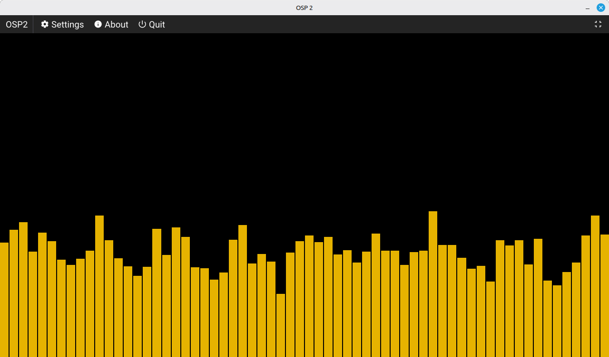
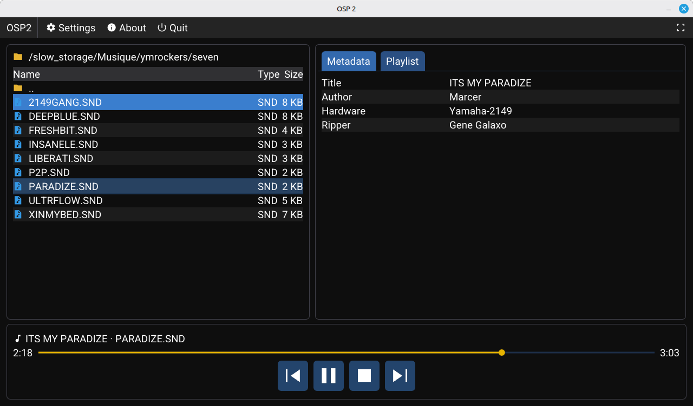
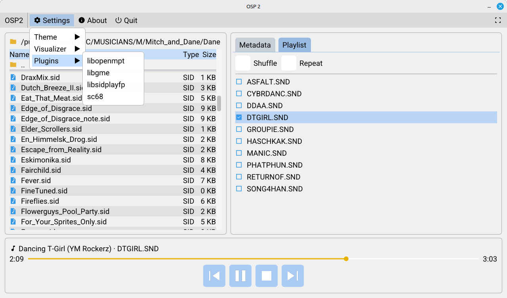

# OSP2

OSP2 is a chiptune player for desktop Linux and Nintendo Switch (homebrew), written in C++20 on top of SDL2, OpenGL, and Dear ImGui.

It plays tracker modules and console/home-computer chiptunes through a plugin-based decoder architecture: each decoder library is wrapped in a `PlayerPlugin`, and the right plugin is chosen by file extension. Four decoders ship today — [libopenmpt](https://lib.openmpt.org/libopenmpt/) (tracker modules), [libgme](https://github.com/libgme/game-music-emu) (console/handheld formats), [libsidplayfp](https://github.com/libsidplayfp/libsidplayfp) (Commodore 64 SID), and [libsc68](https://sourceforge.net/projects/sc68/) (Atari ST).

## Supported formats

| Decoder | Systems / kind | Extensions |
|---|---|---|
| libopenmpt | Tracker modules (Amiga, PC, …) | `mod`, `xm`, `s3m`, `it`, `mptm`, and the many other formats libopenmpt supports |
| libgme | Console & handheld chiptunes | `nsf`, `nsfe` (NES), `spc` (SNES), `gbs` (Game Boy), `ay` (ZX Spectrum / CPC), `hes` (PC Engine), `kss` (MSX), `sap` (Atari 8-bit), `gym` (Genesis), `vgm`, `vgz` |
| libsidplayfp | Commodore 64 | `sid`, `psid`, `rsid` |
| libsc68 | Atari ST (YM2149) | `sc68`, `sndh`, `snd` |

## Features

- Plugin-based playback of tracker modules and console/computer chiptunes (see above), output as 48 kHz 16-bit signed stereo through a pull-model SDL audio device
- Threaded file browser with a pluggable data-source abstraction: browse local storage or stream from the [Modland](https://modland.com/) archive over FTP (libcurl), with downloads cached locally
- Transport controls (play/pause, stop, previous/next) and end-of-track auto-advance
- Per-format metadata display — title plus decoder-specific fields
- Real-time audio visualizations via a visualizer plugin system (a spectrum-bars visualizer ships)
- Theming and user settings persisted to an INI file, including per-plugin decoder tunables
- Nintendo Switch controller → on-screen cursor and scroll emulation, so the ImGui UI is fully usable with a gamepad
- One codebase for desktop Linux and Nintendo Switch, with a fixed 1280×720 UI matching the Switch screen

See the roadmap in [docs/todos/TODO.md](docs/todos/TODO.md) for planned work.

## Building

Clone with the Dear ImGui submodule:

```sh
git clone <repo-url>
cd osp2
git submodule update --init
```

### Desktop (Linux)

Requires, installed system-wide: SDL2, SDL2_image, OpenGL, glad, and the decoder libraries libopenmpt, libgme, libsidplayfp, and sc68 (libsc68 + file68 + unice68), plus libcurl. The decoder libraries and libcurl are located via `pkg-config`; SDL2, SDL2_image, OpenGL, and glad use their CMake config packages.

```sh
cmake -B build
cmake --build build
```

Run from the repository root — asset paths are relative (`romfs/`):

```sh
./build/OSP2
```

### Nintendo Switch

Requires [devkitPro](https://devkitpro.org/) with the Switch toolchain. SDL2, SDL2_image, glad, and libopenmpt are available as devkitPro portlibs; libgme, libsidplayfp (which needs libresidfp), and sc68 are not, so they must be cross-built as Switch portlibs first. With devkitPro installed at `/opt/devkitpro`:

```sh
mkdir -p cmake-build-switch && cd cmake-build-switch
source /opt/devkitpro/switchvars.sh
cmake -G"Unix Makefiles" -DCMAKE_C_FLAGS="$CFLAGS $CPPFLAGS" -DCMAKE_TOOLCHAIN_FILE=/opt/devkitpro/cmake/Switch.cmake ..
make -j$(nproc)
```

This produces `OSP2.nro` with `romfs/` embedded, ready to run through hbmenu or nxlink.

## Formatting & linting

House style is enforced with **clang-format** and **clang-tidy** (both pinned to **18** — output differs across releases), configured by `.clang-format` and `.clang-tidy` at the repo root. Both are scoped to `src/` only; `external/` (vendored ImGui) and `cmake-build-*` are never formatted or linted.

```sh
sudo apt install clang-format-18 clang-tidy-18
```

The CMake targets glob all of `src/` (including the Switch-only `switch_compat.c`) and are decoupled from the normal build:

```sh
cmake --build build --target format         # rewrite src/ in place
cmake --build build --target format-check   # dry-run; non-zero exit on any diff (CI / pre-commit)
cmake --build build --target tidy           # clang-tidy over src/ (needs a configured desktop build dir)
```

`format-check` must pass and `tidy` findings should be addressed before committing. `clang-tidy` reads the desktop `compile_commands.json` (emitted automatically when you configure a build dir).

## Project layout

| Path | Contents |
|---|---|
| `src/main.cpp` | Platform lifecycle: SDL/OpenGL/ImGui init, event loop, render loop |
| `src/Application.*` | Wiring between presentation, playback, filesystem, and settings |
| `src/gui/` | Presentation-only `Gui` (Dear ImGui), sprite atlas rendering |
| `src/filesystem/` | Data sources: local directories and remote FTP (`FileSystem`, `LocalDataSource`, `FtpDataSource`) |
| `src/player/` | Playback core: `PlayerController` and decoder plugins (`plugins/`) |
| `src/visualizer/` | Visualization plugin system and visualizers |
| `src/settings/` | INI-backed user and plugin settings |
| `src/input/` | Switch controller → cursor/scroll emulation |
| `external/imgui/` | Dear ImGui, pristine git submodule |
| `romfs/` | Runtime assets: fonts, sprite atlas, optional SID C64 ROMs, test music |
| `docs/` | Per-domain architecture docs with class diagrams, plus the TODO backlog |

Architecture details — including the audio threading contract and how to add a decoder plugin — are documented per domain in [docs/](docs/) and in [CLAUDE.md](CLAUDE.md).

## Screenshots







## License

OSP2 is licensed under the GPL-3.0-or-later; see [LICENSE](LICENSE). Third-party components and their licenses are listed in [THIRD_PARTY_NOTICES.md](THIRD_PARTY_NOTICES.md).

## Acknowledgements

- [SDL2](https://www.libsdl.org/) & SDL2_image
- [Dear ImGui](https://github.com/ocornut/imgui)
- [libopenmpt](https://lib.openmpt.org/libopenmpt/)
- [libgme](https://github.com/libgme/game-music-emu) (Game Music Emu)
- [libsidplayfp](https://github.com/libsidplayfp/libsidplayfp)
- [libsc68](https://sourceforge.net/projects/sc68/)
- [libcurl](https://curl.se/libcurl/)
- [glad](https://github.com/Dav1dde/glad)
- [devkitPro](https://devkitpro.org/) (Switch homebrew toolchain)
- Roboto and Material Symbols fonts (Google)
