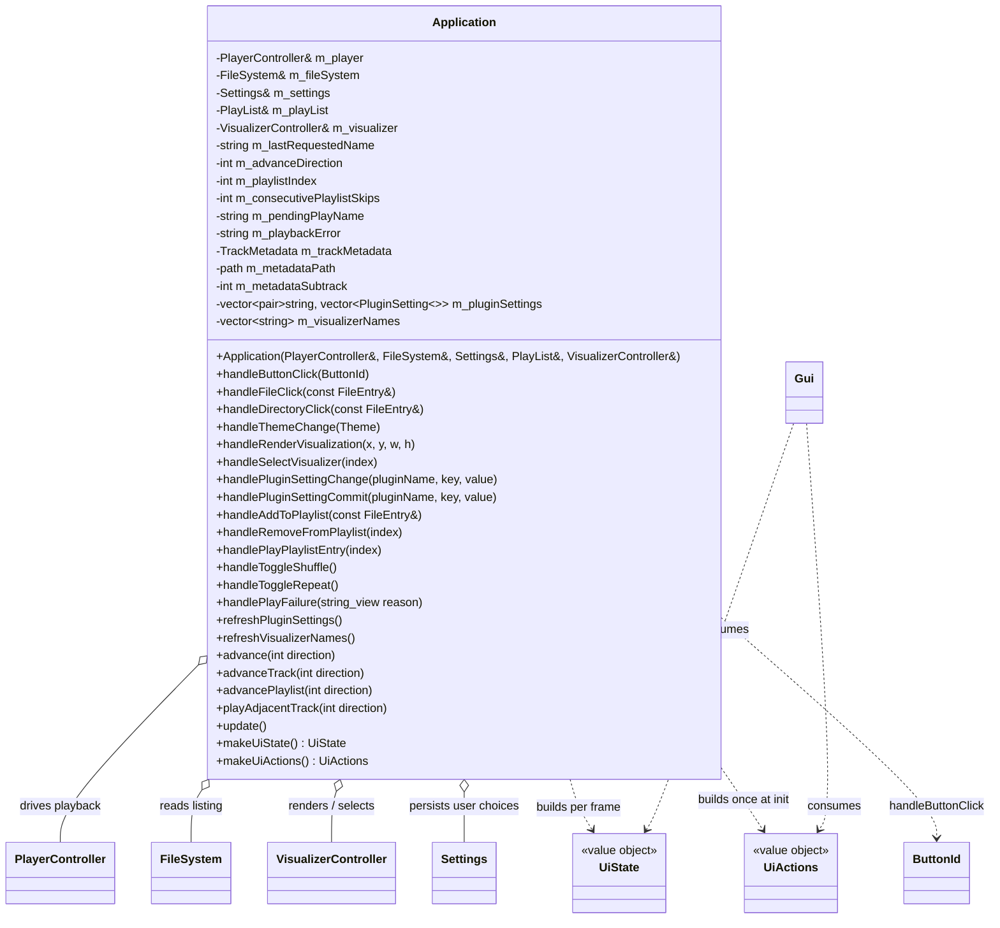

# Application domain

Use-case layer in `src/Application.{h,cpp}`. `Application` sits between the domain (`PlayerController`, `FileSystem`, `VisualizerController`) and the presentation layer (`Gui`): it turns UI intent into playback/navigation actions and produces the per-frame view model. It holds references to the player, filesystem, settings, playlist, and visualizer controller (all outlive it) and no domain state of its own — only per-frame view/orchestration caches (visualizer names, metadata, plugin settings, retry cursors). The platform layer — `Platform` (see [platform.md](platform.md)) — owns the `Application`, calls `update()` each frame, and forwards `makeUiState()`/`makeUiActions()` to `Gui`; `main.cpp` itself is just the entry point that constructs a `Platform` and runs it.

## Notes

- **Callback style, one seam.** UI reports intent, `Application` decides. `makeUiActions()` returns a `UiActions` whose lambdas capture `this`; it is called once at startup because `Application` outlives the actions. `makeUiState()` runs every frame — the domain → view-model translation (edge translation) lives here, never in `Gui`. Both aggregates are built with **C++20 designated initializers** naming every member in declaration order, so extending the seam (its documented growth mode — see the last note) can never silently swap two same-typed fields or handlers: a missed member is a visible `{}`-default, a misordered one a compile error.
- `handleButtonClick` owns the `ButtonId` switch, including the `TODO(temporary)` hardcoded `music/test.s3m` played on PLAY while STOPPED (until `FileSystem` returns real directories). It resolves the asset via the `assetPath()` helper from `src/Paths.h`.
- **`src/Paths.h` is the single source of path truth** (header-only). It defines the read-only asset root once — the `assetPath(relative)` helper returning a `std::filesystem::path` (`romfs:/` on Switch, `romfs/` on desktop; e.g. `assetPath("music/test.s3m")`) — used here, in `Platform` (fonts, `gui.initialize`), and in `SidPlugin` (C64 ROMs). It also exposes the writable-path helpers `configPath()` (the `osp2.ini` location) and `cachePath()` (remote-source download root), which share a `nextToExecutable()` helper on desktop and return fixed `/switch/…` SD-card paths on Switch (romfs is read-only). `Platform` calls these; the per-platform `#if defined(__SWITCH__)` split lives only in `Paths.h`.
- **Playback is routed through `FileSystem`** (so TODO_7 can resolve remote files asynchronously without touching callers). A file click / auto-advance no longer calls `player.play()` directly: `handleFileClick` sets `m_advanceDirection = 0` and calls `m_fileSystem.requestFile(entry)`; `playAdjacentTrack(direction)` requests only the *first* playable sibling, records it in `m_lastRequestedName` (the retry cursor) and keeps the direction in `m_advanceDirection`. Because success isn't known at request time, the play loop lives at the consume site in `update()`.
- `playAdjacentTrack(direction)` (`+1` NEXT, `-1` PREVIOUS) resolves the "current" track from `m_lastRequestedName` when set, else `player.getCurrentPath().filename()`; it scans the listing for the next playable sibling. When a direction runs off the end with no candidate it clears `m_lastRequestedName` so a later NEXT/PREVIOUS resolves against the actually-playing track.
- **`advance(direction)` is the subtrack-first navigation branch** shared by the NEXT/PREVIOUS transport buttons (`handleButtonClick`) and auto-advance (`consumeTrackEnded()`). Many chiptune formats (GME's NSF/SPC/GBS/VGM/KSS/…) pack several subtracks into one file (subtrack count/index surfaced through `PlaybackStatus`, see [audio.md](audio.md)). `advance` reads `player.getSubtrackCount()` + `player.getCurrentSubtrack()` (two lightweight locked getters, distinct from the full `getStatus()` snapshot); when `current + direction` is in `[0, count)` it steps within the file via `player.selectSubtrack(target)` (instant — no fetch, the emulator is already open), otherwise it falls through to `advanceTrack(direction)` (the next/previous **entry** — playlist or browser, see below). When nothing is loaded (count `1` / current `0`) or a single-track file plays, `target` is out of range in **both** directions, so `advance` always falls through — preserving the pre-subtrack behavior. **PREVIOUS from subtrack 0 lands on the previous FILE at ITS subtrack 0**, not that file's *last* subtrack: the last-subtrack variant would need to defer a "select last" until the async load completes, so the simpler per-file-first choice is intentional and documented. Subtrack selection performs **no fetch**, so `advance` deliberately does not touch `m_advanceDirection`/`m_pendingPlayName`/`m_lastRequestedName` — those are always freshly set by `playAdjacentTrack` before any fetch, so a stale value can never reach a fetch-failure site.
- **`advanceTrack(direction)` — playlist-vs-browser dispatch (28e).** The file-boundary target depends on where playback originated, tracked by **`m_playlistIndex`** (index of the playing playlist entry, or `-1` when playback came from the browser). While a playlist entry is playing (`>= 0`), `advanceTrack` calls **`advancePlaylist(direction)`** — NEXT/PREVIOUS and auto-advance traverse the **playlist**; otherwise it calls `playAdjacentTrack(direction)` (the browser's adjacent file). This is the key user-facing behavior: the transport follows the playlist while a playlist entry plays. **`handlePlayPlaylistEntry(index)`** enters playlist mode (`m_playlistIndex = index`, direct play with `m_advanceDirection = 0`) and fetches via `FileSystem::requestFileFromSource(sourceIndex, path)` (replay from the entry's captured source, no browser disturbance — see [filesystem.md](filesystem.md)); **`handleFileClick`** resets `m_playlistIndex = -1`, leaving playlist mode. `advancePlaylist` asks `PlayList::nextIndex` (shuffle/repeat, see [playlist.md](playlist.md)) for the next index, advances `m_playlistIndex` **before** the fetch (so a failure retry keeps skipping through the playlist), and re-fetches from source; no next (end without repeat) simply ends playback, and an empty/out-of-range list detaches (`m_playlistIndex = -1`). **Bounded-skip guard**: because Repeat/Shuffle make `nextIndex` never return `nullopt`, an all-unplayable playlist would loop forever; `advancePlaylist` counts consecutive fetch attempts in `m_consecutivePlaylistSkips` and stops once every entry has been tried once since the last successful play (`>= m_playList.size()`). The counter resets to `0` on `PlayResult::Ok` and at the start of a user-initiated `handlePlayPlaylistEntry`, so it only accrues across consecutive failures and a long healthy playlist never trips it. `handleRemoveFromPlaylist` keeps `m_playlistIndex` coherent with the shifted vector (decrement when an earlier entry is removed, `-1` when the playing entry is removed). `makeUiState()` also copies `m_playlistIndex` into **`UiState::playingPlaylistIndex`** (as of 33): the playlist tab's "now playing" row keys on this cursor — exactly the row the transport will follow — instead of lossy basename matching (see [ui.md](ui.md)). The copy is gated on the player state: while `STOPPED` it exposes `-1` (no row lit), even though the cursor itself survives STOP so a later NEXT still resumes from the playlist — mirroring the browser highlight, which goes dark on the empty stopped-state `fileName`.
- **`update()` responsibilities** (once per frame, before Gui draw): `m_fileSystem.update()` (swap a finished scan in on the main thread); `m_player.update()` (reap a finished async decode and swap the loaded plugin in — see below); then consume a resolved `FetchResult` — on success start the async decode with `player.play(localPath)` (now `void`), on a failed *entry* fetch retry via `advanceTrack(m_advanceDirection)` (playlist- or browser-aware), on a failed *direct-click* fetch compose a `"…: download failed"` error; then **poll the async decode outcome** `player.consumePlayResult()` (now a `PlayResult`, not a `bool`) — `Ok` clears the retry cursor, `Unsupported`/`DecodeError` skip a broken entry via `advanceTrack(m_advanceDirection)` when auto-advancing or compose a user-facing error for a direct click (a cancel produces *no* result, so it is silent); then poll `PlayerController::consumeTrackEnded()` to auto-advance with `advance(+1)` (steps to the next subtrack when one remains, else the next file — see the `advance` note). The first line of `update()` clears `m_playbackError` (mirrors `m_pendingNav`), so a composed error lives exactly the frame it is produced and `makeUiState()` hands it to the Gui as `UiState::error`. The fetch-result consume runs **before** the track-ended poll: `play()` still clears the track-ended flag **synchronously**, so an explicit click landing as the current track ends wins over auto-advance instead of being clobbered by it. Track teardown stays off the audio thread (see [audio.md](audio.md)).
- **The decode is asynchronous, so success/failure is decided at a poll, not at `play()`.** `PlayerController::play()` used to return `bool` (parse done inline on the UI thread); a large module froze the UI. It now starts `plugin->open()` on a player-owned worker and returns `void` (see [audio.md](audio.md)); the "Loading…" overlay covers the parse (see [ui.md](ui.md)). The old `if (r->succeeded && player.play(...))` success test therefore splits into two: fire-and-forget `play()` at the fetch-consume site, and `consumePlayResult()` at a poll one or more frames later. Both the fetch-failure branch and the decode-failure branch call `advanceTrack(m_advanceDirection)`, so a broken entry is still skipped whether it fails to download *or* to decode — within the **playlist** when a playlist entry is playing, else within the browser listing.
- **Failure handling: direct clicks surface a message, auto-advance stays silent.** `play()` now returns a `PlayResult` (`Ok` / `Unsupported` / `DecodeError`, see [audio.md](audio.md)); `Unsupported` is set synchronously (a defensive path — callers gate on `isSupported()`), `DecodeError`/`Ok` come from the load worker. On any failure `Application` decides by `m_advanceDirection`: when **auto-advancing** (`!= 0`) it is a **silent skip** — the broken sibling is never popped up, only the next candidate is tried (the chosen policy, so an auto-advance across broken files can't spam popups); on a **direct click** (`== 0`) it composes `m_playbackError` — `"Cannot play <name>: unsupported format"`, `"…: failed to decode"`, or `"…: download failed"` for a fetch failure. The `<name>` comes from **`m_pendingPlayName`**, set to `entry.name` in **both** `handleFileClick` and `playAdjacentTrack` (right where `requestFile` fires) — a dedicated field, *not* `m_lastRequestedName` (which is the auto-advance retry cursor). **User-cancel is suppressed**: `handleCancelWork` clears `m_pendingPlayName`, and the fetch-failure branch only composes a message when `!m_pendingPlayName.empty()`, so the failed `FetchResult` a cancelled download produces takes the silent path (a cancelled decode already produces no result at all). This whole skip-or-surface tail lives in one helper, **`handlePlayFailure(reason)`** (as of 33), called from the fetch-failure consume (`"download failed"`) and both decode-failure cases (`"unsupported format"` / `"failed to decode"`). `m_playbackError` is exposed as `UiState::error`, which the Gui latches into its error modal (see [ui.md](ui.md)).
- **Cancelling network work.** `handleCancelWork` (wired as `UiActions::onCancelWork`, fired by the browser-overlay Cancel button) calls `m_fileSystem.cancel()` **and** `m_player.cancelLoad()` — the overlay can be showing either stage (download or decode), so cancel covers both — then zeroes the auto-advance intent (`m_advanceDirection = 0`, `m_lastRequestedName.clear()`) **and clears `m_pendingPlayName`**. Dropping the intent is what makes a cancelled *download* stop instead of chaining on: the aborted fetch's `FetchResult{empty, false}` is then consumed with direction 0; and clearing `m_pendingPlayName` makes that direction-0 branch take the **silent** path (its `!m_pendingPlayName.empty()` guard fails) instead of popping a spurious "download failed" error. A cancelled *decode* is likewise silent: the parse cannot be interrupted but its result is dropped, so `consumePlayResult()` returns `nullopt` and no auto-advance fires (see [audio.md](audio.md)).
- **Metadata is fetched on track change, not per frame.** `update()` compares `player.getCurrentPath()` against `m_metadataPath` **and** `player.getCurrentSubtrack()` against `m_metadataSubtrack`; on a difference in **either** it refetches `m_trackMetadata = player.getMetadata()` and remembers both. The subtrack index is part of the key because a subtrack switch keeps the **same path** yet GME reports a different `song`/`comment` per subtrack — without it the Metadata tab would go stale after NEXT/PREVIOUS stepped subtracks. `m_metadataSubtrack` starts at `-1` (no fetch yet), so the first frame always refetches. This covers manual play, auto-advance, subtrack switch, and stop (a cleared path resets `m_trackMetadata` to `monostate`, so the Metadata tab returns to its empty state). Fetching only on change keeps `getMetadata()`'s `m_mutex` lock off the per-frame path. `makeUiState()` exposes `m_trackMetadata` as the `UiState::metadata` reference (valid for the frame); the `Gui` dispatches on the variant (see [ui.md](ui.md)).
- `handleDirectoryClick(entry)` routes `entry.name == ".."` to `FileSystem::navigateToParent()` and any other entry to `navigateToEntry(entry)` — no path joining, since at the virtual root `entry.name` is a source display name, not a path component (`FileSystem` resolves it against the active source). Wired as the third `UiActions` lambda (`onDirectoryClick`).
- `makeUiState()` maps `FileSystem`'s empty path (the virtual root) to the label `"Sources"` — a view-model translation that belongs in `Application`, not in `FileSystem` or `Gui`.
- **Theme change flow.** `Application` holds a `Settings &` (persistence domain, see [settings.md](settings.md)). The Gui's Theme menu applies the palette *itself* (`applyTheme` — presentation owns the ImGui style) and also fires `onThemeChange(theme)`; `Application::handleThemeChange` then persists only — `settings.setString("user", "theme", themeToString(theme))` + `settings.save()`. Keeping the visual apply in the Gui avoids dragging ImGui knowledge into the use-case layer, so the persistence handler has a single responsibility. The initial theme is applied at startup by `Platform` (the composition root, see [platform.md](platform.md)) from `[user] theme`, not by `Application`.
- **Visualizer bridge.** `Application` holds a `VisualizerController &` and owns both ends of the bridge (see [visualization.md](visualization.md)): `handleRenderVisualization(x, y, w, h)` (wired as `onRenderVisualization`, fired by the Gui in VISUALIZATION mode with the reserved rect) reads the audio tap via `PlayerController::readLatestAudio` — gated on `PlayerState::PLAYING` so the visual decays to rest when idle — builds a `VisualFrame`, and calls `VisualizerController::render`; `handleSelectVisualizer(index)` (wired as `onSelectVisualizer`, fired by the Settings→Visualizer picker) selects the plugin and persists its stable name under `[user] visualizer` — the same select-then-persist shape as `handleThemeChange`. **The names are cached, not fetched per frame**: `VisualizerController::getNames()` allocates, so `refreshVisualizerNames()` builds `m_visualizerNames` once — called by `Platform::create()` right after `m_visualizer.create()`, since the plugin set never changes afterwards — and `makeUiState()` exposes it as the non-owning `UiState::visualizerNames` view plus `activeVisualizer`. The startup *restore* of the persisted name stays in `Platform` (composition-root work), mirroring the theme restore.
- **Plugin-setting flow is apply-live-on-edit, persist-on-Save.** The Gui popup owns a working copy and applies edits to the decoder live for an audio preview, persisting only when the user clicks **Save** (see [ui.md](ui.md)). The seam has **two** callbacks: `onPluginSettingChange` → `Application::handlePluginSettingChange` applies to the live decoder via `player.applyPluginSetting(pluginName, key, value)` (mutex-guarded, see [audio.md](audio.md)) for immediate audio and **also patches the matching cached descriptor's value in place** so `m_pluginSettings` tracks the live decoder value; it does **not** save. `onPluginSettingCommit` → `Application::handlePluginSettingCommit` only persists (`settings.setInt("plugin." + pluginName, key, value)` + `settings.save()`), fired by the popup's Save button once per descriptor. The decoder already holds the value from the live edits, so the commit handler never touches the player. **The descriptors are cached, not fetched per frame.** `player.getPluginSettings()` locks the audio mutex and allocates, so — like `m_trackMetadata` — `Application` keeps a `m_pluginSettings` snapshot, built by `refreshPluginSettings()` **once at startup** (from `Platform` after the persisted-value push); thereafter the in-place patch on each live edit keeps it current, so there is no per-frame or deferred rebuild (the old `m_pluginSettingsDirty` flag is gone). The in-place write mutates only an `int` in an existing element (no reallocation), so it is safe even though `makeUiState()` hands `m_pluginSettings` to the Gui by reference — during the popup the Gui reads its own working copy, touching the cache only to seed on open. No plugin name is hardcoded in `Application` — the pair list drives everything.
- Later TODOs extend the seam by adding members to `UiState`/`UiActions` rather than changing signatures: `PlaybackStatus` (TODO_2), `onDirectoryClick` (TODO_4), `metadata` (TODO_5), `onThemeChange` (TODO_6a), `onPluginSettingChange` (TODO_6c), `error` (TODO_17).
