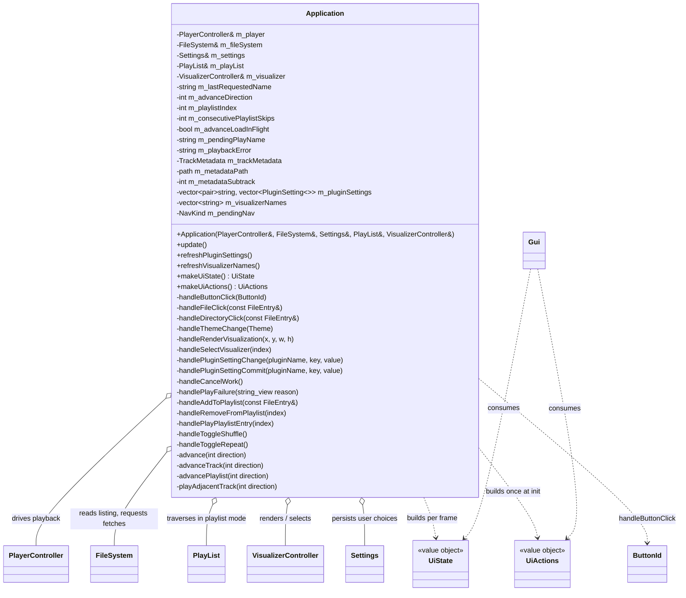

# Application domain

Use-case layer in `src/Application.{h,cpp}`. `Application` sits between the domain (`PlayerController`, `FileSystem`, `PlayList`, `VisualizerController`) and the presentation layer (`Gui`): it turns UI intent into playback/navigation actions and produces the per-frame view model. It holds references to the player, filesystem, settings, playlist, and visualizer controller (all outlive it) and no domain state of its own — only per-frame view/orchestration caches (visualizer names, metadata, plugin settings) and the playback-request state machine described below. `Platform` (see [platform.md](platform.md)) owns the `Application`, calls `update()` each frame, and forwards `makeUiState()`/`makeUiActions()` to `Gui`.

## The UI seam

- **Callback style, one seam.** UI reports intent, `Application` decides. `makeUiActions()` returns a `UiActions` whose lambdas capture `this`; `Platform::run()` calls it once at startup because `Application` outlives the actions. `makeUiState()` runs every frame — the domain → view-model translation lives here, never in `Gui`. Both aggregates are built with C++20 designated initializers naming every member in declaration order, so extending the seam (add a member to `UiState`/`UiActions` rather than changing signatures) can never silently swap two same-typed fields or handlers: a missed member is a visible `{}`-default, a misordered one a compile error.
- **`handleButtonClick`** owns the `ButtonId` switch: `PLAY_PAUSE` toggles pause/resume (a no-op while `STOPPED` — a track is started by selecting a file, not by the transport); `STOP` stops and clears `m_advanceLoadInFlight` (stop cancels an in-flight load whose result would otherwise never be consumed, so the suppression flag must not leak into the next play); `NEXT`/`PREVIOUS` call `advance(±1)`; `QUIT` is intercepted by `Platform` (it owns the run-loop flag) and never reaches the app layer.
- `handleDirectoryClick(entry)` routes `entry.name == ".."` to `FileSystem::navigateToParent()` and any other entry to `navigateToEntry(entry)` — no path joining, since at the virtual root `entry.name` is a source display name, not a path component (`FileSystem` resolves it against the active source).
- `makeUiState()` maps `FileSystem`'s empty path (the virtual root) to the label `"Sources"` and sets `UiState::isAtRoot` from the same emptiness — a view-model translation that belongs here, not in `FileSystem` or `Gui`. `m_pendingNav` (from `FileSystem::consumeNavigation()`, refreshed each `update()`) is relayed as `UiState::navKind` for the browser's scroll restore.

## Playback-request state machine

Playback is routed through `FileSystem` so remote files resolve asynchronously: a click or advance calls `requestFile(entry)` / `requestFileFromSource(sourceIndex, path)`, and the decode itself is also asynchronous (`player.play(path)` returns `void` and starts the parse on a player-owned worker — see [audio.md](audio.md)). Success/failure is therefore decided at consume/poll sites in `update()`, driven by these fields:

- **`m_advanceDirection`** — the current intent: `+1`/`-1` while auto-advancing (transport NEXT/PREVIOUS, track-ended, failure retry), `0` for a direct click. It decides both the failure policy (silent skip vs. surfaced error) and whether a failure retries via `advanceTrack`.
- **`m_lastRequestedName`** — the browser retry cursor: the name `playAdjacentTrack` last requested, so a failed sibling's retry scans onward from it instead of the still-playing track. Cleared on `PlayResult::Ok`, when a direction runs off the end of the listing, at playlist end (repeat off), and on cancel.
- **`m_pendingPlayName`** — the name of the file whose playback was last requested, used only to compose a user-facing error message. Set right where the request fires (`handleFileClick`, `handlePlayPlaylistEntry`, `playAdjacentTrack`, `advancePlaylist`); distinct from `m_lastRequestedName`. `handleCancelWork` clears it so a user cancel never pops an error.
- **`m_advanceLoadInFlight`** — main-thread flag: true while a boundary/auto-advance load is in flight, so `makeUiState()` suppresses the decode "Loading..." overlay for the seamless fast local case (a direct click keeps it; a remote sibling still shows the "Downloading..." fetch overlay). Set at the `play()` call site when `m_advanceDirection != 0`; cleared when the play result is consumed, on STOP, and on cancel.
- **`m_playlistIndex`** — index of the playing playlist entry, or `-1` when playback came from the browser. While `>= 0`, file-boundary advance traverses the playlist.
- **`m_consecutivePlaylistSkips`** — bounded-skip guard counter for the playlist failure-retry chain (see below).

### Advance flow

- **`advance(direction)` is subtrack-first**, shared by the NEXT/PREVIOUS transport buttons and auto-advance. Many chiptune formats (GME's NSF/SPC/GBS/VGM/KSS/…) pack several subtracks into one file (count/index surfaced through `PlaybackStatus`, see [audio.md](audio.md)). It reads `player.getSubtrackCount()` + `player.getCurrentSubtrack()` (two lightweight locked getters, distinct from the full `getStatus()` snapshot); when `current + direction` is in `[0, count)` it steps within the file via `player.selectSubtrack(target)` (instant, no fetch), otherwise it falls through to `advanceTrack(direction)`. When nothing is loaded (count 1 / current 0) or a single-track file plays, the target is out of range in both directions, so it always falls through. PREVIOUS from subtrack 0 lands on the previous entry at *its* subtrack 0, not that entry's last subtrack (the last-subtrack variant would need to defer a "select last" until the async load completes; the per-file-first choice is intentional). Subtrack selection performs no fetch, so `advance` deliberately does not touch `m_advanceDirection`/`m_pendingPlayName`/`m_lastRequestedName` — those are always freshly set before any fetch, so a stale value can never reach a fetch-failure site.
- **`advanceTrack(direction)` is the playlist-vs-browser dispatch** at a file boundary: while a playlist entry is playing (`m_playlistIndex >= 0`) it calls `advancePlaylist(direction)`, otherwise `playAdjacentTrack(direction)`. The failure-retry sites call it too, so a broken playlist entry is skipped within the playlist just as a broken browser sibling is skipped in the browser.
- **`playAdjacentTrack(direction)`** resolves the "current" track from `m_lastRequestedName` when set, else `player.getCurrentPath().filename()`, then requests the first playable sibling (non-directory, `player.isSupported`) in that direction, recording it in `m_advanceDirection`/`m_lastRequestedName`/`m_pendingPlayName`. When a direction runs off the end with no candidate it clears `m_lastRequestedName` so a later NEXT/PREVIOUS resolves against the actually-playing track.
- **`advancePlaylist(direction)`** asks `PlayList::nextIndex` (shuffle/repeat, see [playlist.md](playlist.md)) for the next index, advances `m_playlistIndex` *before* the fetch (so a failure retry keeps skipping through the playlist), and re-fetches via `requestFileFromSource` from the entry's captured source (no browser disturbance — see [filesystem.md](filesystem.md)). No next index (end without repeat) drops the browser retry cursor and lets playback end; an empty or out-of-range list detaches (`m_playlistIndex = -1`). **Bounded-skip guard**: Repeat/Shuffle make `nextIndex` never return `nullopt`, so an all-unplayable playlist would loop forever; `advancePlaylist` counts consecutive fetch attempts in `m_consecutivePlaylistSkips` and stops once every entry has been tried once since the last successful play (`>= m_playList.size()`). The counter resets to 0 on `PlayResult::Ok` and at the start of a user-initiated `handlePlayPlaylistEntry`.
- **`handlePlayPlaylistEntry(index)`** enters playlist mode (`m_playlistIndex = index`, `m_advanceDirection = 0`, skip guard reset) and fetches from the entry's source; **`handleFileClick`** resets `m_playlistIndex = -1`, leaving playlist mode.

### `update()` — once per frame, before the Gui draw

1. Clear `m_playbackError` (like `m_pendingNav`, it lives exactly the frame it is produced).
2. `m_fileSystem.update()` (swap a finished scan in on the main thread) and `consumeNavigation()`.
3. `m_player.update()` — reap a finished async decode and swap the loaded plugin in; the "Loading..." overlay stays up until this swap-in.
4. Consume a resolved `FetchResult`: on success, start the async decode with `player.play(localPath)` and set `m_advanceLoadInFlight = (m_advanceDirection != 0)`; on failure, `handlePlayFailure("download failed")`. This runs **before** the track-ended poll: `play()` clears the track-ended flag synchronously, so an explicit click landing as the current track ends wins over auto-advance instead of being clobbered by it.
5. Poll the decode outcome with `player.consumePlayResult()` (a `PlayResult`): any result clears `m_advanceLoadInFlight` (a retrying advance re-sets it at its next `play()`); `Ok` clears `m_lastRequestedName` and resets `m_consecutivePlaylistSkips`; `Unsupported` → `handlePlayFailure("unsupported format")`; `DecodeError` → `handlePlayFailure("failed to decode")`. A cancelled decode produces *no* result, so it is silent.
6. Poll `player.consumeTrackEnded()` and auto-advance with `advance(+1)` (next subtrack when one remains, else the next entry). Track teardown stays off the audio thread (see [audio.md](audio.md)).
7. Refetch metadata on track/subtrack change (see below).

### Failure and cancel

- **`handlePlayFailure(reason)`** is the shared tail of every play failure (fetch or decode). When auto-advancing (`m_advanceDirection != 0`) it is a **silent skip** — `advanceTrack(m_advanceDirection)` tries the next candidate (playlist- or browser-aware) and no popup appears, so advancing across broken files can't spam errors. On a direct click (`== 0`) it composes `m_playbackError = "Cannot play <m_pendingPlayName>: <reason>"` — unless `m_pendingPlayName` is empty (cleared by a user cancel), which stays silent. `m_playbackError` is exposed as `UiState::error`, which the Gui latches into its error modal (see [ui.md](ui.md)).
- **`handleCancelWork`** (wired as `UiActions::onCancelWork`, fired by the browser-overlay Cancel button) calls `m_fileSystem.cancel()` **and** `m_player.cancelLoad()` — the overlay can be showing either stage — then zeroes the advance intent (`m_advanceDirection = 0`, `m_advanceLoadInFlight = false`, `m_lastRequestedName.clear()`) and clears `m_pendingPlayName`. Dropping the intent is what makes a cancelled download stop instead of chaining on: the aborted fetch's failed `FetchResult` is consumed with direction 0, and the empty pending name makes that branch silent. A cancelled decode cannot be interrupted, but its result is dropped, so `consumePlayResult()` returns `nullopt` and nothing fires.

## Overlay decision (`makeUiState()`)

`UiState::isWorking`/`workingLabel` derive from three conditions, label priority first-match:

1. `loading` = `player.isLoading() && !m_advanceLoadInFlight` → `"Loading..."` (the suppression keeps the fast local auto-advance seamless; a direct click keeps its overlay);
2. `fsWorking` = `fileSystem.isWorking()` → `"Downloading..."` or `"Scanning..."` per `isFetching()`;
3. `fetchParked` = `fileSystem.hasPendingFetchResult()` → `"Downloading..."` (only fetches park results, never scans).

The third condition closes the fetch → decode hand-off gap: the fetch worker parks its result *before* clearing its working flag, so a frame can read `isWorking() == false` with the finished fetch still unconsumed — next frame `update()` consumes it and `play()` raises `isLoading()` synchronously. `fetchParked` keeps the overlay up across exactly that gap frame (see [filesystem.md](filesystem.md)). **Read order is load-bearing**: `fetchParked` must be read *after* `fsWorking` — the worker parks before clearing `m_working`, so this order can never see both false while a fetch is pending; reversed, the overlay blinks. Every exit path still clears promptly — a cancelled or failed fetch drops the overlay the frame its result is consumed. Each flag is read once so a flag and its label cannot disagree if a worker finishes mid-build.

## Cached snapshots

- **Metadata is fetched on track change, not per frame.** `update()` compares `player.getCurrentPath()` against `m_metadataPath` **and** `player.getCurrentSubtrack()` against `m_metadataSubtrack`; on a difference in either it refetches `m_trackMetadata = player.getMetadata()` and remembers both. The subtrack index is part of the key because a subtrack switch keeps the same path yet GME reports a different `song`/`comment` per subtrack. `m_metadataSubtrack` starts at `-1`, so the first frame always refetches; a cleared path (stop) resets `m_trackMetadata` to `monostate`. The refetch is **skipped while `player.isReloading()`**: during a boundary advance the outgoing plugin is closed, so `getCurrentSubtrack()` reads 0 and `getMetadata()` would return empty — the outgoing metadata is held until swap-in. Fetching only on change keeps `getMetadata()`'s mutex lock off the per-frame path. `makeUiState()` exposes `m_trackMetadata` as the `UiState::metadata` reference (valid for the frame).
- **Plugin-setting flow is apply-live-on-edit, persist-on-Save.** The Gui popup owns a working copy and applies edits to the decoder live for an audio preview, persisting only on Save (see [ui.md](ui.md)). Two callbacks: `onPluginSettingChange` → `handlePluginSettingChange` applies to the live decoder via `player.applyPluginSetting(pluginName, key, value)` (mutex-guarded, see [audio.md](audio.md)) and **patches the matching cached descriptor's value in place** so `m_pluginSettings` tracks the live decoder; it does not save. `onPluginSettingCommit` → `handlePluginSettingCommit` only persists (`settings.setInt(kPluginSectionPrefix + pluginName, key, value)` + `save()`), fired per descriptor by the popup's Save button; the decoder already holds the value, so the commit never touches the player. **The descriptors are cached** because `player.getPluginSettings()` locks the audio mutex and allocates: `refreshPluginSettings()` builds `m_pluginSettings` once at startup (called by `Platform` after the persisted-value push), and the in-place patch keeps it current — no per-frame or deferred rebuild. The in-place write mutates only an `int` in an existing element (no reallocation), so it is safe even though `makeUiState()` hands `m_pluginSettings` to the Gui by reference. No plugin name is hardcoded — the pair list drives everything.
- **Visualizer names are cached** because `VisualizerController::getNames()` allocates: `refreshVisualizerNames()` builds `m_visualizerNames` once — called by `Platform::create()` right after `m_visualizer.create()`, since the plugin set never changes afterwards — and `makeUiState()` exposes it as the non-owning `UiState::visualizerNames` view plus `activeVisualizer`.

## Other flows

- **Theme change.** The Gui's Theme menu applies the palette itself (`applyTheme` — presentation owns the ImGui style) and also fires `onThemeChange(theme)`; `handleThemeChange` only persists (`settings.setString(kUserSection, kTheme, themeToString(theme))` + `save()`). The initial theme is applied at startup by `Platform` (the composition root), not by `Application`.
- **Visualizer bridge.** `Application` owns both ends (see [visualization.md](visualization.md)): `handleRenderVisualization(x, y, w, h)` (fired by the Gui in VISUALIZATION mode with the reserved rect) reads the audio tap via `PlayerController::readLatestAudio` — gated on `PlayerState::PLAYING` with `frameCount = 0` otherwise, so the visual decays to rest — into a zero-initialized local buffer (so untouched tails are silence, never indeterminate stack), builds a `VisualFrame`, and calls `VisualizerController::render`. `handleSelectVisualizer(index)` selects the plugin and persists its stable name under `[user] visualizer` — the same select-then-persist shape as the theme. The startup restore of the persisted name lives in `Platform`.
- **Playlist edits.** `handleAddToPlaylist` guards against directories, captures the entry's identity as (active source index, source-relative path) so replay re-fetches from where the file actually lives, and rejects duplicates on that identity. `handleRemoveFromPlaylist` keeps `m_playlistIndex` coherent with the shifted vector (decrement when an earlier entry is removed; `-1` when the playing entry is removed — the track keeps playing, but a later NEXT falls back to browser advance). `handleToggleShuffle`/`handleToggleRepeat` forward to `PlayList`.
- **`UiState::playingPlaylistIndex`.** `makeUiState()` copies `m_playlistIndex` into it so the playlist tab's "now playing" row keys on the exact cursor the transport will follow, not on basename matching (see [ui.md](ui.md)). The copy is gated on player state: while `STOPPED` it exposes `-1` (no row lit) even though the cursor itself survives STOP, so a later NEXT still resumes from the playlist — mirroring the browser highlight, which goes dark on the empty stopped-state `fileName`.
