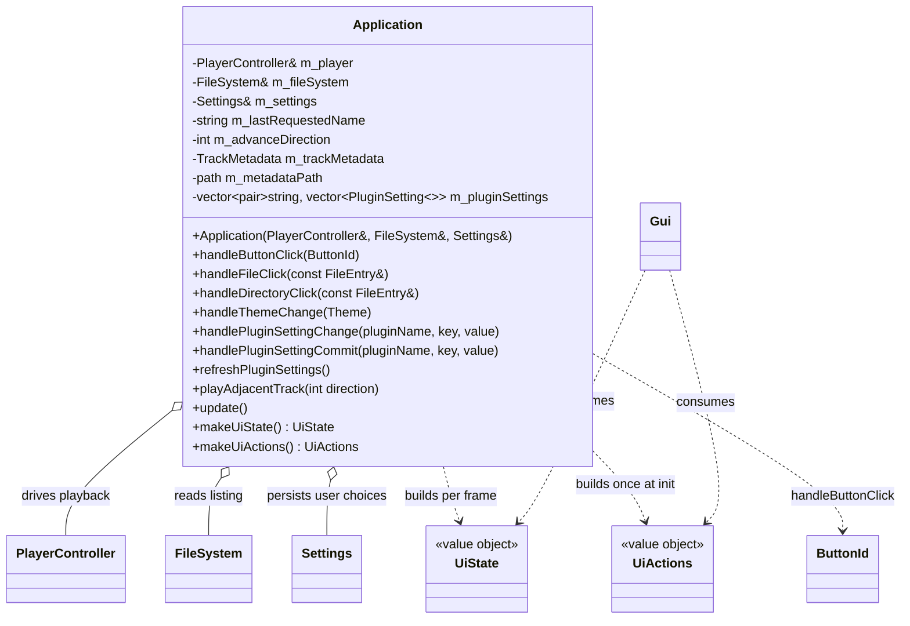

# Application domain

Use-case layer in `src/Application.{h,cpp}`. `Application` sits between the domain (`PlayerController`, `FileSystem`) and the presentation layer (`Gui`): it turns UI intent into playback/navigation actions and produces the per-frame view model. It holds references to the player and filesystem (both outlive it) and no state of its own. The platform layer — `Platform` (see [platform.md](platform.md)) — owns the `Application`, calls `update()` each frame, and forwards `makeUiState()`/`makeUiActions()` to `Gui`; `main.cpp` itself is just the entry point that constructs a `Platform` and runs it.

## Notes

- **Callback style, one seam.** UI reports intent, `Application` decides. `makeUiActions()` returns a `UiActions` whose lambdas capture `this`; it is called once at startup because `Application` outlives the actions. `makeUiState()` runs every frame — the domain → view-model translation (edge translation) lives here, never in `Gui`.
- `handleButtonClick` owns the `ButtonId` switch, including the `TODO(temporary)` hardcoded `music/test.s3m` played on PLAY while STOPPED (until `FileSystem` returns real directories). It resolves the asset via the `assetPath()` helper from `src/Paths.h`.
- **`src/Paths.h` is the single source of path truth** (header-only). It defines the read-only asset root once — the `assetPath(relative)` helper returning a `std::filesystem::path` (`romfs:/` on Switch, `romfs/` on desktop; e.g. `assetPath("music/test.s3m")`) — used here, in `Platform` (fonts, `gui.initialize`), and in `SidPlugin` (C64 ROMs). It also exposes the writable-path helpers `configPath()` (the `osp2.ini` location) and `cachePath()` (remote-source download root), which share a `nextToExecutable()` helper on desktop and return fixed `/switch/…` SD-card paths on Switch (romfs is read-only). `Platform` calls these; the per-platform `#if defined(__SWITCH__)` split lives only in `Paths.h`.
- **Playback is routed through `FileSystem`** (so TODO_7 can resolve remote files asynchronously without touching callers). A file click / auto-advance no longer calls `player.play()` directly: `handleFileClick` sets `m_advanceDirection = 0` and calls `m_fileSystem.requestFile(entry)`; `playAdjacentTrack(direction)` requests only the *first* playable sibling, records it in `m_lastRequestedName` (the retry cursor) and keeps the direction in `m_advanceDirection`. Because success isn't known at request time, the play loop lives at the consume site in `update()`.
- `playAdjacentTrack(direction)` (`+1` NEXT, `-1` PREVIOUS) resolves the "current" track from `m_lastRequestedName` when set, else `player.getCurrentPath().filename()`; it scans the listing for the next playable sibling. When a direction runs off the end with no candidate it clears `m_lastRequestedName` so a later NEXT/PREVIOUS resolves against the actually-playing track.
- **`update()` responsibilities** (once per frame, before Gui draw): `m_fileSystem.update()` (swap a finished scan in on the main thread); `m_player.update()` (reap a finished async decode and swap the loaded plugin in — see below); then consume a resolved `FetchResult` — on success start the async decode with `player.play(localPath)` (now `void`), on a failed *sibling* fetch retry via `playAdjacentTrack(m_advanceDirection)`; then **poll the async decode outcome** `player.consumePlayResult()` — on success (`true`) clear the retry cursor, on a decode failure (`false`) skip a broken sibling via `playAdjacentTrack(m_advanceDirection)` (a cancel produces *no* result, so it is silent); then poll `PlayerController::consumeTrackEnded()` to auto-advance with `playAdjacentTrack(+1)`. The fetch-result consume runs **before** the track-ended poll: `play()` still clears the track-ended flag **synchronously**, so an explicit click landing as the current track ends wins over auto-advance instead of being clobbered by it. Track teardown stays off the audio thread (see [audio.md](audio.md)).
- **The decode is asynchronous, so success/failure is decided at a poll, not at `play()`.** `PlayerController::play()` used to return `bool` (parse done inline on the UI thread); a large module froze the UI. It now starts `plugin->open()` on a player-owned worker and returns `void` (see [audio.md](audio.md)); the "Loading…" overlay covers the parse (see [ui.md](ui.md)). The old `if (r->succeeded && player.play(...))` success test therefore splits into two: fire-and-forget `play()` at the fetch-consume site, and `consumePlayResult()` at a poll one or more frames later. Both the fetch-failure branch and the decode-failure branch call `playAdjacentTrack(m_advanceDirection)`, so a broken sibling is still skipped whether it fails to download *or* to decode. Because `handleFileClick`/`playAdjacentTrack` gate on `player.isSupported()`, `play()` only ever gets a supported extension, so the only failure it can report is a parse failure (an unsupported-vs-decode status enum is deferred to 17b).
- **Cancelling network work.** `handleCancelWork` (wired as `UiActions::onCancelWork`, fired by the browser-overlay Cancel button) calls `m_fileSystem.cancel()` **and** `m_player.cancelLoad()` — the overlay can be showing either stage (download or decode), so cancel covers both — then zeroes the auto-advance intent (`m_advanceDirection = 0`, `m_lastRequestedName.clear()`). Dropping the intent is what makes a cancelled *download* stop instead of chaining on: the aborted fetch's `FetchResult{empty, false}` is then consumed with direction 0, taking the log-only branch rather than `playAdjacentTrack`. A cancelled *decode* is likewise silent: the parse cannot be interrupted but its result is dropped, so `consumePlayResult()` returns `nullopt` and no auto-advance fires (see [audio.md](audio.md)).
- **Metadata is fetched on track change, not per frame.** `update()` compares `player.getCurrentPath()` against `m_metadataPath`; on a difference it refetches `m_trackMetadata = player.getMetadata()` and remembers the new path. This covers manual play, auto-advance, and stop (a cleared path resets `m_trackMetadata` to `monostate`, so the Metadata tab returns to its empty state). Fetching only on change keeps `getMetadata()`'s `m_mutex` lock off the per-frame path. `makeUiState()` exposes `m_trackMetadata` as the `UiState::metadata` reference (valid for the frame); the `Gui` dispatches on the variant (see [ui.md](ui.md)).
- `handleDirectoryClick(entry)` routes `entry.name == ".."` to `FileSystem::navigateToParent()` and any other entry to `navigateToEntry(entry)` — no path joining, since at the virtual root `entry.name` is a source display name, not a path component (`FileSystem` resolves it against the active source). Wired as the third `UiActions` lambda (`onDirectoryClick`).
- `makeUiState()` maps `FileSystem`'s empty path (the virtual root) to the label `"Sources"` — a view-model translation that belongs in `Application`, not in `FileSystem` or `Gui`.
- **Theme change flow.** `Application` holds a `Settings &` (persistence domain, see [settings.md](settings.md)). The Gui's Theme menu applies the palette *itself* (`applyTheme` — presentation owns the ImGui style) and also fires `onThemeChange(theme)`; `Application::handleThemeChange` then persists only — `settings.setString("user", "theme", themeToString(theme))` + `settings.save()`. Keeping the visual apply in the Gui avoids dragging ImGui knowledge into the use-case layer, so the persistence handler has a single responsibility. The initial theme is applied at startup by `Platform` (the composition root, see [platform.md](platform.md)) from `[user] theme`, not by `Application`.
- **Plugin-setting flow is apply-live-on-edit, persist-on-Save.** The Gui popup owns a working copy and applies edits to the decoder live for an audio preview, persisting only when the user clicks **Save** (see [ui.md](ui.md)). The seam has **two** callbacks: `onPluginSettingChange` → `Application::handlePluginSettingChange` applies to the live decoder via `player.applyPluginSetting(pluginName, key, value)` (mutex-guarded, see [audio.md](audio.md)) for immediate audio and **also patches the matching cached descriptor's value in place** so `m_pluginSettings` tracks the live decoder value; it does **not** save. `onPluginSettingCommit` → `Application::handlePluginSettingCommit` only persists (`settings.setInt("plugin." + pluginName, key, value)` + `settings.save()`), fired by the popup's Save button once per descriptor. The decoder already holds the value from the live edits, so the commit handler never touches the player. **The descriptors are cached, not fetched per frame.** `player.getPluginSettings()` locks the audio mutex and allocates, so — like `m_trackMetadata` — `Application` keeps a `m_pluginSettings` snapshot, built by `refreshPluginSettings()` **once at startup** (from `Platform` after the persisted-value push); thereafter the in-place patch on each live edit keeps it current, so there is no per-frame or deferred rebuild (the old `m_pluginSettingsDirty` flag is gone). The in-place write mutates only an `int` in an existing element (no reallocation), so it is safe even though `makeUiState()` hands `m_pluginSettings` to the Gui by reference — during the popup the Gui reads its own working copy, touching the cache only to seed on open. No plugin name is hardcoded in `Application` — the pair list drives everything.
- Later TODOs extend the seam by adding members to `UiState`/`UiActions` rather than changing signatures: `PlaybackStatus` (TODO_2), `onDirectoryClick` (TODO_4), `metadata` (TODO_5), `onThemeChange` (TODO_6a), `onPluginSettingChange` (TODO_6c).
