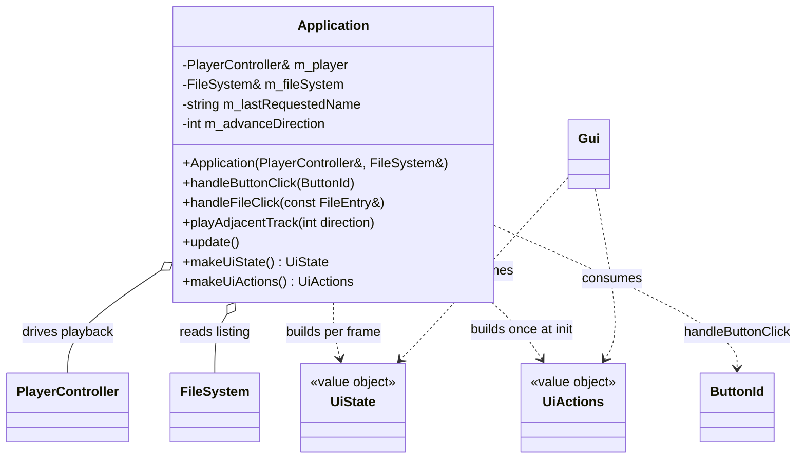

# Application domain

Use-case layer in `src/Application.{h,cpp}`. `Application` sits between the domain (`PlayerController`, `FileSystem`) and the presentation layer (`Gui`): it turns UI intent into playback/navigation actions and produces the per-frame view model. It holds references to the player and filesystem (both outlive it) and no state of its own. `main.cpp` shrinks to pure platform lifecycle (SDL/GL/ImGui init, event loop) — it owns the `Application` global, calls `update()` each frame, and forwards `makeUiState()`/`makeUiActions()` to `Gui`.

## Notes

- **Callback style, one seam.** UI reports intent, `Application` decides. `makeUiActions()` returns a `UiActions` whose lambdas capture `this`; it is called once at startup because `Application` outlives the actions. `makeUiState()` runs every frame — the domain → view-model translation (edge translation) lives here, never in `Gui`.
- `handleButtonClick` owns the `ButtonId` switch, including the `TODO(temporary)` hardcoded `music/test.s3m` played on PLAY while STOPPED (until `FileSystem` returns real directories). Its `BASE_PATH` (`romfs:/` on Switch, else `romfs/`) mirrors main.cpp.
- **Playback is routed through `FileSystem`** (so TODO_7 can resolve remote files asynchronously without touching callers). A file click / auto-advance no longer calls `player.play()` directly: `handleFileClick` sets `m_advanceDirection = 0` and calls `m_fileSystem.requestFile(entry)`; `playAdjacentTrack(direction)` requests only the *first* playable sibling, records it in `m_lastRequestedName` (the retry cursor) and keeps the direction in `m_advanceDirection`. Because success isn't known at request time, the play loop lives at the consume site in `update()`.
- `playAdjacentTrack(direction)` (`+1` NEXT, `-1` PREVIOUS) resolves the "current" track from `m_lastRequestedName` when set, else `player.getCurrentPath().filename()`; it scans the listing for the next playable sibling. When a direction runs off the end with no candidate it clears `m_lastRequestedName` so a later NEXT/PREVIOUS resolves against the actually-playing track.
- **`update()` responsibilities** (once per frame, before Gui draw): `m_fileSystem.update()` (swap a finished scan in on the main thread); then consume a resolved `FetchResult` — on success `player.play(localPath)` and clear the cursor, on a failed *sibling* fetch retry via `playAdjacentTrack(m_advanceDirection)`; then poll `PlayerController::consumeTrackEnded()` to auto-advance with `playAdjacentTrack(+1)`. The fetch-result consume runs **before** the track-ended poll: a successful `play()` clears the track-ended flag, so an explicit click landing as the current track ends wins over auto-advance instead of being clobbered by it. Track teardown stays off the audio thread (see [audio.md](audio.md)).
- `makeUiState()` maps `FileSystem`'s empty path (the virtual root) to the label `"Sources"` — a view-model translation that belongs in `Application`, not in `FileSystem` or `Gui`.
- Later TODOs extend the seam by adding members to `UiState`/`UiActions` rather than changing signatures: `PlaybackStatus` (TODO_2), `onDirectoryClick` (TODO_4), `metadata` (TODO_5), `onThemeChange`/`onPluginSettingChange` (TODO_6).
