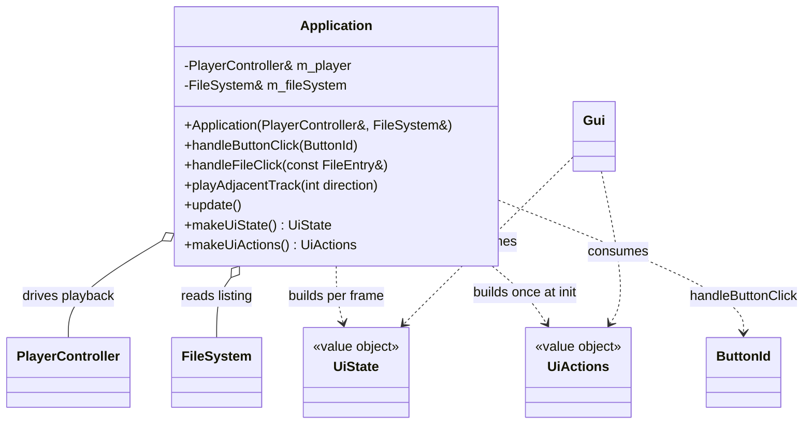

# Application domain

Use-case layer in `src/Application.{h,cpp}`. `Application` sits between the domain (`PlayerController`, `FileSystem`) and the presentation layer (`Gui`): it turns UI intent into playback/navigation actions and produces the per-frame view model. It holds references to the player and filesystem (both outlive it) and no state of its own. `main.cpp` shrinks to pure platform lifecycle (SDL/GL/ImGui init, event loop) — it owns the `Application` global, calls `update()` each frame, and forwards `makeUiState()`/`makeUiActions()` to `Gui`.

## Notes

- **Callback style, one seam.** UI reports intent, `Application` decides. `makeUiActions()` returns a `UiActions` whose lambdas capture `this`; it is called once at startup because `Application` outlives the actions. `makeUiState()` runs every frame — the domain → view-model translation (edge translation) lives here, never in `Gui`.
- `handleButtonClick` owns the `ButtonId` switch, including the `TODO(temporary)` hardcoded `music/test.s3m` played on PLAY while STOPPED (until `FileSystem` returns real directories). Its `BASE_PATH` (`romfs:/` on Switch, else `romfs/`) mirrors main.cpp.
- `playAdjacentTrack(direction)` (`+1` NEXT, `-1` PREVIOUS) scans the current listing for the nearest playable sibling. `update()` polls `PlayerController::consumeTrackEnded()` and auto-advances with `playAdjacentTrack(+1)` — track teardown stays off the audio thread (see [audio.md](audio.md)).
- Later TODOs extend the seam by adding members to `UiState`/`UiActions` rather than changing signatures: `PlaybackStatus` (TODO_2), `onDirectoryClick` (TODO_4), `metadata` (TODO_5), `onThemeChange`/`onPluginSettingChange` (TODO_6).
