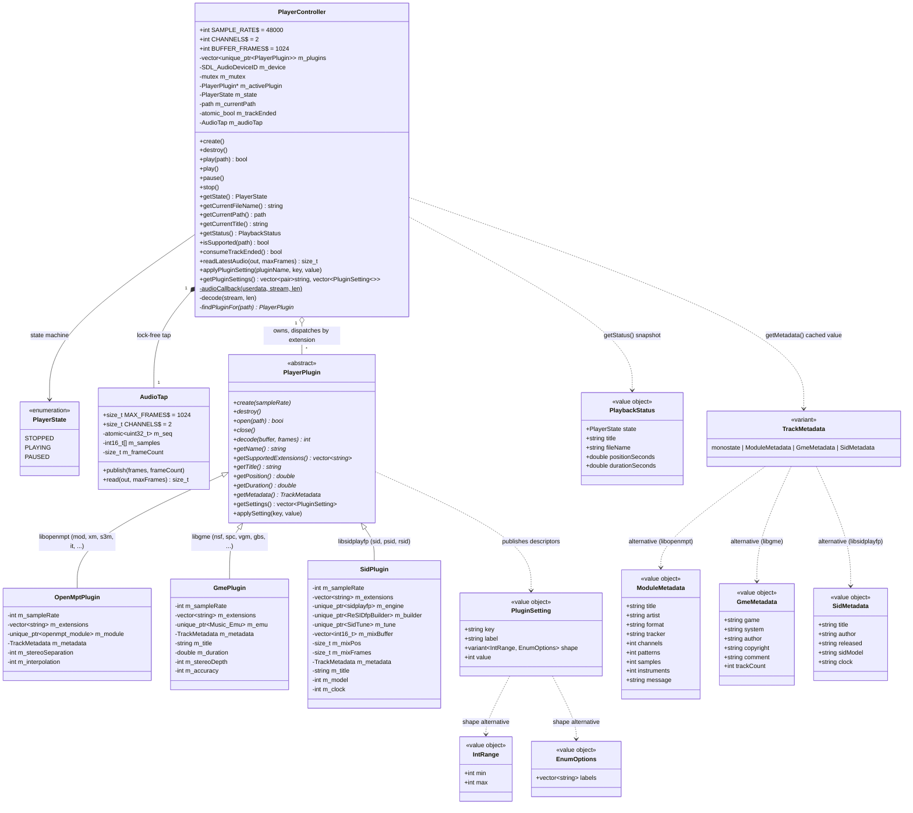

# Audio domain

Playback core in `src/player/`. `PlayerController` is the SDL boundary (audio device, threading); `PlayerPlugin` implementations wrap one decoder library each and are SDL-free.

## Threading

- The SDL audio thread pulls samples via `audioCallback` → `decode()` (48 kHz, signed-16-bit interleaved stereo, `AUDIO_S16SYS`). Plugins render native int16 (`PlayerPlugin::decode(std::int16_t*, frames)`) — no format conversion on the audio path (libgme/libsidplayfp/libsc68 emit 16-bit natively; libopenmpt has a native int16 render overload). The **only** int16→float conversion is in `AudioTap::read`, off the audio thread, for the visualization layer.
- `m_mutex` guards `m_state` and `m_activePlugin` (including the decoder inside it); locked by the callback and by play/pause/stop/getters.
- `getStatus()` returns a `PlaybackStatus` (`src/player/PlaybackStatus.h`) snapshot — state, title, filename, position, duration — built under a **single** `m_mutex` lock (it inlines the reads rather than calling the re-locking getters, since `m_mutex` is non-recursive). The plugin virtuals `getPosition()`/`getDuration()` (seconds) read the shared decoder, so they are contractually **only** called under `m_mutex`. Position/duration are `0` when stopped or unknown.
- Pause is controller state only — the device runs for the whole app lifetime and the callback emits silence when not PLAYING.
- End of track: the audio thread flips state to STOPPED and sets `m_trackEnded` (atomic); the main loop consumes it once per frame (`consumeTrackEnded()`) to auto-advance. Track teardown (`close()`) never happens on the audio thread.
- **Audio tap (visualization).** `m_audioTap` (`src/player/AudioTap.h`) is a single-producer / single-consumer **seqlock** publishing the most recently decoded block of interleaved stereo **int16** frames, **independent of `m_mutex`**. `read()` converts int16→float (normalized) for the visualizer, which is why `readLatestAudio()` still hands out `float`. Producer: the audio thread calls `publish()` inside `decode()` after a successful decode (only the real `frames_written` frames, before the end-of-track zero-padding rewrites the buffer tail) — it never blocks and never allocates. Consumer: the main thread calls `readLatestAudio()` (→ `AudioTap::read()`), which spins only on a torn read and **never touches `m_mutex`**. So the audio thread never blocks to publish and the reader never contends the decode lock. When not PLAYING, `decode()` publishes nothing, so the reader sees a stale block; the visualization layer passes `frameCount = 0` and decays the visual to rest.
- `destroy()` closes the audio device before destroying plugins.
- **Plugin settings follow the same lock discipline as decode.** A plugin publishes tunables as `PluginSetting` descriptors (`src/player/PluginSetting.h`): a `key`/`label`, a current `int value`, and a `shape` variant — `IntRange` (→ slider) or `EnumOptions` (→ combo, `value` = index into `labels`). `getSettings()` returns plain **cached** members (no decoder access), while `applySetting(key, value)` may touch the *live* decoder, so it is called **only** through `PlayerController::applyPluginSetting(pluginName, key, value)`, which takes `m_mutex` (plugins are matched by `getName()`; no match = no-op). `getPluginSettings()` also locks and returns `(pluginName, descriptors)` per plugin for the UI. `OpenMptPlugin` exposes `stereo_separation` (`IntRange 0–200`, default 100 → `RENDER_STEREOSEPARATION_PERCENT`) and `interpolation` (`EnumOptions` Default/None/Linear/Cubic/Sinc → filter lengths 0/1/2/4/8 → `RENDER_INTERPOLATIONFILTER_LENGTH`); both are cached members, applied to the module in `open()` and immediately in `applySetting()`. **Values are clamped/normalized on store** (separation to 0–200, interpolation to a valid index) so a hand-edited INI can never feed `set_render_param` an out-of-range value — that call throws, and an unchecked value would otherwise make every subsequent `open()` fail. Persisted `[plugin.<name>]` values are pushed once at startup by `main.cpp` via `applyPluginSetting` (see [settings.md](settings.md)).
- **Metadata is captured once, not read per frame.** Each library exposes a different metadata shape, so it travels as `TrackMetadata` (`src/player/Metadata.h`) — a `std::variant<std::monostate, ModuleMetadata, ...>`, one struct per plugin family, `monostate` = no track. Reading the decoder every frame would contend with `decode()`, so a plugin's `getMetadata()` returns a value **cached during `open()`** and cleared to `monostate` in `close()`; it must never touch the decoder object. `PlayerController::getMetadata()` still locks `m_mutex` (to read `m_activePlugin` safely) and returns the plugin's cached value, or a default (`monostate`) when nothing is active. `Application` refetches only on track change (see [application.md](application.md)), so the lock is taken rarely, not per frame.

## Adding a decoder plugin

One class under `src/player/plugins/` implementing `PlayerPlugin`, one `emplace_back` in `PlayerController::create()` (registration order = dispatch priority on extension overlap), one CMake stanza. Shipped: libopenmpt (`OpenMptPlugin`), libgme (`GmePlugin` — `ay, gbs, gym, hes, kss, nsf, nsfe, sap, spc, vgm, vgz`; renders libgme's interleaved-stereo 16-bit straight into the output buffer, no conversion; exposes `stereo_depth` (`IntRange 0–100` → `gme_set_stereo_depth`) and `accuracy` (`EnumOptions` Fast/Accurate → `gme_enable_accuracy`)), libsidplayfp (`SidPlugin` — `sid, psid, rsid`; see below). Planned: libsc68. A plugin with no tunables need not override `getSettings()`/`applySetting()` (safe defaults: `{}` / no-op); one that does override them gets persistence and settings UI for free via the `PluginSetting` descriptor mechanism.

**SidPlugin (libsidplayfp v3).** Drives the `sidplayfp` engine with a `ReSIDfpBuilder` (the accurate ReSIDfp emulation; requires the `libresidfp` companion library on both platforms — see [build-portlibs.md](build-portlibs.md)). **Optional C64 ROMs:** `create()` loads `romfs/roms/{kernal-901227-03,basic-901226-01,chargen-901225-01}.bin` if present and hands them to `setRoms()` (each skipped on absence or size mismatch — `setRoms` copies the data, so the load buffers are transient). PSID tunes (the vast majority) play with **no** ROMs; RSID tunes that boot like a real C64 need at least the KERNAL. The ROMs are copyrighted Commodore firmware, so they are `.gitignore`d (not in the repo) and only baked into the `.nro` if the user supplies them. libsidplayfp's v3 API is a two-step `play(cycles)` → `mix(short*, samples)` that yields a **variable** number of interleaved-stereo 16-bit samples per call, so `decode()` runs the emulation in fixed cycle slices and buffers the surplus in `m_mixBuffer` (`m_mixPos`/`m_mixFrames`), draining it before emulating more — the scratch is sized once in `open()` (`getBufSize`) so the audio thread never allocates. SID tunes loop indefinitely and carry no intrinsic length, so `getDuration()` returns `0` (unknown) and playback never self-ends. **Default subtune only** (`selectSong(0)`); per-subtune selection is a deliberate future extension. Settings: `sid_model` (`EnumOptions` Auto/MOS 6581/MOS 8580) and `clock` (`EnumOptions` Auto/PAL/NTSC), both **applied on the next `open()`** (a live change would restart the tune) and clamped on store.
