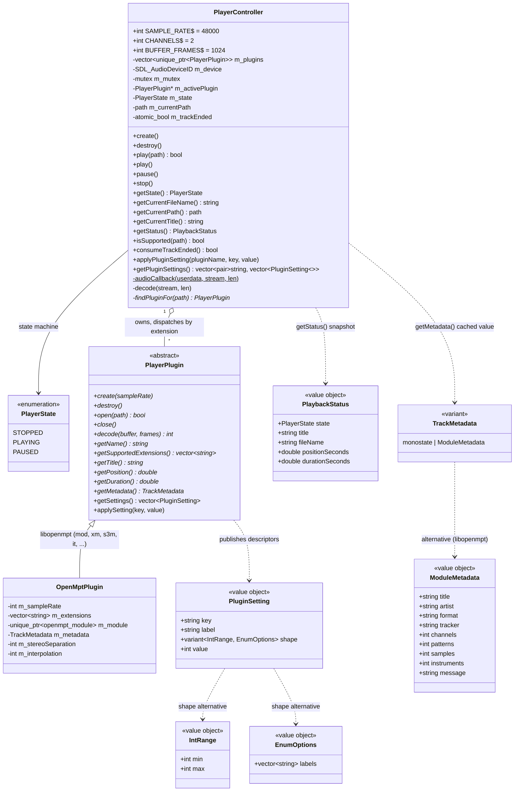

# Audio domain

Playback core in `src/player/`. `PlayerController` is the SDL boundary (audio device, threading); `PlayerPlugin` implementations wrap one decoder library each and are SDL-free.

## Threading

- The SDL audio thread pulls samples via `audioCallback` → `decode()` (48 kHz, float32 interleaved stereo, `AUDIO_F32SYS`).
- `m_mutex` guards `m_state` and `m_activePlugin` (including the decoder inside it); locked by the callback and by play/pause/stop/getters.
- `getStatus()` returns a `PlaybackStatus` (`src/player/PlaybackStatus.h`) snapshot — state, title, filename, position, duration — built under a **single** `m_mutex` lock (it inlines the reads rather than calling the re-locking getters, since `m_mutex` is non-recursive). The plugin virtuals `getPosition()`/`getDuration()` (seconds) read the shared decoder, so they are contractually **only** called under `m_mutex`. Position/duration are `0` when stopped or unknown.
- Pause is controller state only — the device runs for the whole app lifetime and the callback emits silence when not PLAYING.
- End of track: the audio thread flips state to STOPPED and sets `m_trackEnded` (atomic); the main loop consumes it once per frame (`consumeTrackEnded()`) to auto-advance. Track teardown (`close()`) never happens on the audio thread.
- `destroy()` closes the audio device before destroying plugins.
- **Plugin settings follow the same lock discipline as decode.** A plugin publishes tunables as `PluginSetting` descriptors (`src/player/PluginSetting.h`): a `key`/`label`, a current `int value`, and a `shape` variant — `IntRange` (→ slider) or `EnumOptions` (→ combo, `value` = index into `labels`). `getSettings()` returns plain **cached** members (no decoder access), while `applySetting(key, value)` may touch the *live* decoder, so it is called **only** through `PlayerController::applyPluginSetting(pluginName, key, value)`, which takes `m_mutex` (plugins are matched by `getName()`; no match = no-op). `getPluginSettings()` also locks and returns `(pluginName, descriptors)` per plugin for the UI. `OpenMptPlugin` exposes `stereo_separation` (`IntRange 0–200`, default 100 → `RENDER_STEREOSEPARATION_PERCENT`) and `interpolation` (`EnumOptions` Default/None/Linear/Cubic/Sinc → filter lengths 0/1/2/4/8 → `RENDER_INTERPOLATIONFILTER_LENGTH`); both are cached members, applied to the module in `open()` and immediately in `applySetting()`. **Values are clamped/normalized on store** (separation to 0–200, interpolation to a valid index) so a hand-edited INI can never feed `set_render_param` an out-of-range value — that call throws, and an unchecked value would otherwise make every subsequent `open()` fail. Persisted `[plugin.<name>]` values are pushed once at startup by `main.cpp` via `applyPluginSetting` (see [settings.md](settings.md)).
- **Metadata is captured once, not read per frame.** Each library exposes a different metadata shape, so it travels as `TrackMetadata` (`src/player/Metadata.h`) — a `std::variant<std::monostate, ModuleMetadata, ...>`, one struct per plugin family, `monostate` = no track. Reading the decoder every frame would contend with `decode()`, so a plugin's `getMetadata()` returns a value **cached during `open()`** and cleared to `monostate` in `close()`; it must never touch the decoder object. `PlayerController::getMetadata()` still locks `m_mutex` (to read `m_activePlugin` safely) and returns the plugin's cached value, or a default (`monostate`) when nothing is active. `Application` refetches only on track change (see [application.md](application.md)), so the lock is taken rarely, not per frame.

## Adding a decoder plugin

One class under `src/player/plugins/` implementing `PlayerPlugin`, one `emplace_back` in `PlayerController::create()` (registration order = dispatch priority on extension overlap), one CMake stanza. Planned: libgme, libsidplayfp, libsc68. A plugin with no tunables need not override `getSettings()`/`applySetting()` (safe defaults: `{}` / no-op); one that does override them gets persistence and settings UI for free via the `PluginSetting` descriptor mechanism.
