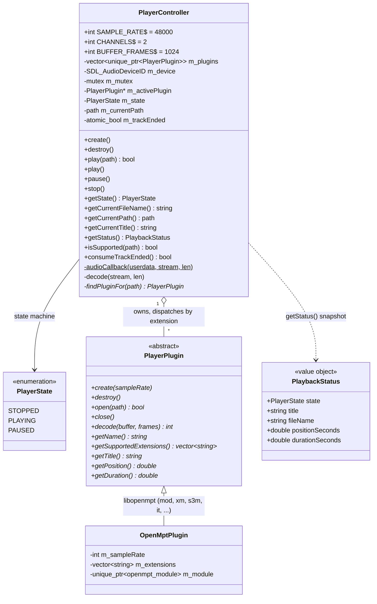

# Audio domain

Playback core in `src/player/`. `PlayerController` is the SDL boundary (audio device, threading); `PlayerPlugin` implementations wrap one decoder library each and are SDL-free.

## Threading

- The SDL audio thread pulls samples via `audioCallback` → `decode()` (48 kHz, float32 interleaved stereo, `AUDIO_F32SYS`).
- `m_mutex` guards `m_state` and `m_activePlugin` (including the decoder inside it); locked by the callback and by play/pause/stop/getters.
- `getStatus()` returns a `PlaybackStatus` (`src/player/PlaybackStatus.h`) snapshot — state, title, filename, position, duration — built under a **single** `m_mutex` lock (it inlines the reads rather than calling the re-locking getters, since `m_mutex` is non-recursive). The plugin virtuals `getPosition()`/`getDuration()` (seconds) read the shared decoder, so they are contractually **only** called under `m_mutex`. Position/duration are `0` when stopped or unknown.
- Pause is controller state only — the device runs for the whole app lifetime and the callback emits silence when not PLAYING.
- End of track: the audio thread flips state to STOPPED and sets `m_trackEnded` (atomic); the main loop consumes it once per frame (`consumeTrackEnded()`) to auto-advance. Track teardown (`close()`) never happens on the audio thread.
- `destroy()` closes the audio device before destroying plugins.

## Adding a decoder plugin

One class under `src/player/plugins/` implementing `PlayerPlugin`, one `emplace_back` in `PlayerController::create()` (registration order = dispatch priority on extension overlap), one CMake stanza. Planned: libgme, libsidplayfp, libsc68.
