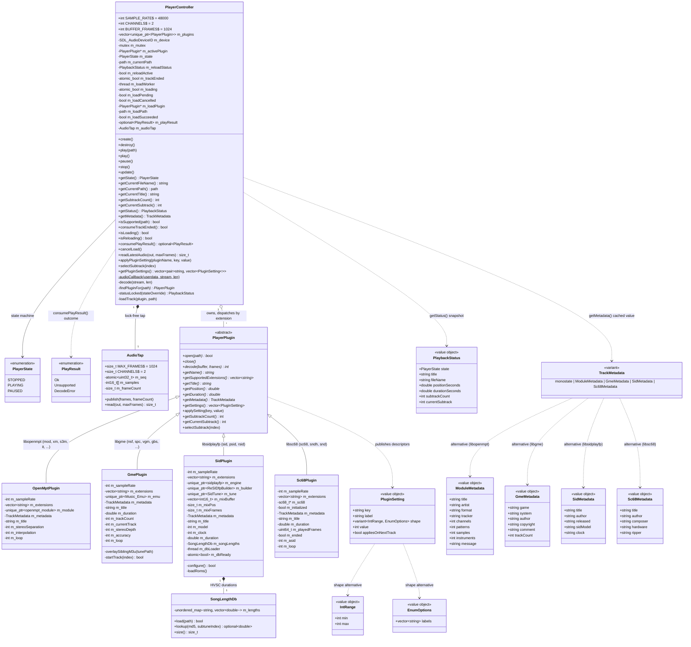

# Audio domain

Playback core in `src/player/`. `PlayerController` is the SDL boundary (audio device, threading, plugin dispatch); each `PlayerPlugin` implementation wraps one decoder library and is SDL-free. Free helpers — `toUtf8` (`Charset.{h,cpp}`) and the header-only `plugins/PluginUtil.h` — are deliberately absent from the class diagram.

## Audio format and threading

- The SDL audio device is pull-model: 48 kHz, signed-16-bit interleaved stereo (`AUDIO_S16SYS`), `BUFFER_FRAMES` = 1024. The SDL audio thread pulls samples via `audioCallback` → `decode()`. Plugins render **native int16** (`PlayerPlugin::decode(std::int16_t*, frames)`) — no format conversion on the audio path (libgme/libsidplayfp/libsc68 emit 16-bit natively; libopenmpt has an int16 render overload). The only int16→float conversion is in `AudioTap::read`, off the audio thread, for the visualization layer.
- `m_mutex` guards `m_state`, `m_currentPath` and `m_activePlugin` (including the decoder object inside it); it is taken by the audio callback and by play/pause/stop/getters. The plugin virtuals `getPosition()`/`getDuration()`/`applySetting()`/`selectSubtrack()` touch the audio-thread-shared decoder, so they are contractually called **only** under `m_mutex`.
- `getStatus()` returns a `PlaybackStatus` snapshot (state, title, filename, position, duration, subtrack counts) built under a **single** lock by the private `statusLocked(stateOverride)` (precondition: caller holds the non-recursive `m_mutex` and `m_activePlugin` is non-null). A `STOPPED` state zeroes position/duration per the "0 when stopped" contract; duration `0` also means unknown and renders open-ended (`--:--`) in the player bar.
- Pause is controller state only — the device runs for the whole app lifetime and the callback emits silence when not PLAYING (or when no plugin is active).
- End of track: a plugin returning fewer frames than requested makes the audio thread zero-pad the tail, flip `m_state` to STOPPED and set `m_trackEnded` (atomic); the main loop consumes it once per frame (`consumeTrackEnded()`) to auto-advance. Track teardown (`close()`) never happens on the audio thread.

## Async load

`plugin->open()` parses a whole module and can be slow, so it runs on a player-owned worker (`m_loadWorker`), never the UI thread. `play(path)` is `void` and asynchronous:

- It resolves the plugin (`findPluginFor`; a null match sets `m_playResult = Unsupported` **synchronously** — the only outcome not produced by the worker — and returns; callers gate on `isSupported`, so this is defensive).
- Under `m_mutex` it closes the current plugin, nulls `m_activePlugin`, and clears `m_trackEnded` (so a click landing as a track ends wins over auto-advance). This guarantees **the plugin being opened is never the one the audio thread decodes** — the callback outputs silence.
- It then joins any still-running previous load (closing an orphaned successfully-opened module so an interrupted load never leaks) and launches `loadTrack(plugin, path)`. `loadTrack` (worker) calls `plugin->open()` **off `m_mutex`** (safe: the plugin is inactive), stores the outcome in `m_loadSucceeded` under `m_mutex`, then clears the `m_loading` atomic **last** so `update()` only observes a fully-published result.
- `update()` (main thread, each frame) reaps a finished load: it joins the worker (a happens-before for `m_loadSucceeded`) and under `m_mutex` either swaps the plugin in (`m_activePlugin = m_loadPlugin`, PLAYING, `m_currentPath`) or `close()`s it (a failed `open()` may leave a half-parsed module), then publishes `m_playResult` (`Ok`/`DecodeError`). `Application` consumes it once via `consumePlayResult()` for its error/skip decision (see [application.md](application.md)).
- `isLoading()` tracks the main-thread `m_loadPending` (not the atomic) so the loading overlay holds through the swap-in frame with no one-frame flicker.
- `cancelLoad()` sets `m_loadCancelled`: the parse cannot be interrupted (it finishes in the background) but its result is dropped — `update()` closes the opened plugin, starts no playback, and produces **no** play result (a cancel never triggers auto-advance or an error popup). `stop()` applies the same drop to an in-flight load, so a Stop pressed mid-load is honoured instead of being overridden by the load swapping in.
- `destroy()` joins `m_loadWorker` **before** closing the device / destroying plugins, so no parse is ever in flight during teardown.

## Reload continuity

When `play(path)` replaces a track currently being presented (e.g. next/prev rolling past the last/first subsong into an adjacent file), the player bar must not flash to STOPPED/"No track" for the async-load window. `play(path)` detects the reload (`m_activePlugin != nullptr`, **or** `m_reloadActive` already set — so continuity survives chained advances while a load is in flight), snapshots the outgoing track's `PlaybackStatus` into `m_reloadStatus` (via `statusLocked`, stamped PLAYING so nothing is zeroed), sets `m_reloadActive`, and keeps `m_state`/`m_currentPath` (only the plugin is closed and nulled; PLAYING with a null plugin is fine — `decode()` checks both and outputs silence).

While `m_reloadActive` is set, `getStatus()` serves `m_reloadStatus`, so the bar keeps the outgoing title/highlight until `update()` swaps the replacement in. `isReloading()` exposes the window so `Application` gates its metadata refetch on `!isReloading()` — the outgoing plugin is already closed, so refetching then would blank the Metadata tab. `getSubtrackCount()`/`getCurrentSubtrack()` deliberately do **not** honor the snapshot (a subtrack step during a reload must not appear valid; the advance logic needs the real values). `m_reloadActive` is cleared on swap-in success; failure, cancel, and `stop()` all revert to a genuine STOPPED "No track". A first play from a stopped state keeps the immediate STOPPED teardown, since nothing is being presented. `Application` suppresses the loading overlay for boundary/auto advances (see [application.md](application.md)).

## Audio tap (visualization)

`m_audioTap` (`AudioTap.h`) is a single-producer / single-consumer **seqlock** publishing the most recently decoded block of interleaved-stereo int16 frames, independent of `m_mutex`. Producer: the audio thread calls `publish()` inside `decode()` after a successful decode — only the real `frames_written` frames, before end-of-track zero-padding rewrites the buffer tail — and never blocks or allocates. Consumer: the main thread calls `readLatestAudio()` → `AudioTap::read()`, which converts int16→normalized float, spins only on a torn read, and **never touches `m_mutex`**. The read's copy length is bounded by the compile-time capacity because `m_frameCount` can tear mid-write; the sequence check discards a torn snapshot after the copy. `static_assert`s in `PlayerController.cpp` pin `AudioTap::MAX_FRAMES`/`CHANNELS` to `PlayerController::BUFFER_FRAMES`/`CHANNELS` (kept as independent constants so `AudioTap.h` stays dependency-free). When not PLAYING nothing is published; the reader sees a stale block and the visualization layer decays to rest (see [visualization.md](visualization.md)).

## Plugin lifecycle and teardown ordering

Plugins are RAII: each takes the output sample rate as a constructor parameter and fully tears down (decoder object, worker threads, library shutdown) in its destructor — **destructors do their own teardown directly, never via the virtual `close()`**, so no destructor depends on dynamic dispatch mid-destruction. `PlayerController::create()` constructs them directly (`std::make_unique<XxxPlugin>(SAMPLE_RATE)`; registration order = dispatch priority on extension overlap) and opens the SDL device. `destroy()` joins the load worker, **closes the audio device first**, `close()`s each plugin, then `m_plugins.clear()` runs the destructors — so a destructor can never race `decode()`.

## Plugin settings

A plugin publishes tunables as `PluginSetting` descriptors (`PluginSetting.h`): `key`/`label`, a current `int value`, a `shape` variant — `IntRange` (slider) or `EnumOptions` (combo; `value` indexes `labels`) — and an `appliesOnNextTrack` flag that makes the settings popup show an "applies on next track" hint for deferred settings.

- `getSettings()` returns plain **cached** members (no decoder access). `applySetting(key, value)` may touch the live decoder, so it is called only through `PlayerController::applyPluginSetting(pluginName, key, value)`, which takes `m_mutex` (plugins matched by `getName()`; no match = no-op).
- Every plugin **clamps/normalizes values on store**, so a hand-edited INI can never feed a decoder an out-of-range value (libopenmpt's `set_render_param` throws on one, which would fail every subsequent `open()`).
- `getPluginSettings()` locks the audio mutex and returns `(pluginName, descriptors)` per plugin, so callers cache it off the per-frame path — `Application` holds the cached copy that rides in `UiState`.
- Persisted `[plugin.<name>]` INI values are pushed once at startup by `Platform::initPlayerAndSettings()` via `applyPluginSetting` (see [settings.md](settings.md)).

## Subtracks

Many chiptune formats pack several tunes into one file (GME especially). `PlayerPlugin` exposes three virtuals with single-track defaults: `getSubtrackCount()` (default 1) and `getCurrentSubtrack()` (default 0) are cached reads; `selectSubtrack(int)` (default no-op) touches the live decoder, so it is called only through `PlayerController::selectSubtrack(index)`, which takes `m_mutex`, sets `m_state = PLAYING` (a switch made after the previous subtrack ended must actually start), and clears `m_trackEnded` (a manual change must not be clobbered by auto-advance). `getStatus()` surfaces both counts through `PlaybackStatus` (1/0 when idle); the two lightweight locked getters expose the same values as the navigation-query API `Application::advance` uses to decide subtrack-step vs. file-advance (see [application.md](application.md)).

Only `GmePlugin` overrides them: `selectSubtrack` clamps to `[0, count)` and calls the private `startTrack(clamped)`, keeping the current track (and **not** resetting `m_emu`) on failure since the file is still valid.

## Metadata

- **Captured once, not read per frame.** Metadata travels as `TrackMetadata` (`Metadata.h`), a `std::variant<std::monostate, ModuleMetadata, GmeMetadata, SidMetadata, Sc68Metadata>` (`monostate` = no track; the Gui dispatches with `std::visit`, so adding a plugin forces the UI to handle its shape). A plugin's `getMetadata()` returns a value cached during `open()` and cleared to `monostate` in `close()`; it must never touch the decoder object. `PlayerController::getMetadata()` locks `m_mutex` only to read `m_activePlugin` safely; `Application` refetches only on track change, so the lock is taken rarely.
- **Transcoded to UTF-8 at the plugin boundary.** Dear ImGui renders only UTF-8, but the decoder libraries hand back each format's legacy charset, so every captured string is transcoded during `open()` — where the source charset is known — via the free function `toUtf8(std::string_view, Charset)` (`Charset.{h,cpp}`). Charsets: **GME = Shift-JIS** (NSF/GBS/… header fields; ASCII tags pass through unchanged), **SID = Latin-1** (PSID/STIL info strings), **SC68 = Latin-1** (Atari ST / Amiga tags; library-generated hardware strings are ASCII). **OpenMPT is left untouched** — libopenmpt already returns UTF-8. Only decoder-derived strings are transcoded: a title that falls back to `path.filename()` is already UTF-8. `toUtf8` is dependency-free and Switch-portable: Latin-1 is a per-byte expansion; Shift-JIS is a decoder loop (ASCII passthrough, halfwidth katakana `0xA1–0xDF`, double-byte lead bytes looked up by `std::lower_bound` in `ShiftJisTable.inc` — vendored sorted `{uint16 sjis, uint16 codepoint}` pairs generated by `scripts/gen_sjis.py` from Python's `shift_jis` codec). Malformed/truncated input never crashes or reads out of bounds: undecodable bytes become U+FFFD.

## Adding a decoder plugin

One class under `src/player/plugins/` implementing `PlayerPlugin` — an `explicit XxxPlugin(int sampleRate)` constructor does all setup, the destructor fully tears down — one `emplace_back(std::make_unique<XxxPlugin>(SAMPLE_RATE))` in `PlayerController::create()`, one CMake stanza. A plugin with no tunables need not override `getSettings()`/`applySetting()`; one that does gets persistence and settings UI for free. The header-only `plugins/PluginUtil.h` (no CMake entry) carries the shared player-domain helpers: `toString(const char*)` for possibly-null decoder strings, `asciiToLower` for extension/filename matching, `readFileBytes` for the read-whole-file-then-parse pattern (nullopt when the file can't open; it deliberately does **not** catch — each caller keeps its own must-not-throw try block and `SDL_Log` prefix) — plus the `short`/`int16_t` equivalence `static_assert` the native-int16 hand-through relies on. `open()` must not throw: file reads into memory can `bad_alloc` on the Switch's constrained RAM, so each plugin catches and returns false.

## Shipped plugins

**OpenMptPlugin (libopenmpt)** — tracker formats; extensions from `openmpt::get_supported_extensions()`. Settings: `stereo_separation` (`IntRange` 0–200, default 100 → `RENDER_STEREOSEPARATION_PERCENT`), `interpolation` (`EnumOptions` Default/None/Linear/Cubic/Sinc → filter lengths 0/1/2/4/8), `loop` (`EnumOptions` Off/On → `set_repeat_count`; On → `-1` so the module loops forever and never signals end-of-track — a seamless decoder-native loop, no app-level re-play). All three are cached members applied in `open()` and **live** in `applySetting()` (unlike the GME/sc68 loops, which are deferred).

**GmePlugin (libgme)** — `ay, gbs, gym, hes, kss, nsf, nsfe, sap, spc, vgm, vgz`; `gme_play` renders interleaved-stereo 16-bit straight into the output buffer. Settings: `stereo_depth` (`IntRange` 0–100 → `gme_set_stereo_depth`, live), `accuracy` (`EnumOptions` Fast/Accurate → `gme_enable_accuracy`, live), `loop` (`EnumOptions` Off/On, `appliesOnNextTrack` — consumed at the next `startTrack()`).

- `startTrack(index)` is the shared per-track init: `gme_set_autoload_playback_limit` (loop off → on: SPC is the only self-limiting format), `gme_start_track`, **re-apply** the cached stereo depth (start_track can reset per-track effects), `gme_track_info`, rebuild the cached title/duration/metadata (game/system/author/copyright/comment are file-level; song and length are per-track), set `m_currentTrack`.
- **Duration is a real length only:** `gme_info_t.length` (explicit NSFe/`.m3u` time), else `intro_length + loop_length`, else `0` = unknown. libgme's `play_length` is deliberately ignored — for a bare NSF header it is a built-in 150000 ms default that would fake a constant 2:30 on every subsong.
- **End-of-track for auto-advance:** most GME formats never self-limit, so with loop off `startTrack` calls `gme_set_fade_msecs`, fading out at the track's length (or 150000 ms when unknown; fade duration = length/10 clamped to 500…8000 ms) so the track ends and playback advances. With loop on, no fade is set and SPC's limit is disabled: the tune repeats forever.
- **Sibling `.m3u` overlay:** right after `gme_open_data`, the private `overlaySiblingM3u(tunePath)` overlays a companion playlist (the "NSF M3U" convention) carrying curated per-subtrack titles and lengths. Local-only and strictly best-effort — a missing/malformed playlist is logged and ignored, never a reason to fail the open. Two layouts: (1) a combined `<stem>.m3u` next to the tune → `gme_load_m3u`; else (2) the exploded layout (common Zophar dumps) — several per-track `.m3u` files in the tune's directory, each referencing the tune by filename (`TUNE.gbs::GBS,<track>,<title>,<time>,…`) — whose referencing lines are gathered, ordered by source `.m3u` filename to recover album order, and handed to `gme_load_m3u_data`. Either way libgme then reports the curated playlist as the subtrack list, so `gme_track_count` and the `startTrack` caches pick up the curated titles and real durations. It must run before `m_trackCount` is read, since a loaded playlist redefines `gme_track_count`.

**SidPlugin (libsidplayfp v3)** — `sid, psid, rsid`. Drives the `sidplayfp` engine with a `ReSIDfpBuilder` (requires the `libresidfp` companion library on both platforms — see [build-portlibs.md](build-portlibs.md)).

- **Optional C64 ROMs:** the constructor loads `romfs/roms/{kernal-901227-03,basic-901226-01,chargen-901225-01}.bin` if present and hands them to `setRoms()` (each skipped on absence or size mismatch; `setRoms` copies, so the buffers are transient). PSID tunes play with no ROMs; RSID tunes that boot like a real C64 need at least the KERNAL. The ROMs are copyrighted Commodore firmware — `.gitignore`d, only baked into the `.nro` if the user supplies them.
- **Decode:** the v3 API is a two-step `play(cycles)` → `mix(short*, samples)` yielding a variable number of interleaved-stereo samples per call, so `decode()` runs the emulation in fixed cycle slices and buffers the surplus in `m_mixBuffer` (`m_mixPos`/`m_mixFrames`), draining it before emulating more. The scratch is sized once in `open()` (`getBufSize`) so the audio thread never allocates.
- **Duration from the HVSC Songlengths database:** SID tunes carry no intrinsic length and loop indefinitely (no `loop` setting), so `open()` computes the tune's MD5 (`SidTune::createMD5New()`, whose 32-hex output matches the DB keys) and caches the current subtune's time in `m_duration`; `0` = open-ended when the DB is absent or the tune isn't listed. `SongLengthDb` (`SongLengthDb.{h,cpp}`) parses `Songlengths.md5` — `<md5>=<M:SS[.mmm]> …` per-subtune times (fractional part = milliseconds) — into an `unordered_map<md5, vector<seconds>>`, skipping blank/`[Database]`/`;` comment lines and malformed tokens; a missing file is a normal non-error condition.
- **DB loader thread:** the ~5 MB file is slow enough on the Switch to visibly stall a decode, so it is loaded once on a **background thread started in the constructor** (last constructor step, so no later step can throw past a joinable thread), from `assetPath("sidlength/Songlengths.md5")` — a bundled `romfs/` asset (freely redistributable per HVSC terms — see `romfs/sidlength/README.md`). `m_dbReady` (release/acquire) publishes the finished map and `open()` reads it only once set, so the loader and the load worker never touch it concurrently. The destructor joins the loader. A tune opened before the load finishes just shows an open-ended duration.
- The lookup uses the **default subtune only** (`selectSong(0)` → `info->currentSong()`, 1-based, indexed as `currentSong()-1`); per-subtune selection is a deliberate future extension.
- Settings: `sid_model` (`EnumOptions` Auto/MOS 6581/MOS 8580) and `clock` (`EnumOptions` Auto/PAL/NTSC), both `appliesOnNextTrack` — applied on the next `open()` (a live change would restart the tune), clamped on store.

**Sc68Plugin (libsc68)** — `sc68, sndh, snd` (Atari ST YM-2149/STE and Amiga Paula formats, SNDH archives). Needs no external ROMs.

- The constructor runs the global `sc68_init()` (a single init flag, guarded by `m_initialized` so the destructor pairs exactly one `sc68_shutdown()` with a successful init; a failure leaves `m_sc68` null and every `open()` fails defensively), creates the instance at the output sample rate, and forces `SC68_SET_PCM`/`SC68_PCM_S16` so `sc68_process()` writes interleaved signed-16-bit stereo straight into `decode()`'s buffer — no conversion.
- `open()` reads the whole file into memory for `sc68_load_mem()`, sets the aSIDifier mode, then `sc68_play(SC68_DEF_TRACK, m_loop ? SC68_INF_LOOP : SC68_DEF_LOOP)` starts the disk's **default track** (per-subtune selection is a future extension).
- `decode()` runs a **fill loop** over `sc68_process()`: `sc68_play()` only *posts* the track change, which `sc68_process()` applies lazily on its first call — reporting `SC68_CHANGE` with zero frames before emulating a sample — so a single call can fall short without the track ending. The loop keeps calling until the buffer is full or the track truly ends, latches `m_ended` on `SC68_END` or `SC68_ERROR` (tested with `==`, since `SC68_ERROR == ~0` would otherwise match the normal status bits), and carries a consecutive-empty-pass guard so a persistent `SC68_IDLE` can never spin the audio thread under `m_mutex`.
- `getPosition()` derives from an accumulated decoded-frame counter (sc68 has no cheap position query); `getDuration()` is `sc68_music_info`'s `time_ms` (track time, falling back to disk time). Metadata (`Sc68Metadata`) is copied out of the disk info during `open()` — those pointers are only valid until `sc68_close()`: title (falling back to album), author, composer (case-insensitive `composer` tag scanned from the track then disk tag arrays), hardware name, ripper.
- Settings, both `appliesOnNextTrack` and clamped on store: `asid` (`EnumOptions` Off/On/Force → `SC68_SET_ASID`, the aSIDifier reshaping YM/ST output toward a SID-like waveform; consumed by `sc68_play()`, so a live change would need a track restart; a no-op on tracks without aSID caps) and `loop` (`EnumOptions` Off/On; the loop count is fixed by the `sc68_play()` argument — `SC68_CUR_TRACK` is a getter, so it can't change live).
- **Switch note:** libsc68 references a plain `basename` symbol that devkitA64's newlib declares but does not provide, so the Switch build compiles `src/player/plugins/switch_compat.c` (a minimal C-linkage `basename`, deliberately including no libc string headers whose asm aliases would rename the symbol); the desktop libc already provides it.
