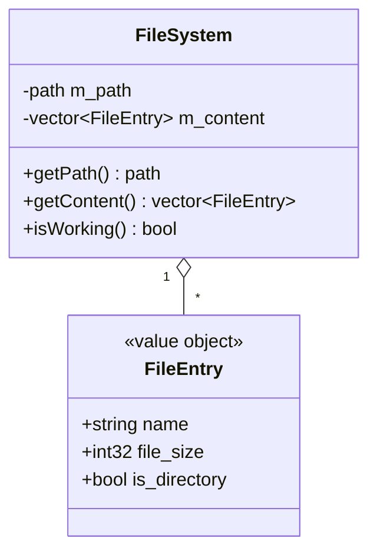

# Filesystem domain

Directory browsing in `src/filesystem/`. Supplies the file list rendered by the UI and the sibling list used for next/previous track navigation in main.cpp.

## Notes

- Currently returns hardcoded placeholder entries and a fake path; `isWorking()` (meant to signal an in-progress directory scan, shown as a loading overlay by the UI) always returns false. Real directory traversal is still to be implemented.
- `FileEntry.file_size` is displayed in Kb by the file browser.
