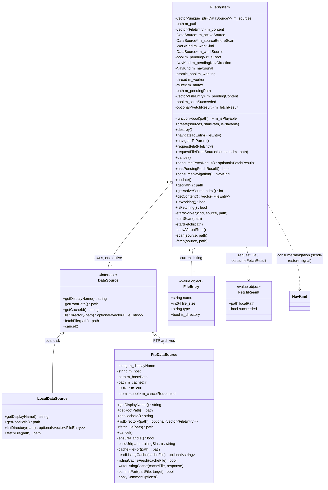

# Filesystem domain

Directory browsing in `src/filesystem/`. Supplies the file list rendered by the UI and
resolves a chosen entry to a locally-openable file for `PlayerController::play()`.
Directory scans and file downloads run on a worker thread so the UI never blocks; the
browser shows an overlay while work is in flight.

Browsing is **source-based**: a `DataSource` abstracts one place to browse — local disk
(`LocalDataSource`) and FTP archives (`FtpDataSource`, libcurl; built-in instance: Modland).
`FileSystem` owns the sources, the worker thread, and the current listing. A synthetic
**virtual root** lists the sources themselves as folders. Beyond the built-in Modland
instance, additional `FtpDataSource` instances are registered from user-defined
`[source.NAME]` INI sections (host + optional base path) — see [settings.md](settings.md).

## FileEntry

`name`, `file_size` (bytes; the Gui formats B/KB/MB), `type` (uppercase extension without
the dot — `"S3M"` — or `"Folder"`, or `"Source"` for virtual-root entries; empty when a
source hands entries over pre-derivation), `is_directory`. A bare aggregate. `".."` is
**not** an entry — the Gui pins it on top of the listing, and **hides it at the virtual
root** (sources list), where `navigateToParent()` would be a no-op (the Gui gates the row
on `UiState::isAtRoot`, set from `getPath().empty()`).

## DataSource

Header-only domain interface (`DataSource.h`). One implementation per browsable place:

- `getDisplayName()` — `"Local files"`, `"Modland (FTP)"`, or a user-defined source name.
- `getRootPath()` — top of the source; `".."` here exits to the virtual root.
- `getCacheId()` — the source's on-disk cache subdirectory name (the component under the
  cache root); empty when the source has no cache (local disk). `Platform::buildDataSources`
  seeds its "taken cache dirs" set from the built-in sources' ids so a user `[source.*]`
  can't collide with them.
- `listDirectory(path)` — **blocking**; raw entries (name, byte size, `is_directory`) of one
  directory, hidden entries skipped, no filtering/sorting (FileSystem applies `isPlayable`,
  derives `type`, sorts). `nullopt` = hard failure (already `SDL_Log`ged) → FileSystem keeps
  the current listing.
- `fetchFile(path)` — **blocking**; resolves a source path to a locally-openable file.
  `LocalDataSource` returns the path itself; remote sources download to cache and return the
  cache path. Empty path = failure.
- `cancel()` — requests that an in-flight `listDirectory`/`fetchFile` abort ASAP. Called from
  the **main thread** and may run concurrently with a blocking call on the worker, so
  implementations must be thread-safe (an atomic flag). Default: no-op — `LocalDataSource`
  is instant and has nothing to cancel.

`LocalDataSource` scans with `directory_iterator(path, skip_permission_denied, ec)` using the
`error_code` overloads throughout, returns what was readable on error (never `nullopt`), and
skips dot-prefixed entries. `getRootPath()` is `"/"` on both platforms — on the Switch, sdmc is
libnx's default device, so `"/"` resolves to the SD card and decomposes like any POSIX path
(the `"sdmc:"` device prefix would confuse `parent_path()` and break upward navigation).

**Serialization contract**: FileSystem guarantees at most one `DataSource` call is in flight
at any time (on the worker), so sources need no internal locking.

## FtpDataSource

Browses a remote archive over anonymous FTP via **libcurl**. The built-in instance is Modland
(`ftp.modland.com/pub/modules`, `<format>/<artist>/<file>`), registered at the virtual root as
`"Modland (FTP)"`; `getRootPath()` is the base path (`/pub/modules`). Constructed with
`(displayName, host, basePath, cacheDir)` — user-defined `[source.NAME]` sections build extra
instances the same way.

- **One reusable `CURL*` easy handle**, created lazily on first use (`ensureHandle`) and
  cleaned up in the destructor — FTP control-connection reuse keeps navigation snappy. Safe
  without locking thanks to the serialization contract above. Each call does `curl_easy_reset`
  then re-applies the common options (`applyCommonOptions`, named constants): `CURLOPT_NOSIGNAL`,
  `CONNECTTIMEOUT=10`, and `LOW_SPEED_LIMIT=1` / `LOW_SPEED_TIME=15` for stall detection instead
  of a total timeout — 15 s of sub-1 B/s transfer aborts a dead connection without killing
  slow-but-live links (fetches/scans are UI-modal, so a dead connection must not freeze the app
  for long). `<curl/curl.h>` stays out of the header (`typedef void CURL;` mirror); it is
  included only in the `.cpp`.
- **Cancellation**: `cancel()` sets a `mutable std::atomic<bool> m_cancelRequested`; a
  `CURLOPT_XFERINFOFUNCTION` progress callback (armed via `NOPROGRESS=0`, its `XFERINFODATA` is
  the flag's address) polls it during `perform` and returns non-zero to abort →
  `CURLE_ABORTED_BY_CALLBACK`. The flag is reset to false at the start of every
  `listDirectory`/`fetchFile` so a stale cancel never carries into the next call. A cancelled
  **download** deletes its `.part` and reports failure; a cancelled **scan** returns `nullopt`
  (stays put) — unlike a genuine transfer failure, it does *not* fall back to the stale listing
  cache, so cancelling doesn't drop the user into the folder with old data. `cancel()` only
  aborts a transfer already in progress; during synchronous DNS/connect curl may not poll the
  callback, so a cancel there waits out `CONNECTTIMEOUT` (≤ 10 s).
- **URL building** (`buildUrl`): `ftp://<host>` + each path component percent-escaped with
  `curl_easy_escape` and joined by `/` — Modland names contain spaces (`Fasttracker 2` →
  `Fasttracker%202`); MLSD directory URLs get a trailing `/`.
- **listDirectory (MLSD first, then LIST)**: tries `CURLOPT_CUSTOMREQUEST "MLSD"`, response
  accumulated via a write callback. `parseMlsdListing` splits it per line — each is
  `fact1=val1;fact2=val2; name`, the name everything after the first space, facts split on `;`.
  `type=` → `dir`/`file` (`cdir`/`pdir` self/parent refs are skipped), `size=` → bytes (files
  only; dirs report `sizd` and list as size 0). Malformed line → `SDL_Log` + skip. If MLSD
  fails, what happens next depends on *how* it failed:
  - **User cancel** (`CURLE_ABORTED_BY_CALLBACK`) → `nullopt`, no fallback of any kind.
  - **Connection failure** (`isConnectionFailure`: DNS/connect/timeout) → skip straight to the
    stale-cache fallback; retrying with LIST would burn the connect/stall timeout a second time
    and double the UI freeze.
  - **Command rejected** (server lacks MLSD — Modland always speaks it, but arbitrary user
    servers may not): the control connection is alive, so it retries a plain LIST on the same
    directory URL (no `CUSTOMREQUEST`). `parseListListing` parses the classic Unix `ls -l`
    output via `parseListLine` (9-field layout `perms links owner group size month day
    time/year name`; only the leading type char and the size field are load-bearing; symlinks
    `type == 'l'` drop their `" -> target"` and count as files; `.`/`..` and any line whose
    type char is not `d`/`-`/`l` — e.g. the `total N` header — are skipped).

  **LIST responses are NOT cached**: the `.listing` cache only ever holds raw MLSD text (the
  cache-hit path re-parses it with `parseMlsdListing`), so caching LIST text there would corrupt
  cache-hit parsing.
- **Directory-listing cache (30-min TTL, `kListingCacheTtl`)**: each directory's raw MLSD
  response is cached to `<mirrored dir>/.listing` (dot-prefixed, so it coexists with downloaded
  module files and never collides with a real name; server-sourced listings never surface it).
  `listDirectory` reads the cache once up front (`readListingCache`), and if it exists and its
  mtime is within the TTL (`listingCacheFresh`) it parses and returns it **without any network
  call** — snappy re-browsing, and recently-visited directories work offline. Otherwise it
  fetches online; on `CURLE_OK` it writes the cache (best-effort `.part` → rename via
  `commitPart`, refreshing the mtime) and parses. If the fetch fails (but is not a user cancel)
  or no handle could be created, it **falls back to the stale cached listing** if one exists
  (logged), serving slightly-old contents rather than stalling; only with no cache at all does
  it return `nullopt` (FileSystem keeps the current listing / stays put). `readListingCache`
  reads exactly `file_size` bytes and rejects a short read, so a truncated cache is never served.
- **fetchFile (download-to-cache)**: the cache path mirrors the remote layout under `m_cacheDir`
  (`cacheFileFor`: each non-root path component appended, so `/pub/modules/AHX/x.ahx` →
  `cache/modland/pub/modules/AHX/x.ahx`). This preserves the extension (plugin selection) and
  the `filename()` (the player's adjacent-track cursor matches on it). A non-empty existing file
  is a cache hit (`file_size` via the `error_code` overload, `!ec && size > 0` — `!ec` also
  covers absence). Otherwise it `create_directories(parent)`, downloads via
  `CURLOPT_WRITEFUNCTION` into a sibling `<file>.part` `std::ofstream`, and on `CURLE_OK`
  **and** a clean `close()` flush renames it into place; any failure (transfer error,
  write/flush error, rename error) removes the `.part`, `SDL_Log`s, and returns an empty path.
  Staging via `.part` + rename keeps the cache from ever holding a truncated file.
- **Cache-path sanitization** (`sanitizeCachePathComponent`, a free function in
  `FtpDataSource.h`, applied per component in `cacheFileFor` — so it covers both downloads and
  the `.listing` cache): FAT-illegal characters (`\ / : * ? " < > |`) and controls (`< 0x20`)
  map to `_` so the mirror is writable on the Switch's FAT SD card; the literal `.`/`..`
  components map to `_`/`__` so a hostile or broken server can't escape the cache dir via
  traversal. Applied identically on both platforms; `Platform::buildDataSources` reuses it to
  derive per-source cache subdirs, so both layouts sanitize identically. Only the local mirror
  is sanitized — `buildUrl` keeps the real (percent-escaped) names for the FTP request.

**curl lifecycle ownership**: `Platform` owns the *global* state — `Platform::initNetwork` runs
`curl_global_init` before `FileSystem::create()` spawns the worker (it is not thread-safe),
paired with `curl_global_cleanup` in `Platform::destroy()`; on the Switch
`socketInitializeDefault()` brackets it first and `socketExit()` last. Each `FtpDataSource`
owns its *easy* handle. `FileSystem::destroy()` releases its sources (running
`curl_easy_cleanup`) right after joining the worker — not at static destruction, which would
run after curl/socket are already torn down.

## Threading

Scans and fetches run on `m_worker`; `PlayerController`'s SDL audio thread is separate. Same
style as the audio domain (atomic flag + mutex-guarded handoff, swap on the main thread).

| Data | Protection |
|---|---|
| `m_path`, `m_content` (refs handed to the Gui) | main thread only, mutated **outside the draw** — `update()` swap (scan result or deferred virtual root), or the synchronous virtual-root build in `create()` |
| `m_pendingPath`, `m_pendingContent`, `m_scanSucceeded` | `m_mutex` (worker writes, `update()` reads/swaps) |
| `m_fetchResult` | `m_mutex` (worker writes in `fetch()`; `consumeFetchResult()` / `hasPendingFetchResult()` read on the main thread) |
| `m_working` | `std::atomic_bool` (worker clears; Gui overlay + navigate/request guards read) |
| `m_worker` | main thread only (launch in `startWorker`, join in `update`/`destroy`) |
| `m_sources`, `m_isPlayable` | immutable after `create()` until `destroy()` releases the sources (worker already joined); `m_isPlayable` is called on the worker: `PlayerController::isSupported` reads only immutable plugin extension lists |
| `m_activeSource`, `m_sourceBeforeScan`, `m_workKind`, `m_workSource` | main thread only, mutated while the worker is idle; the worker uses the source pointer captured at launch. `m_workKind`/`m_workSource` are set at each worker start and cleared in `update()` (and `destroy()`); `m_workSource` is read by `cancel()` |
| `m_pendingVirtualRoot` | main thread only — set by `navigateToParent()` (mid-draw), applied and cleared by `update()` |
| `m_pendingNavDirection`, `m_navSignal` | main thread only (never shared with the worker) |

- **Worker lifecycle**: every launch goes through the shared `startWorker(kind, source, path)` —
  join any finished-but-unswapped worker, set `m_workKind`/`m_workSource`, set `m_working = true`,
  spawn `scan`/`fetch` with the source captured by value. `startScan(path)` runs it with
  `m_activeSource` and `WorkKind::Scan`. `scan` calls `listDirectory`, drops files failing
  `m_isPlayable`, derives `type`, sorts (directories first, then files, case-insensitive by
  name), writes `m_pending*` under the mutex, and stores `m_working = false` **last**.
  `update()` detects the finished edge (`m_worker.joinable() && !m_working`), `join()`s (which
  establishes happens-before for the pending writes), then swaps success into
  `m_path`/`m_content` or, on `nullopt`, restores `m_activeSource` from `m_sourceBeforeScan`
  and keeps the current listing. `destroy()` joins the worker, then releases the sources (so
  `FtpDataSource`'s `curl_easy_cleanup` runs while curl is still initialized) —
  **`Platform::destroy()` calls `m_fileSystem.destroy()` before `m_player.destroy()`** because
  the worker's predicate calls into `PlayerController`, and before `curl_global_cleanup()`.
- **Fetch lifecycle**: `requestFile` launches `startFetch(path)` — the same `startWorker` launch
  as `startScan`, tagged `WorkKind::Fetch`. The worker runs `fetch(source, path)`
  (`source->fetchFile`, store `m_fetchResult` under the mutex, `m_working = false` **last**).
  `update()` joins the finished worker and, only for a `Scan`, swaps the listing; a `Fetch`
  leaves its result parked for `consumeFetchResult()`. The single worker is sufficient because
  all FileSystem work is UI-modal — a listing and a download never need to overlap.
  `hasPendingFetchResult()` reports (under `m_mutex`) whether a finished fetch's result is still
  parked unconsumed; because the worker parks the result **before** clearing `m_working`,
  whenever `isWorking()` reads false during the hand-off the parked result is already visible —
  the UI uses this to keep the "Downloading..." overlay up across the fetch → decode gap frame,
  race-free (see [application.md](application.md)).
- **Cancellation**: `FileSystem::cancel()` (main thread) forwards to `m_workSource->cancel()`
  while `m_working` — `m_workSource` is the source captured at worker start, which for a
  playlist-replay fetch (`requestFileFromSource`) can differ from the browsed `m_activeSource`.
  The worker then finishes normally (its aborted transfer surfaces as `nullopt` / empty path)
  and `update()` swaps as usual. The Gui overlay's Cancel button drives this via
  `UiActions::onCancelWork` → `Application::handleCancelWork`, which also drops the
  auto-advance intent so a cancelled download doesn't chain into the next sibling (see
  [application.md](application.md)).
- **Navigation** (`navigateToEntry`/`navigateToParent`) and `requestFile` are ignored while a
  scan or fetch runs (the UI is blocked by the overlay anyway). Root detection compares
  `m_path == m_activeSource->getRootPath()` (not `parent_path()`, since `parent_path()` of a
  root like `"/"` returns itself); reaching the root defers the virtual-root transition to
  `update()` via `m_pendingVirtualRoot` (see **Virtual root**) rather than mutating `m_content`
  from inside the drawing callback.

## Virtual root

`m_activeSource == nullptr` means "at the sources list": `getPath()` is empty and `m_content`
holds one `FileEntry{displayName, 0, "Source", true}` per source, built by `showVirtualRoot()`.
`navigateToParent()` from a source root transitions here; entering a source entry activates it
and scans its `getRootPath()`. `create()` activates `sources[0]` (the startup source) and scans
it at the given start path; with no sources it shows the virtual root directly.

`getActiveSourceIndex()` (main-thread only, like `getPath()`) returns the index of
`m_activeSource` within the source list — a linear find — or `-1` at the virtual root. It
identifies the source that produced the current listing so the playlist can capture an entry's
full identity (source + source-relative path) at add-time; replay resolves the stored index
back to a `DataSource` (see [playlist.md](playlist.md)).

`showVirtualRoot()` mutates `m_content` synchronously, so it must never run **during a draw** —
`UiState::files` is a reference to `m_content`, and the Gui fires navigation callbacks mid-frame
while its list clipper is iterating that vector; clearing it in place would shrink the vector
under the clipper and index out of bounds. It is therefore only ever called at two safe points,
both outside a draw: `create()` (before the first frame), and `update()` (between frames).
`navigateToParent()` reaching a source root sets `m_pendingVirtualRoot`, and the next `update()`
performs the transition (clear `m_activeSource`, rebuild the list) — the same defer-to-update
rule scans follow: no listing change ever happens while the Gui draws.

Before rebuilding, that `update()` branch **joins and discards any finished-but-unswapped
worker**: a scan can clear `m_working` after a frame's `makeUiState()` snapshot, re-enabling the
browser for one frame so `".."` is clickable with a stale listing still on screen — draining it
here stops a later `update()` from swapping that listing back over the just-built virtual root.

## Fetch flow

`requestFile(entry)` runs `m_activeSource->fetchFile(m_path / entry.name)` on the worker (via
`startFetch`, the same single worker used for scans — see **Fetch lifecycle** above).
`Application::update()` polls `consumeFetchResult()` (consume-once, same pattern as
`PlayerController::consumeTrackEnded()`) and plays the resolved local path; on a failed fetch
during auto-advance it retries the next sibling. Fetching on the worker gives one uniform path
for every source — the spinner overlay covers remote downloads and instant local resolution
alike, guarded by `m_working` like scans. `isFetching()` distinguishes the overlay label
("Downloading..." vs "Scanning..."); it is only meaningful while `isWorking()` is true.

**`requestFileFromSource(sourceIndex, path)` — playlist replay**: fetches a file addressed by
`(source index, source-relative path)` rather than by a `FileEntry` from the *active* listing.
It guards on `m_working` and bounds-checks `sourceIndex`, then launches the same `fetch(...)`
worker as `startFetch` — but crucially it does **not** touch `m_activeSource` or `m_path`. A
playlist entry may live in a different source (or a different directory) than the one currently
browsed, so replay must leave the browser listing exactly where it is; the resulting
`FetchResult` flows through the unchanged `consumeFetchResult()` path. Cancellation works here
like everywhere else: `cancel()` targets `m_workSource` (captured at worker start), so a
playlist fetch from a *non-active* remote source aborts mid-transfer just like a
browser-initiated download.

## Navigation direction signal

`FileSystem` emits a **one-frame descend/ascend signal** (`NavKind`, defined in `NavKind.h`) so
the Gui can restore the browser's scroll position across navigation (open a directory at the
top; restore the parent's offset on `..` — see [ui.md](ui.md)). Because navigation is
asynchronous — a click only *starts* a worker scan and the listing swaps in later — the
direction is recorded at the navigate call (`m_pendingNavDirection`: `Descend` before each
`startScan` in `navigateToEntry`, `Ascend` in `navigateToParent`, including its deferred
virtual-root branch) but **emitted only when the listing actually swaps in**. `update()`
promotes `m_pendingNavDirection` into `m_navSignal` on a successful scan swap or the
virtual-root transition, and **discards it with no signal on a failed scan** (so the Gui's
scroll stack stays balanced with real navigation). Fetch completions never set the pending
direction, so they emit nothing. `Application::update()` reads it once per frame via
`consumeNavigation()` (consume-and-clear, like `consumeFetchResult()`) and surfaces it on
`UiState::navKind`. `m_pendingNavDirection`/`m_navSignal` are main-thread-only (not shared with
the worker), so they need no locking.

## UI seam

Navigation is driven by the Gui through `UiActions::onDirectoryClick` →
`Application::handleDirectoryClick` → `navigateToEntry`/`navigateToParent`. The browser shows
`FileEntry.type` in a Type column and formats `file_size` as B/KB/MB; while `isWorking()` it
dims the listing (`BeginDisabled`) under an ASCII spinner overlay. See [ui.md](ui.md).
