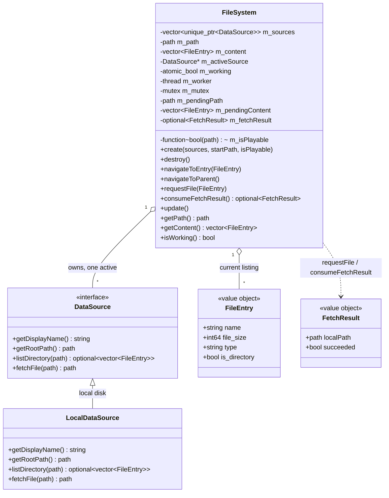

# Filesystem domain

Directory browsing in `src/filesystem/`. Supplies the file list rendered by the UI and
resolves a chosen entry to a locally-openable file for `PlayerController::play()`.
Directory scans run on a worker thread so the UI never blocks; the browser shows an
overlay while a scan is in flight.

Browsing is **source-based**: a `DataSource` abstracts one place to browse (local disk
now; Modland FTP in TODO_7). `FileSystem` owns the sources, the worker thread, and the
current listing. A synthetic **virtual root** lists the sources themselves as folders.

## FileEntry

`name`, `file_size` (bytes; the Gui formats B/KB/MB), `type` (uppercase extension without
the dot — `"S3M"` — or `"Folder"`, or `"Source"` for virtual-root entries), `is_directory`.
A bare aggregate. `".."` is **not** an entry — the Gui pins it on top of the listing.

## DataSource

Header-only domain interface (`DataSource.h`). One implementation per browsable place:

- `getDisplayName()` — `"Local files"` (TODO_7: `"Modland (FTP)"`).
- `getRootPath()` — top of the source; `".."` here exits to the virtual root.
- `listDirectory(path)` — **blocking**; raw entries (name, byte size, `is_directory`) of one
  directory, hidden entries skipped, no filtering/sorting (FileSystem applies `isPlayable`,
  derives `type`, sorts). `nullopt` = hard failure (already `SDL_Log`ged) → FileSystem keeps
  the current listing.
- `fetchFile(path)` — **blocking**; resolves a source path to a locally-openable file.
  `LocalDataSource` returns the path itself; remote sources download to cache and return the
  cache path. Empty path = failure.

`LocalDataSource` scans with `directory_iterator(path, skip_permission_denied, ec)` using the
`error_code` overloads throughout, returns what was readable on error (never `nullopt`), and
skips dot-prefixed entries. `getRootPath()` is `"/"` on desktop, `"sdmc:/"` under `__SWITCH__`.

**Serialization contract**: FileSystem guarantees at most one `DataSource` call is in flight
at any time (on the worker, or the TODO_4 inline `fetchFile` on the main thread while no
worker runs), so sources need no internal locking.

## Threading

Directory scans run on `m_worker`; `PlayerController`'s SDL audio thread is separate. Same
style as the audio domain (atomic flag + mutex-guarded handoff, swap on the main thread).

| Data | Protection |
|---|---|
| `m_path`, `m_content` (refs handed to the Gui) | main thread only — `update()` swap, or the synchronous virtual-root build while `!m_working` |
| `m_pendingPath`, `m_pendingContent`, `m_scanSucceeded` | `m_mutex` (worker writes, `update()` reads/swaps) |
| `m_working` | `std::atomic_bool` (worker clears; Gui overlay + navigate/request guards read) |
| `m_worker` | main thread only (launch in `startScan`, join in `update`/`destroy`) |
| `m_sources`, `m_isPlayable` | immutable after `create()` (`m_isPlayable` is called on the worker: `PlayerController::isSupported` reads only immutable plugin extension lists) |
| `m_activeSource`, `m_sourceBeforeScan` | main thread only, mutated while the worker is idle; the worker uses the source pointer captured at launch |
| `m_fetchResult` | `m_mutex` (TODO_4: written inline on the main thread; TODO_7: worker writes) |

- **Worker lifecycle**: `startScan(path)` joins any finished-but-unswapped worker, sets
  `m_working = true`, spawns `scan(source, path)` with the active source captured by value.
  `scan` calls `listDirectory`, drops files failing `m_isPlayable`, derives `type`, sorts
  (directories first, then files, case-insensitive by name), writes `m_pending*` under the
  mutex, and stores `m_working = false` **last**. `update()` detects the finished edge
  (`m_worker.joinable() && !m_working`), `join()`s (which establishes happens-before for the
  pending writes), then swaps success into `m_path`/`m_content` or, on `nullopt`, restores
  `m_activeSource` and keeps the current listing. `destroy()` joins the worker — **main.cpp
  calls `file_system.destroy()` before `player.destroy()`** because the worker's predicate
  calls into `PlayerController`.
- **Navigation** (`navigateToEntry`/`navigateToParent`) and `requestFile` are ignored while a
  scan runs (the UI is blocked by the overlay anyway). Root detection compares
  `m_path == m_activeSource->getRootPath()` (not `parent_path()`, since `parent_path()` of a
  root like `sdmc:/` returns itself).

## Virtual root

`m_activeSource == nullptr` means "at the sources list": `getPath()` is empty and `m_content`
holds one `FileEntry{displayName, 0, "Source", true}` per source, built synchronously on the
main thread while `!m_working` (the one exception to "`m_content` mutated only in `update()`",
still main-thread-only and guarded by `!m_working`). `navigateToParent()` from a source root
clears the active source and shows this list; entering a source entry activates it and scans
its `getRootPath()`.

## Fetch flow

`requestFile(entry)` resolves `m_activeSource->fetchFile(m_path / entry.name)` and stores a
`FetchResult{localPath, succeeded}`. `Application::update()` polls `consumeFetchResult()`
(consume-once, same pattern as `PlayerController::consumeTrackEnded()`) and plays the resolved
local path. TODO_4 resolves inline on the main thread (local fetch is instant); TODO_7 moves
it onto the worker behind the overlay.

## Not yet wired

`navigateToEntry`/`navigateToParent` exist but are not invoked until TODO_4 chunk 4b adds the
directory-click UI seam (`UiActions::onDirectoryClick` + `Application::handleDirectoryClick`);
the Type/Size columns and the scanning spinner overlay land in chunk 4c.
