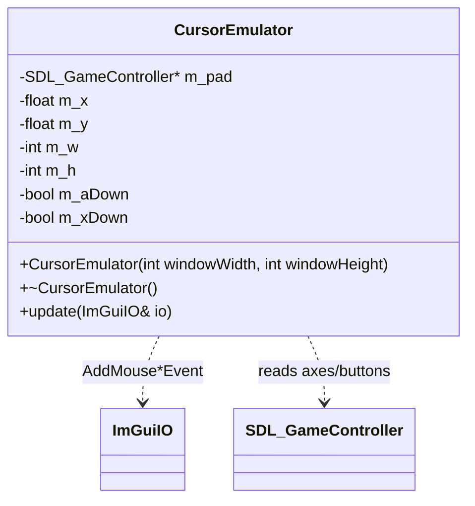

# Input domain

Platform-layer controller input in `src/input/CursorEmulator.{h,cpp}`. The Switch has no mouse, and ImGui is entirely mouse/nav-driven, so `CursorEmulator` synthesizes a virtual cursor from an `SDL_GameController` and injects it into ImGui IO. It lives in the platform layer alongside `main.cpp` — no domain, gui, or player type depends on it.

## Mapping (10a)

| Input             | Action                              |
|-------------------|-------------------------------------|
| Left analog stick | Move cursor (velocity ∝ deflection) |
| **A**             | Left click (button 0, primary)      |
| **X**             | Right click (button 1)              |

Right-stick scroll and the L / R held speed modifiers are TODO_10 chunk 10b — not yet implemented.

## Notes

- **Per-frame injection point (main-thread only).** `update(io)` is called once per frame from the render loop **between `ImGui_ImplSDL2_NewFrame()` and `ImGui::NewFrame()`** — after the SDL backend seeds IO, before ImGui consumes it. This is the ImGui-idiomatic way to feed a virtual cursor; calling it anywhere else drops or double-counts input. It touches only ImGui IO and the SDL controller; it holds no locks and must not be called off the main thread.
- **Switch only.** The instance is a `#ifdef __SWITCH__` local in `main()` and the `update()` call is likewise guarded; desktop uses the real mouse and none of this compiles in. `io.MouseDrawCursor` is also set `true` on the Switch (the OS draws no cursor there) so ImGui renders the emulated one.
- **Cursor integration.** The left-stick deflection (with a dead-zone at rest, rescaled so motion ramps from zero at the dead-zone edge) is scaled by a base speed in px/frame and added to the cursor position each frame, clamped to `[0, windowWidth] × [0, windowHeight]`. SDL `LEFTY` is positive when the stick is pushed down and screen Y grows downward, so raw deflection maps directly to intuitive motion on both axes. The cursor seeds to the window center.
- **Click edges.** A/X button state is emitted to ImGui only on change (`m_aDown`/`m_xDown` mirror the physical state), so a held button is not re-fired oddly — though ImGui tolerates repeated same-state events.
- **Constants.** Dead-zone (~8000 of the signed-16-bit axis range), base speed (~12 px/frame at full tilt), and (in 10b) the speed multipliers and scroll speed are local constants in `CursorEmulator.cpp`. They could later be surfaced as [Settings](settings.md) (TODO_6) without changing the `update(io)` interface.
- **Controller ownership.** `CursorEmulator` opens its own handle via `SDL_GameControllerOpen(0)` (closed in its destructor). `main.cpp` independently opens the same index (`controller`) as the single owner used by the quit-on-START handler; `SDL_GameControllerOpen` is refcounted per index, so the two opens and their matching closes are safe. `SDL_GameControllerOpen(0)` may return `nullptr` (no pad present) — every pad read is guarded.
