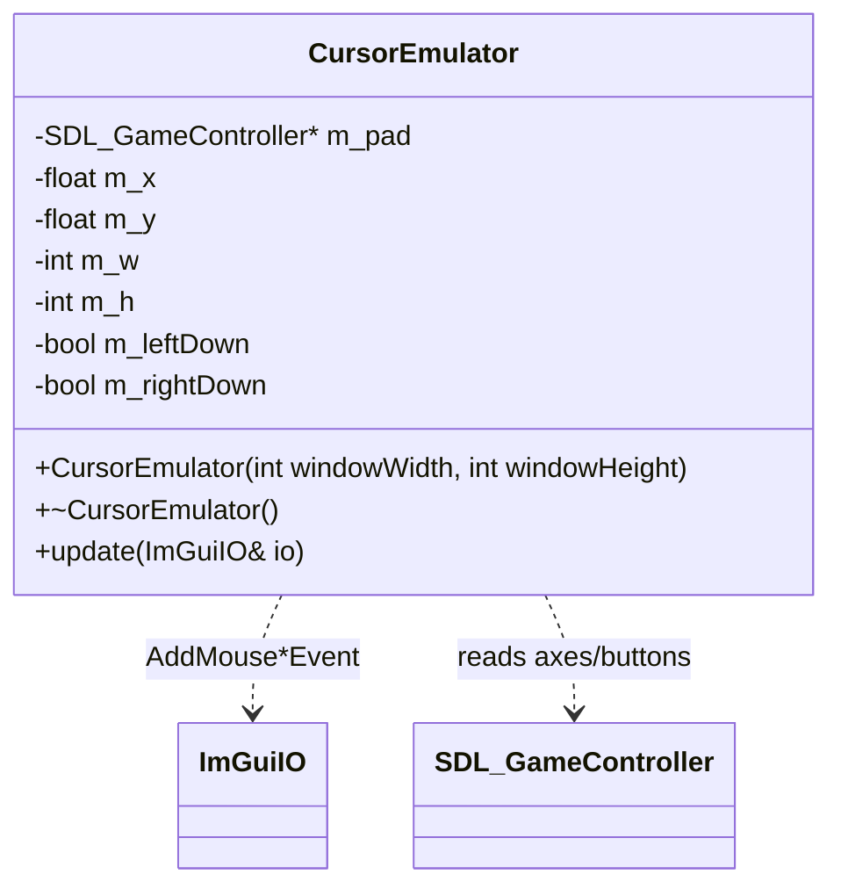

# Input domain

Platform-layer controller input in `src/input/CursorEmulator.{h,cpp}`. The Switch has no mouse, and ImGui is entirely mouse/nav-driven, so `CursorEmulator` synthesizes a virtual cursor from an `SDL_GameController` and injects it into ImGui IO. It lives in the platform layer — no domain, gui, or player type depends on it.

## Mapping

| Input | Action |
|-------|--------|
| Left analog stick | Move cursor (velocity ∝ deflection) |
| Right analog stick | Scroll (vertical primary, horizontal too) |
| **A** | Left click (button 0, primary) |
| **X** | Right click (button 1) |
| **L** shoulder or ZL trigger (hold) | Slow/precise, cursor + scroll (×0.35) |
| **R** shoulder or ZR trigger (hold) | Fast, cursor + scroll (×2.5) |
| neither held | Normal speed (×1) |

## Notes

- **Per-frame injection point (main-thread only).** `update(io)` is called once per frame from `Platform::run()` **between `ImGui_ImplSDL2_NewFrame()` and `ImGui::NewFrame()`** — after the SDL backend seeds IO, before ImGui consumes it. This is the ImGui-idiomatic way to feed a virtual cursor; calling it anywhere else drops or double-counts input. It touches only ImGui IO and the SDL controller; it holds no locks and must not be called off the main thread.
- **Switch only.** The instance is a `#ifdef __SWITCH__` local in `Platform::run()` — so it (and the controller handle it owns) is destroyed when `run()` returns, before `Platform::destroy()` calls `SDL_Quit()`, which force-frees open controllers. The `update()` call is likewise guarded; desktop uses the real mouse and none of this compiles in. `Platform::initImGui()` also sets `io.MouseDrawCursor = true` on the Switch (the OS draws no cursor there) so ImGui renders the emulated one.
- **Cursor integration.** The left-stick deflection (dead-zone at rest, rescaled so motion ramps from zero at the dead-zone edge) is scaled by a base speed in px/frame and added to the cursor position each frame, clamped to `[0, windowWidth] × [0, windowHeight]`. SDL `LEFTY` is positive when the stick is pushed down and screen Y grows downward, so raw deflection maps directly to intuitive motion on both axes. The cursor seeds to the window center.
- **Scroll injection.** The right stick feeds `io.AddMouseWheelEvent(wheel_x, wheel_y)`, vertical primary. ImGui treats positive `wheel_y` as scroll-up and (counter-intuitively) positive `wheel_x` as scroll-*left*; SDL's stick axes point the other way, so both axes are negated to map an up/right stick push to an up/right scroll. The event is emitted only on real deflection, so at rest no zero-wheel events are spammed. Scroll speed stays small (ImGui scrolls a fixed number of items per wheel unit).
- **Speed modifiers.** Holding the **L** side (`SDL_CONTROLLER_BUTTON_LEFTSHOULDER` **or** the `TRIGGERLEFT` axis past a threshold — i.e. L or ZL) scales speed by 0.35× for precision; holding the **R** side (`RIGHTSHOULDER` or `TRIGGERRIGHT`, i.e. R or ZR) scales it by 2.5× for fast travel. If both sides are held, slow wins (precision is the safer default). The multiplier scales **both** the left-stick cursor movement and the right-stick scroll. Unlike the rotated A/B/X/Y face buttons, the physical L/R shoulders and triggers map directly to their SDL names, so no `#ifdef` is needed for them.
- **Click edges.** A/X button state is emitted to ImGui only on change (`m_leftDown`/`m_rightDown` mirror the physical state), so a held button is not re-fired every frame.
- **Switch button labels.** SDL names controller buttons by *Xbox position*, but the Switch's physical labels are rotated: its physical **A** is at the east position (`SDL_CONTROLLER_BUTTON_B`) and physical **X** at the north (`SDL_CONTROLLER_BUTTON_Y`). Under `__SWITCH__`, `update()` reads `B`/`Y` so the console's usual confirm button (**A**) left-clicks and **X** right-clicks; the desktop branch (never actually invoked — cursor emulation is Switch-only) keeps the plain `A`/`X` positions.
- **Constants.** Local constants in `CursorEmulator.cpp`: dead-zone 8000 of the signed-16-bit axis range, base speed 12 px/frame at full tilt, speed multipliers 0.35× / 2.5×, scroll speed 0.5 wheel units/frame at full tilt, trigger-held threshold 8000 (the Switch triggers are digital — 0 or full — so any positive threshold works there).
- **Controller ownership.** `CursorEmulator` opens its own handle via `SDL_GameControllerOpen(0)` (closed in its destructor). `Platform` independently opens the same index (`m_controller`) as the handle backing the quit-on-START event handling; `SDL_GameControllerOpen` is refcounted per index, so the two opens and their matching closes are safe. `SDL_GameControllerOpen(0)` may return `nullptr` (no pad present) — `update()` returns immediately in that case.
