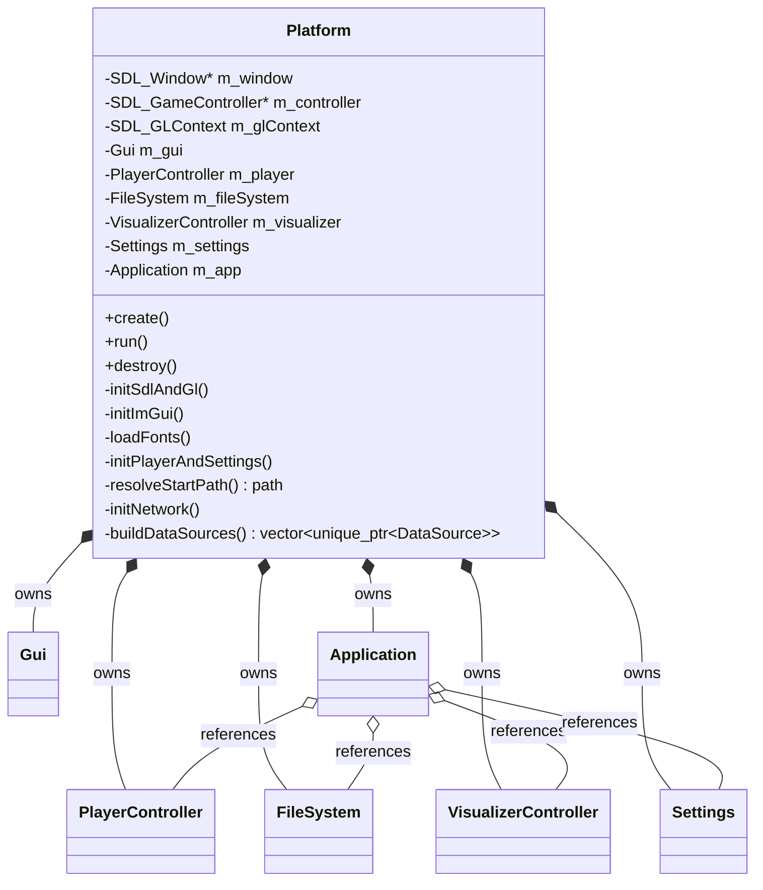

# Platform domain

Platform / lifecycle layer in `src/Platform.{h,cpp}` (plus the tiny `src/main.cpp` entry point).
`Platform` owns everything platform-related — the SDL window, the OpenGL context, the game
controller handle, and Dear ImGui — **and** owns the process's subsystems (`Gui`,
`PlayerController`, `FileSystem`, `VisualizerController`, `Settings`, `Application`) as value
members. It brings them up, runs the event + render loop, and tears them down, exposing
`create()` / `run()` / `destroy()`. `main.cpp` reduces to constructing a `Platform` and calling the
three in order — there are no file-scope globals.

This is the platform layer; `Application` is the orchestration layer above it (see
[application.md](application.md)). The visualizer bridge (audio tap → `VisualFrame` → active
visualizer, plus the Settings→Visualizer picker) lives in `Application` like every other UI
action; `Platform` only owns the `VisualizerController` and restores the persisted selection at
startup (see [visualization.md](visualization.md)).

## Notes

- **Ownership vs. wiring.** `Platform` *owns* the subsystems by value; `Application` (also a member)
  holds *references* to `m_player`/`m_fileSystem`/`m_visualizer`/`m_settings`/`m_playList`. Member
  **declaration order is load-bearing**: those five precede `m_app`, so they are constructed before
  `Application`'s constructor binds references to them. `Platform` is non-copyable and non-movable (deleted copy +
  user-declared destructor) and lives as a `main()` local, so those references never dangle.
- **`create()` order is load-bearing**:
  `initNetwork()` first (`curl_global_init` is not thread-safe, and `socketInitializeDefault()` on
  Switch — both must precede `m_fileSystem.create(...)` spawning its worker thread) →
  `initSdlAndGl()` → `initImGui()` (context + backends + `loadFonts()` + `m_gui.initialize()`) →
  `m_visualizer.create()` (GL context must be up) followed by `m_app.refreshVisualizerNames()`
  (the plugin set is fixed from then on, so the name cache is built once — see
  [application.md](application.md)) → `initPlayerAndSettings()` (settings
  load + theme + `m_player.create()` + the persisted plugin-setting push) → `resolveStartPath()` →
  `m_fileSystem.create(...)`.
- **`destroy()` is the exact reverse teardown** (`m_fileSystem.destroy()` joins the worker first,
  then `curl_global_cleanup()` / Switch `socketExit()`, then player/visualizer/gui, ImGui shutdown,
  controller close, GL context + window, `SDL_Quit`, `IMG_Quit`). Exceptions from `create()` are
  left uncaught (init failure terminates the process, as before).
- **Switch cursor lifetime.** On the Switch the gamepad drives an emulated ImGui cursor via a
  `CursorEmulator` (see [input.md](input.md)) constructed as a **local inside `run()`**, so it (and
  the controller it owns) is destroyed when `run()` returns — before `destroy()` calls `SDL_Quit`,
  which force-frees open controllers (a later close would be a use-after-free).
- **The entry point stays wrapped as `SDL_main`.** `main.cpp` keeps `#include <SDL.h>` so SDL's
  `#define main SDL_main` applies there; the build links `SDL2::SDL2main`, whose real `main` calls
  it. `Platform.h` uses granular SDL includes (`<SDL_video.h>`, `<SDL_gamecontroller.h>`) so it does
  not drag `SDL_main` into other translation units.
- **Named constants.** Window size is `Platform::kWindowWidth`/`kWindowHeight` (1280×720), a private
  static `constexpr` shared by `SDL_CreateWindow` and the Switch `CursorEmulator`. Single-use
  tunables (the GL context version, the merged font point size) are `constexpr` locals in the method
  that uses them. Read-only asset paths come from `assetPath()`, writable paths from `configPath()` /
  `cachePath()` — all in `src/Paths.h`.
- **Font stack (`loadFonts()`).** Three fonts are merged into ImGui's default atlas at one point
  size: **Roboto-Regular** (the base — Latin ranges), **Material Symbols Sharp Filled** (UI icon
  glyphs, offset `+2` in y), and **NotoSansJP-Subset** (CJK), so decoder metadata transcoded to UTF-8
  at the plugin boundary (see [audio.md](audio.md), TODO_20a) renders as glyphs instead of tofu.
  ImGui 1.92 rasterizes glyphs on demand, so CJK coverage is whatever the shipped TTF holds — it is
  pre-subset to ImGui's curated Japanese set (kana + ~2999 common kanji) by `scripts/gen_cjk_subset.py`
  (from a Noto Sans JP variable TTF) to keep the Switch `romfs/` asset small (~0.85 MB); widen coverage
  by regenerating the subset, not by changing the range argument. Roboto is added first, so it stays
  authoritative over the Latin range all three cover — ImGui keeps the first source to supply a glyph.
  **Switch note:** verify the on-demand atlas still builds and memory/startup stay acceptable on device.
