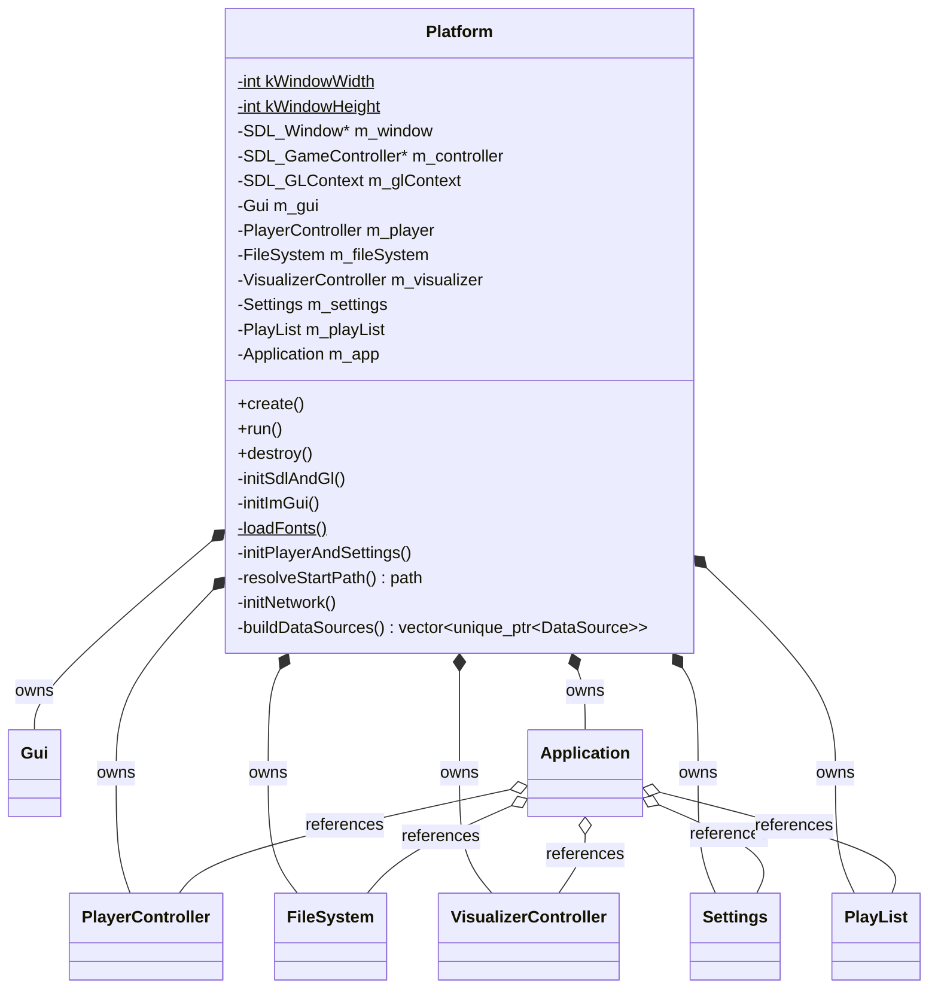

# Platform domain

Platform / lifecycle layer in `src/Platform.{h,cpp}` (plus the tiny `src/main.cpp` entry point and the header-only `src/Paths.h`). `Platform` owns everything platform-related — the SDL window, the OpenGL context, the game-controller handle, and Dear ImGui — **and** owns the process's subsystems (`Gui`, `PlayerController`, `FileSystem`, `VisualizerController`, `Settings`, `PlayList`, `Application`) as value members. It brings them up, runs the event + render loop, and tears them down, exposing `create()` / `run()` / `destroy()`. `main.cpp` reduces to constructing a `Platform` and calling the three in order — there are no file-scope globals.

`Application` is the orchestration layer above it (see [application.md](application.md)). The visualizer bridge (audio tap → `VisualFrame` → active visualizer, plus the Settings→Visualizer picker) lives in `Application` like every other UI action; `Platform` only owns the `VisualizerController` and restores the persisted selection at startup (see [visualization.md](visualization.md)).

## Lifecycle

- **Ownership vs. wiring.** `Platform` *owns* the subsystems by value; `Application` (also a member) holds *references* to `m_player`/`m_fileSystem`/`m_settings`/`m_playList`/`m_visualizer`. Member **declaration order is load-bearing**: those five precede `m_app`, so they are constructed before `Application`'s constructor binds references to them. `Platform` is non-copyable and lives as a `main()` local, so the references never dangle.
- **`create()` order is load-bearing**: `initNetwork()` first (`curl_global_init` is not thread-safe, and `socketInitializeDefault()` on Switch — both must precede `m_fileSystem.create(...)` spawning its worker thread) → `initSdlAndGl()` → `initImGui()` (context + backends + `loadFonts()` + `m_gui.initialize()`) → `m_visualizer.create()` (GL context must be up — GL plugins allocate shaders in `create()`) followed by `m_app.refreshVisualizerNames()` (the plugin set is fixed from then on, so the name cache is built once — see [application.md](application.md)) → `initPlayerAndSettings()` → `m_fileSystem.create(buildDataSources(), resolveStartPath(), isPlayable-predicate)` — the predicate calls into `m_player.isSupported`. Exceptions from `create()` are left uncaught: init failure terminates the process.
- **`destroy()` teardown order**: `m_fileSystem.destroy()` joins the worker first (its isPlayable predicate calls into `PlayerController`), then `curl_global_cleanup()` / Switch `socketExit()` (no curl call can be in flight once the worker is joined), then `m_player.destroy()`, `m_visualizer.destroy()` (frees GL objects while the context is still valid), `m_gui.finalize()`, ImGui backend shutdown + `DestroyContext`, controller close, GL context + window, `SDL_Quit`, `IMG_Quit`.

## Init details

- **`initSdlAndGl()`** — `SDL_Init(VIDEO | AUDIO | GAMECONTROLLER)`, `IMG_Init(PNG)`, an **OpenGL 4.3 core** context (double-buffered, no depth/stencil), a `kWindowWidth`×`kWindowHeight` (1280×720) window, vsync (`SDL_GL_SetSwapInterval(1)`), and `gladLoadGL()`. It opens one `SDL_GameController` handle, used by the quit-on-START handler on every platform; on the Switch `CursorEmulator` opens its own (refcounted) handle for the same controller index.
- **`initImGui()`** — ImGui context, `ImGui_ImplSDL2_InitForOpenGL`, `ImGui_ImplOpenGL3_Init("#version 330 core")` (a GLSL version kept compatible with the 4.3 context, not the same number), disables ImGui's ini/log files, sets `io.MouseDrawCursor = true` on the Switch (the OS draws no cursor, so ImGui must render the emulated one), then `loadFonts()` and `m_gui.initialize()`.
- **Font stack (`loadFonts()`).** Three fonts are merged into ImGui's default atlas at one point size (22): **Roboto-Regular** (the base — Latin), **Material Symbols Sharp Filled** (UI icon glyphs, merge mode, glyph offset +2 in y), and **NotoSansJP-Subset** (CJK), so decoder metadata transcoded to UTF-8 at the plugin boundary (see [audio.md](audio.md)) renders as glyphs instead of tofu. ImGui 1.92 rasterizes glyphs on demand, so CJK coverage is whatever the shipped TTF holds — it is pre-subset to ImGui's curated Japanese set (kana + ~2999 common kanji) by `scripts/gen_cjk_subset.py` to keep the Switch `romfs/` asset small (~0.85 MB); widen coverage by regenerating the subset, not by changing the range argument. Roboto is added first, so it stays authoritative over the Latin range all three cover — ImGui keeps the first source to supply a glyph.
- **`initPlayerAndSettings()`** — loads the INI from `configPath()`, applies the persisted theme via `m_gui.applyTheme` (default `"dark"`), `m_player.create()`, pushes persisted plugin settings from the `plugin.<pluginName>` INI sections (absent keys keep the plugin's own default), seeds the `Application`'s cached descriptors via `m_app.refreshPluginSettings()`, and restores the persisted visualizer by stable plugin name (`VisualizerController::indexOf`; an empty or unknown name leaves the default, index 0).
- **`resolveStartPath()`** — prefers a hand-edited `[user] default_folder` when it names a valid directory; otherwise the compile-time default (`/` — the sdmc root — on Switch, the current working directory on desktop).
- **`buildDataSources()`** — a `LocalDataSource`, the built-in `FtpDataSource` "Modland (FTP)" (`ftp.modland.com/pub/modules`, cache `cachePath()/modland`), plus one extra FTP source per hand-edited `[source.NAME]` INI section (name from the section, `host`/`path` keys). Cache subdirectories must be unique: the taken set is seeded from the built-in sources' cache ids, each user source's name is sanitized into a cache path component, and colliding or incomplete sections are skipped with a log — no two sources can cross-contaminate one cache dir.

## Frame loop (`run()`)

`run()` builds the `UiActions` bundle once via `m_app.makeUiActions()`, then wraps `onButtonClick` to intercept `QUIT` (Platform owns the run-loop flag; every other button is delegated — keeps `Application` quit-agnostic). Each iteration:

1. Poll SDL events → `ImGui_ImplSDL2_ProcessEvent`; ESC, controller START, and `SDL_QUIT` end the loop.
2. `m_app.update()` (see [application.md](application.md)).
3. Clear the framebuffer; `ImGui_ImplOpenGL3_NewFrame()`, `ImGui_ImplSDL2_NewFrame()`.
4. Switch only: `cursorEmulator.update(io)` — injected between the SDL backend's NewFrame (which seeds IO) and `ImGui::NewFrame()` (which consumes it), the ImGui-idiomatic virtual-cursor injection point.
5. `ImGui::NewFrame()`; `const UiState state = m_app.makeUiState()`; `m_gui.drawUserInterface(state, actions)` — in VISUALIZATION mode this fires `onRenderVisualization`, which schedules the visualizer's drawing into the ImGui draw data (see [visualization.md](visualization.md)).
6. `ImGui::Render()`, `ImGui_ImplOpenGL3_RenderDrawData(...)` (raw-GL visualizer callbacks execute here), `SDL_GL_SwapWindow`.

- **Switch cursor lifetime.** On the Switch the gamepad drives an emulated ImGui cursor via a `CursorEmulator` (see [input.md](input.md)) constructed as a **local inside `run()`**, so it (and the controller handle it owns) is destroyed when `run()` returns — before `destroy()` calls `SDL_Quit`, which force-frees open controllers (a later close would be a use-after-free). It is clamped to `kWindowWidth`/`kWindowHeight`.
- **The entry point stays wrapped as `SDL_main`.** `main.cpp` keeps `#include <SDL.h>` so SDL's `#define main SDL_main` applies there; the build links `SDL2::SDL2main`, whose real `main` calls it. `Platform.h` uses granular SDL includes (`<SDL_video.h>`, `<SDL_gamecontroller.h>`) so it does not drag `SDL_main` into other translation units.
- The ImGui OpenGL3 backend is compiled through `src/gui/imgui_impl_opengl3_glad.cpp`, a wrapper that includes glad before the upstream backend source — the CMake target compiles the wrapper instead of the backend directly (needed for the Switch glad integration).

## Paths (`src/Paths.h`)

**`src/Paths.h` is the single source of path truth** (header-only); the per-platform `#if defined(__SWITCH__)` split lives only here.

- `assetPath(relative)` returns the absolute path of a read-only asset under the romfs root: `romfs:/` on the Switch (embedded in the `.nro`), `romfs/` next to the executable on desktop. Used by `Platform` (fonts, `gui.initialize`) and `SidPlugin` (C64 ROMs).
- `nextToExecutable(relative)` resolves a writable file next to the executable via `SDL_GetBasePath()` (falling back to a bare relative path when SDL cannot resolve the base directory). Desktop only — romfs is read-only on the Switch, so Switch callers target fixed SD-card paths instead.
- `configPath()` — the `osp2.ini` location: `/switch/OSP2/osp2.ini` on the Switch, `nextToExecutable("osp2.ini")` on desktop.
- `cachePath()` — the remote-source download root: `/switch/OSP2/cache/` on the Switch, `nextToExecutable("cache/")` on desktop.
