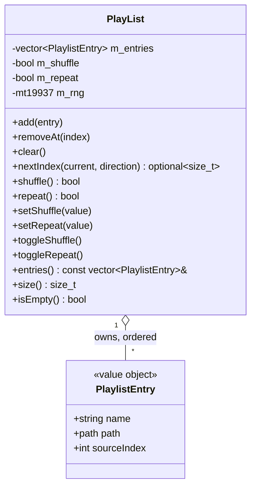

# Playlist domain

Domain module in `src/playlist/`. `PlayList` is an ordered, session-only list of songs the user has queued from the browser — a pure domain type (no ImGui/GL/SDL), owned by value in `Platform` and constructor-injected into `Application` (mirroring `PlayerController`/`FileSystem`/`Settings`). The Playlist tab renders a per-frame slice of it via `UiState`; the tab reports intent through `UiActions` callbacks routed by `Application`.

## Notes

- **`PlaylistEntry`** (`src/playlist/PlaylistEntry.h`) is a value object kept in its own light header so `UiState` can depend on the entry shape without pulling in the whole module. A file's identity in this app is **(owning `DataSource`, source-relative path)**, so an entry captures three things at add-time: `name` (basename — display and error text only; the playing row is tracked by index, not by name), `path` (the source-relative path `getPath()/name` that `DataSource::fetchFile` expects), and `sourceIndex` (the index of the owning source in `FileSystem`'s source list). `path` and `sourceIndex` are both captured because the browser may later have navigated elsewhere or switched source; replay re-fetches an entry from that pair.

- **`PlayList`** (`src/playlist/PlayList.{h,cpp}`) is a small, non-copyable `final` module with plain RAII — no explicit `create()`/`destroy()` lifecycle. It is **single-threaded, main-thread only**: every access happens on the UI/update path, so unlike `PlayerController` it needs no mutex. `removeAt` is a bounds-checked no-op when out of range.

- **Session-only:** the playlist is not persisted across launches.

- **Shuffle / Repeat are model flags** on `PlayList` (`m_shuffle`/`m_repeat`), surfaced onto `UiState` (`playlistShuffle`/`playlistRepeat`) and toggled through `UiActions` (`onToggleShuffle`/`onToggleRepeat`).

- **`nextIndex(current, direction)` — traversal policy** (non-const: it advances the RNG). Given the playing entry's index and a direction (`+1` NEXT/auto-advance, `-1` PREVIOUS), it returns the next index or `std::nullopt` when there is no next (empty list, or a boundary with repeat off). **Shuffle** randomizes only the *forward* target (`direction > 0`, `size > 1`): a uniform pick in `[0, size-1)` shifted past `current` — a uniform choice among the other entries in one draw, never repeating the current entry back-to-back. **PREVIOUS always steps linearly** (deliberate simplification: no shuffle history). **Repeat** wraps at either end. The RNG is a `std::mt19937` seeded from `std::random_device` in the constructor.

## Wiring

`Platform` owns `PlayList m_playList` by value (declared before `m_app`, which binds a reference to it). `Application` holds `PlayList &m_playList`, populates the `UiState` playlist slice in `makeUiState()` — `playlist` (non-owning per-frame view), `playlistShuffle`/`playlistRepeat`, and `playingPlaylistIndex` (the index of the currently-playing playlist entry, `-1` when stopped or when playback originated from the browser; it drives the tab's "now playing" row — exactly the row advance follows) — and routes the five playlist `UiActions` callbacks to `handleAddToPlaylist`, `handleRemoveFromPlaylist`, `handlePlayPlaylistEntry`, `handleToggleShuffle`, and `handleToggleRepeat`.

## Playback origin: playlist-vs-browser advance

While a playlist entry is playing, NEXT/PREVIOUS and auto-advance traverse the **playlist**, not the browser's adjacent file. `Application` tracks the playback origin with `int m_playlistIndex` (index of the playing entry, or `-1` when playback came from the browser). See [application.md](application.md) for the full advance state machine; in short:

- **Click-to-play** (`handlePlayPlaylistEntry(index)`): enters playlist mode (`m_playlistIndex = index`), treats it as a direct play (`m_advanceDirection = 0`, so errors surface and the decode overlay shows; `m_pendingPlayName` carries the entry name for a possible error message), and fetches the entry with `FileSystem::requestFileFromSource(entry.sourceIndex, entry.path)` — replaying from the entry's captured source without disturbing the browser listing. A browser file click (`handleFileClick`) resets `m_playlistIndex = -1`, leaving playlist mode.
- **`advance(direction)`** steps subtracks within the current entry first, then at the file boundary dispatches through `advanceTrack(direction)`: `advancePlaylist` when `m_playlistIndex >= 0`, else `playAdjacentTrack` (browser sibling). The fetch/decode-failure retry sites call `advanceTrack` too, so a broken playlist entry is skipped within the playlist just as a broken browser sibling is skipped in the browser.
- **`advancePlaylist(direction)`** asks `PlayList::nextIndex` for the next index (shuffle/repeat applied), advances `m_playlistIndex` **before** the fetch (so a failure retry keeps skipping through the playlist), and fetches via `requestFileFromSource`. No next (end without repeat) → playback simply ends. An empty list or out-of-range index detaches from playlist mode (`m_playlistIndex = -1`).
- **Bounded-skip guard** (`m_consecutivePlaylistSkips`): with Repeat or Shuffle on, `nextIndex` never returns `nullopt`, so an all-unplayable playlist would otherwise loop forever re-fetching every entry (hammering the network). `advancePlaylist` counts consecutive fetch attempts and stops once it has tried every entry once since the last track that actually played (`m_consecutivePlaylistSkips >= size()`); the counter resets to `0` on a successful decode (`PlayResult::Ok`) and at the start of a user-initiated playlist play, so it only accrues across *consecutive* failures and a long healthy playlist never trips it. The transport stops instead of spinning.
- **Removal coherence** (`handleRemoveFromPlaylist`): after `removeAt(index)`, `m_playlistIndex` is adjusted so it keeps pointing at the same entry — decremented when an earlier entry is removed, and set to `-1` when the playing entry itself is removed (the track keeps playing, but the next advance falls back to browser navigation).

**Add-to-playlist flow**: right-clicking a browser **file** row opens a context menu whose "Add to playlist" item fires `onAddToPlaylist(FileEntry)`. `Application::handleAddToPlaylist` builds the entry from the browser's current context — `PlaylistEntry{ entry.name, m_fileSystem.getPath() / entry.name, m_fileSystem.getActiveSourceIndex() }` — and calls `m_playList.add(...)`. Only file rows carry the menu (with a defensive `is_directory` guard). **Duplicates are rejected**: the add is skipped when an entry with the same identity — `(sourceIndex, source-relative path)` — is already present. See [ui.md](ui.md) for the tab and [application.md](application.md) for the routing.

**Remove-from-playlist flow**: right-clicking a **playlist** row opens a "Remove from playlist" context menu that fires `onRemoveFromPlaylist(index)` → `Application::handleRemoveFromPlaylist` → `m_playList.removeAt(index)`. Because the tab iterates a live slice of `PlayList`, the Gui records the requested index and calls the callback **after** the row loop, never mutating the vector mid-iteration.
