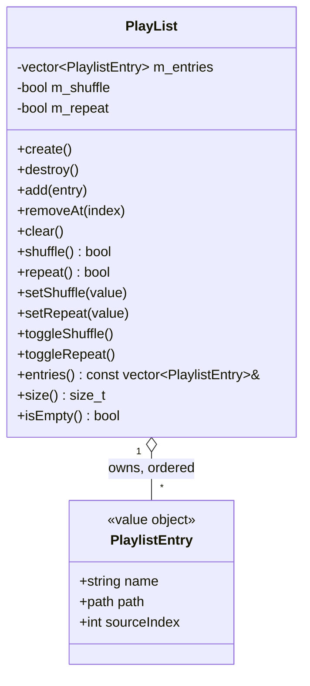

# Playlist domain

Domain module in `src/playlist/`. `PlayList` is an ordered, session-only list of songs the user has queued from the browser. It is a pure domain type — no ImGui/GL/SDL — owned by value in `Platform` and constructor-injected into `Application` (mirroring `PlayerController`/`FileSystem`/`Settings`). The Playlist tab renders a per-frame slice of it via `UiState`; the tab reports intent through `UiActions` callbacks routed by `Application`.

## Notes

- **`PlaylistEntry`** (`src/playlist/PlaylistEntry.h`) is a value object kept in its own light header so `UiState` can depend on the entry shape without pulling in the whole module. A file's identity in this app is **(owning `DataSource`, source-relative path)**, so an entry stores three things captured at add-time: `name` (basename, shown in the tab and matched against `PlaybackStatus.fileName` for the current-track "tofu" icon — the same filename basis the browser highlight uses), `path` (the **source-relative path** `getPath()/name` that `DataSource::fetchFile` expects), and `sourceIndex` (the index of the owning source in `FileSystem`'s source list). Both `path` and `sourceIndex` are captured because the browser may later have navigated elsewhere or switched source; 28e re-fetches an entry from that pair. 28b reads only `name`, so the fields added in 28c are backward-compatible.

- **`PlayList`** (`src/playlist/PlayList.{h,cpp}`) mirrors `VisualizerController`'s small `final`-module shape: non-copyable, `create()`/`destroy()` lifecycle (nothing to allocate — `create()` is kept for symmetry and future use, `destroy()` clears the vector). It is **single-threaded, main-thread only** — every access happens on the UI/update path, so unlike `PlayerController` it needs **no mutex**. Mutators (`add`, `removeAt` — bounds-checked no-op if out of range, `clear`) and the `shuffle`/`repeat` flag accessors/toggles are in place from 28a; the behavior that consumes them lands in 28e.

- **Session-only (no persistence).** The playlist is not saved across launches this round: the flat INI `Settings` store has no list type, and an ordered path list would need numbered keys. A later chunk can add persistence.

- **Shuffle / Repeat are model flags** on `PlayList` (`m_shuffle` / `m_repeat`), surfaced onto `UiState` (`playlistShuffle` / `playlistRepeat`) and toggled through `UiActions` (`onToggleShuffle` / `onToggleRepeat`). In 28a they are pure state; their effect on next-track selection during auto-advance (shuffle randomizes the next entry, repeat wraps at the end) arrives in 28e.

## Wiring

`Platform` owns `PlayList m_playList` by value (declaration order before `m_app`, which binds a reference to it) and calls `create()`/`destroy()` alongside the other subsystems. `Application` holds `PlayList &m_playList`, populates the `UiState` playlist slice (`playlist` non-owning view + `playlistShuffle`/`playlistRepeat`) in `makeUiState()`, and routes the five playlist `UiActions` callbacks to `handleAddToPlaylist` (28c), `handleRemoveFromPlaylist` (28d), `handlePlayPlaylistEntry` / `handleToggleShuffle` / `handleToggleRepeat` (28e) — the latter four are placeholder stubs until their chunks.

**Add-to-playlist flow (28c)**: right-clicking a browser **file** row opens a context menu whose "Add to playlist" item fires `onAddToPlaylist(FileEntry)`. `Application::handleAddToPlaylist` builds the entry from the browser's current context — `PlaylistEntry{ entry.name, m_fileSystem.getPath() / entry.name, m_fileSystem.getActiveSourceIndex() }` — and calls `m_playList.add(...)`. Only file rows carry the menu (a defensive `is_directory` guard aside), and duplicates are allowed (no dedup this chunk). The stored `path` + `sourceIndex` are what 28e's replay-from-source path will resolve against; 28c only wires the capture, not playback. See [ui.md](ui.md) for the tab and [application.md](application.md) for the routing.
