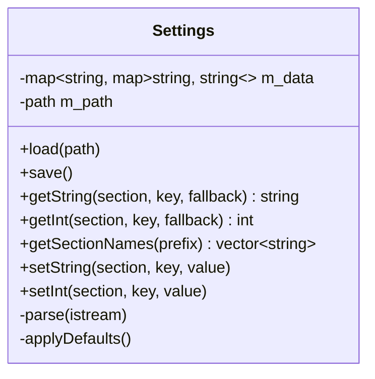

# Settings domain

Persistence layer in `src/settings/`. `Settings` is a hand-editable INI store: sections of `key = value` pairs, loaded at startup and rewritten on every change. Main-thread only, no dependency beyond `SDL_Log`. It holds no app-specific schema knowledge except the defaults it seeds on first run.

The INI schema's section/key names live in `src/settings/SettingsKeys.h` (`settingskeys::kUserSection`, `kTheme`, `kVisualizer`, `kDefaultFolder`, `kPluginSectionPrefix`, `kSourceSectionPrefix`, `kSourceHost`, `kSourcePath`) — the single source of truth shared by every save site (`Application`), restore site (`Platform`), and the seeded defaults (`Settings::applyDefaults`), so a typo can't silently fork a key between writer and reader.



## The file — osp2.ini

Location (`configPath()` in `src/Paths.h`, the single source of path truth): desktop `SDL_GetBasePath() + "osp2.ini"` (lands in the build dir, which is git-ignored); Switch `/switch/OSP2/osp2.ini` (romfs is read-only; `/` is libnx's default sdmc device, and `/switch/OSP2/` also holds the download cache). Created with defaults on first launch so the user can find and hand-edit it.

```ini
[user]
theme = dark              # dark | light | classic
visualizer = Bars         # stable VisualizerPlugin::getName(); empty/unknown -> first (index 0)
default_folder =          # hand-edit only; empty/invalid -> platform default start path

[plugin.libopenmpt]       # section = "plugin." + PlayerPlugin::getName()
stereo_separation = 100   # IntRange 0..200
interpolation = 0         # index into the plugin's enum options (0..4)

[source.Modland Mirror]   # optional; each adds an extra FTP source at the virtual root
host = some.ftp.example.org   # required — FTP hostname, no scheme
path = /pub/modules           # optional, default "/" — base directory to browse
```

### User-defined FTP sources — `[source.NAME]`

Each optional `[source.NAME]` section adds an extra FTP source at the virtual root, labelled `NAME`, alongside the built-in "Local files" and "Modland (FTP)". Keys:

- `host` (**required**) — FTP hostname, no scheme (`ftp://` is added internally). An empty or missing `host` (or an empty `NAME`) skips the section with an `SDL_Log`.
- `path` (optional, default `/`) — base directory to browse.

The cache subdir for each source is derived from `NAME`, FAT-sanitized (illegal chars and `.`/`..` mapped to `_`) so it is writable on the Switch's SD card. Like `default_folder`, these sections are **hand-edit only** — never seeded on first run and never surfaced in the UI. `Platform` discovers them via `Settings::getSectionNames("source.")` (all section names starting with a given prefix, in sorted order — `Settings` itself knows nothing about the source schema).

```ini
[source.Modland Mirror]
host = some.ftp.example.org
path = /pub/modules
```

## INI grammar (hand-rolled parser)

- Each line is trimmed, then an inline comment starting at the first `#` or `;` is stripped and the remainder re-trimmed. **Consequence: `#` and `;` cannot appear inside a value** (documented limitation — fine for the current keys).
- Blank lines are skipped.
- `[section]` switches the current section.
- Any other line splits on the **first** `=` into a trimmed key/value stored under the current section (so a value may itself contain `=`).
- Malformed lines (no `=`, or a key line before any section) are logged with `SDL_Log` and skipped — the parser never throws.
- `getInt` reads the string then `std::stoi` in a `try/catch`, returning the fallback on any error.

## Persistence rules

- **Storage**: `std::map<std::string, std::map<std::string, std::string>>` — ordered, so `save()` output is deterministic. `save()` first `create_directories(parent_path())` (best-effort) so a nested config location writes even when its directory doesn't exist yet (e.g. the Switch's `/switch/OSP2/`), then truncates and rewrites every section (`[section]` then `key = value` lines, one blank line between sections).
- **Unknown sections/keys survive** a load→save round-trip (they live in `m_data`).
- **Comments are NOT preserved** by the writer (documented limitation).
- **Setters mutate only**; callers call `save()` explicitly after a batch of changes.
- **`default_folder` is hand-edit only** — it is never surfaced in the UI (see [ui.md](ui.md)); an empty or non-directory value falls back to the platform default start path.

## Startup wiring & change flow

`Platform` (composition root) loads settings, then applies the persisted `[user] theme` via `Gui::applyTheme` before the loop, restores the persisted `[user] visualizer` by resolving its stable plugin name through `VisualizerController::indexOf` (empty or unknown name keeps the controller's default index 0), and resolves the browser start path from `[user] default_folder` when it names a valid directory. Runtime changes go through `Application` (which holds a `Settings &`): the UI reports intent, the presentation layer applies the visible effect, and `Application` persists it (`set…` + `save()`). See [application.md](application.md) for the theme change flow.

The visualizer follows the same rule: `Application::handleSelectVisualizer` selects the plugin, then persists the chosen plugin's stable `getName()` under `[user] visualizer` (`setString` + `save()`) — the same select-then-persist shape as the theme flow. Only the startup *restore* stays in `Platform` (see above) — see [visualization.md](visualization.md).

**Plugin settings** live in `[plugin.<name>]` sections, where `<name>` is each decoder plugin's `PlayerPlugin::getName()`. After `player.create()`, `Platform` iterates `player.getPluginSettings()` and, for every descriptor, pushes `getInt("plugin."+name, key, descriptor.value)` back through `player.applyPluginSetting(...)` — so an absent key keeps the plugin's own default, and no plugin name is hardcoded in `Platform`. The plugin clamps values on store, so a malformed hand-edited value cannot break playback. The INI is **not** seeded with plugin sections on first run (they materialize once chunk 6c writes them on change); reading tolerates their absence. See [audio.md](audio.md) for the descriptor/threading contract.
