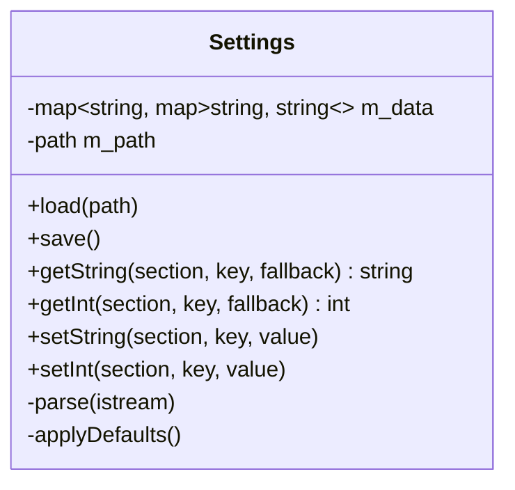

# Settings domain

Persistence layer in `src/settings/`. `Settings` is a hand-editable INI store: sections of `key = value` pairs, loaded at startup and rewritten on every change. Main-thread only, no dependency beyond `SDL_Log`. It holds no app-specific schema knowledge except the defaults it seeds on first run.



## The file — osp2.ini

Location (config path helper in `main.cpp`): desktop `SDL_GetBasePath() + "osp2.ini"` (lands in the build dir, which is git-ignored); Switch `sdmc:/switch/osp2.ini` (romfs is read-only). Created with defaults on first launch so the user can find and hand-edit it.

```ini
[user]
theme = dark              # dark | light | classic
default_folder =          # hand-edit only; empty/invalid -> platform default start path

[plugin.openmpt]          # added by TODO_6 chunk 6b
```

## INI grammar (hand-rolled parser)

- Each line is trimmed, then an inline comment starting at the first `#` or `;` is stripped and the remainder re-trimmed. **Consequence: `#` and `;` cannot appear inside a value** (documented limitation — fine for the current keys).
- Blank lines are skipped.
- `[section]` switches the current section.
- Any other line splits on the **first** `=` into a trimmed key/value stored under the current section (so a value may itself contain `=`).
- Malformed lines (no `=`, or a key line before any section) are logged with `SDL_Log` and skipped — the parser never throws.
- `getInt` reads the string then `std::stoi` in a `try/catch`, returning the fallback on any error.

## Persistence rules

- **Storage**: `std::map<std::string, std::map<std::string, std::string>>` — ordered, so `save()` output is deterministic. `save()` truncates and rewrites every section (`[section]` then `key = value` lines, one blank line between sections).
- **Unknown sections/keys survive** a load→save round-trip (they live in `m_data`).
- **Comments are NOT preserved** by the writer (documented limitation).
- **Setters mutate only**; callers call `save()` explicitly after a batch of changes.
- **`default_folder` is hand-edit only** — it is never surfaced in the UI (see [ui.md](ui.md)); an empty or non-directory value falls back to the platform default start path.

## Startup wiring & change flow

`main.cpp` (composition root) loads settings, then applies the persisted `[user] theme` via `Gui::applyTheme` before the loop, and resolves the browser start path from `[user] default_folder` when it names a valid directory. Runtime changes go through `Application` (which holds a `Settings &`): the UI reports intent, the presentation layer applies the visible effect, and `Application` persists it (`set…` + `save()`). See [application.md](application.md) for the theme change flow.
