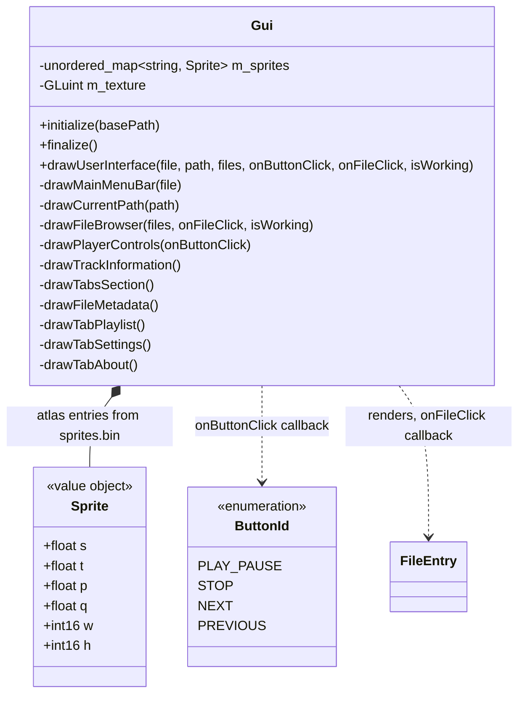

# UI domain

Presentation layer in `src/gui/`. `Gui` is stateless apart from the sprite atlas texture: all data arrives as `drawUserInterface` parameters and user intent leaves through the two callbacks. It never touches the player or filesystem directly — main.cpp wires the callbacks.

## Notes

- Sprites are loaded in `initialize()` from `romfs/sprites/sprites.bin` (custom `SPSH` format) + `sprites.png` into one GL texture; `Sprite` holds the UV rect (s/t/p/q) and pixel size.
- Icon glyphs in labels (e.g. folder/file icons) are Material Symbols codepoints merged into the default font in main.cpp.
- Dear ImGui is a pristine git submodule at `external/imgui/` (pinned to v1.92.8). The Switch glad integration lives in `src/gui/imgui_impl_opengl3_glad.cpp` — a wrapper that includes `<glad/glad.h>` before the upstream OpenGL3 backend (`IMGUI_IMPL_OPENGL_LOADER_CUSTOM` skips the embedded loader on Switch).
