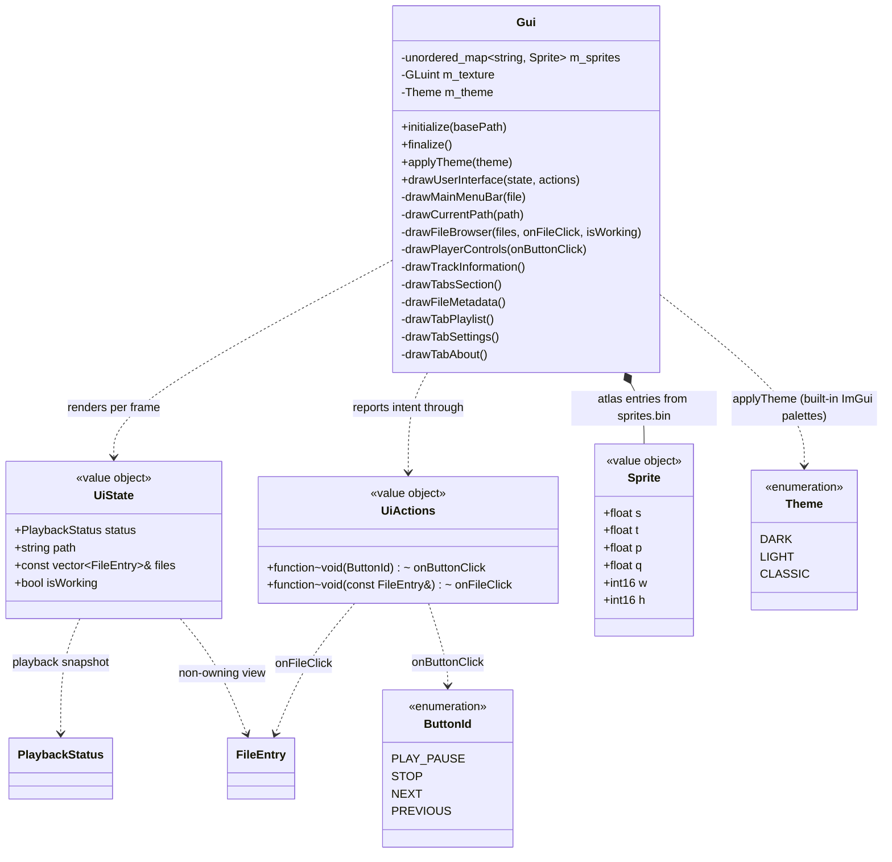

# UI domain

Presentation layer in `src/gui/`. `Gui` is stateless apart from the sprite atlas texture: each frame it receives a `UiState` view model (all data to render) and a `UiActions` bundle (callbacks to report intent). It never touches the player or filesystem directly — `Application` builds `UiState`/`UiActions`, main.cpp just forwards them (see [application.md](application.md)).

## Notes

- `UiState` (`src/gui/UiState.h`) is a per-frame value object, rebuilt each frame and never stored; its `files` member is a non-owning reference valid only for that frame. `UiActions` (`src/gui/UiActions.h`) is the callback bundle, wired once at startup. Both are produced by `Application`.
- `drawUserInterface(state, actions)` fans the view model out to the private draw helpers, which keep their focused per-widget parameters (`drawFileBrowser(state.files, actions.onFileClick, state.isWorking)`, etc.).
- `UiState::status` is a `PlaybackStatus` snapshot from the player domain (see [audio.md](audio.md)); the current-file menu line reads `state.status.fileName`. TODO_3 consumes the rest (title, position/duration progress bar, play/pause sprite swap).
- `Theme` (`src/gui/Theme.h`) selects one of ImGui's three built-in color palettes; `Gui::applyTheme(Theme)` dispatches to `StyleColorsDark`/`Light`/`Classic` and records `m_theme` (presentation state, drives the Settings menu checkmark). `initialize()` sets the theme-independent style metrics (rounding, padding, spacing) once and then applies the dark default; `applyTheme` only swaps colors, so it is safe to call live from the menu. Theme choice is not yet persisted (TODO_6). The full design lives in [ui-design.md](ui-design.md).

- Sprites are loaded in `initialize()` from `romfs/sprites/sprites.bin` (custom `SPSH` format) + `sprites.png` into one GL texture; `Sprite` holds the UV rect (s/t/p/q) and pixel size.
- Icon glyphs in labels (e.g. folder/file icons) are Material Symbols codepoints merged into the default font in main.cpp.
- Dear ImGui is a pristine git submodule at `external/imgui/` (pinned to v1.92.8). The Switch glad integration lives in `src/gui/imgui_impl_opengl3_glad.cpp` — a wrapper that includes `<glad/glad.h>` before the upstream OpenGL3 backend (`IMGUI_IMPL_OPENGL_LOADER_CUSTOM` skips the embedded loader on Switch).
