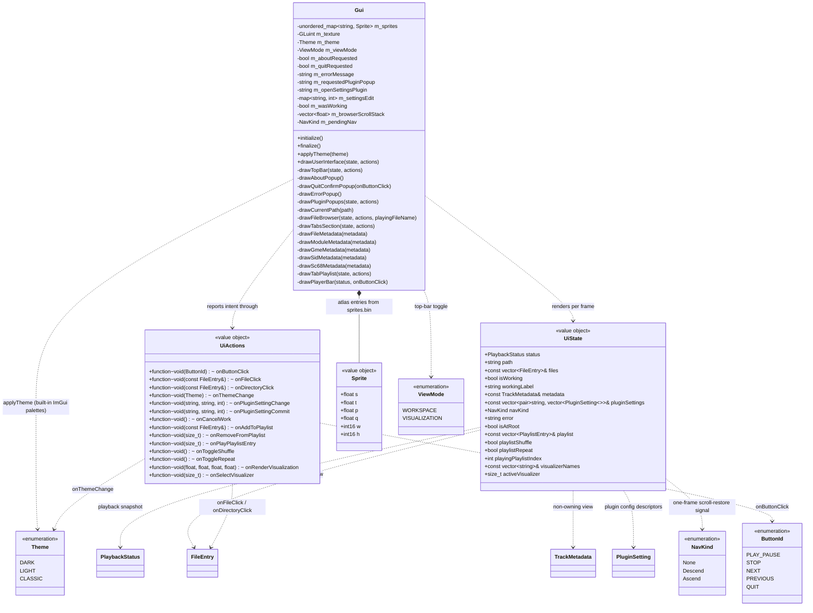

# UI domain

Presentation layer in `src/gui/`. `Gui` is presentation-only: each frame `Platform` hands it an immutable `UiState` snapshot (built by `Application::makeUiState()`) and a `UiActions` callback bundle (built once at startup by `Application::makeUiActions()`); `drawUserInterface(state, actions)` renders the snapshot and reports user intent only through the callbacks. The Gui holds presentation state only — the sprite-atlas texture, current theme, view mode, and popup/settings-edit latches — never application or domain state, and it never touches the player or filesystem directly (see [application.md](application.md) / [platform.md](platform.md)). All draw helpers take the `(state, actions)` bundles (or the specific slice they need).

The visual reference — layout mockups, metrics, palette, glyph inventory — is [ui-design.md](ui-design.md).

## The presentation seam

- `UiState` (`src/gui/UiState.h`) is a per-frame value object: rebuilt every frame by `Application::makeUiState()`, never stored across frames. Its reference members (`files`, `metadata`, `pluginSettings`, `playlist`, `visualizerNames`) are non-owning views valid only for that frame.
- `UiActions` (`src/gui/UiActions.h`) is the callback bundle, wired once at startup by `Application::makeUiActions()`. `Platform` wraps `onButtonClick` before the run loop: `QUIT` flips its run-loop flag, every other id delegates to `Application::handleButtonClick` (which keeps a no-op `case QUIT` so its switch stays exhaustive). See [platform.md](platform.md).
- `ButtonId` (`src/gui/ButtonId.h`) keys the transport and quit intents; `Theme` (`src/gui/Theme.h`) also carries `themeToString`/`themeFromString` for lossless INI round-tripping (unknown values fall back to `DARK`).

## Layout and view modes

- `drawUserInterface(state, actions)` draws the top bar, then — in `WORKSPACE` mode — a borderless fullscreen window sized to the viewport work area: a left pane (45% of the width, `drawCurrentPath` + `drawFileBrowser`) beside a right pane (`drawTabsSection` → Metadata + Playlist tabs), both filling the height above a full-width 140 px `drawPlayerBar` child pinned to the bottom. Pane/bar geometry is derived each frame from `GetContentRegionAvail()` and `ItemSpacing` (fixed 1280×720 window).
- `ViewMode` (`src/gui/ViewMode.h`) is presentation state on the `Gui`, flipped by the right-aligned top-bar toggle (fullscreen / fullscreen_exit glyph). `VISUALIZATION` skips the panes + player bar: after the top bar, `drawUserInterface` hands the work area to the visualizer via `actions.onRenderVisualization(x, y, w, h)` and returns. The rect is the main viewport's `WorkPos`/`WorkSize` (which already exclude the menu bar). The mode never touches the player, so audio keeps playing while collapsed.
- `onRenderVisualization` is the presentation-only hook for that mode — `Gui` reports the reserved rect and knows nothing about the visualizer domain. It routes to `Application::handleRenderVisualization`, which reads the audio tap, builds a `VisualFrame`, and calls `VisualizerController::render`. See [visualization.md](visualization.md).

## Top bar and popups

- `drawTopBar(state, actions)` is the ImGui main menu bar: the `OSP2` title, a **Settings** menu (**Theme**, **Visualizer**, **Plugins** submenus, in that order), an **About** entry, a **Quit** entry, and the right-aligned view-mode toggle.
- Each Theme item both calls `applyTheme` (immediate visual apply, drives the checkmark) **and** fires `onThemeChange(theme)` so `Application` persists the choice — the visual apply stays in the Gui because it owns the ImGui style (see [settings.md](settings.md)).
- The **Visualizer** submenu lists `state.visualizerNames` with a checkmark on `state.activeVisualizer`; picking one fires `onSelectVisualizer(index)`, which `Application` routes to select the plugin and persist its stable name (see [visualization.md](visualization.md)).
- **Popup latch idiom.** All modals are opened from the always-drawn menu-bar window so `OpenPopup` and `BeginPopupModal` share one window ID scope and work in both view modes. About uses a one-frame `m_aboutRequested` latch; Quit mirrors it with `m_quitRequested` (`drawQuitConfirmPopup`: **Quit** fires `onButtonClick(QUIT)`, **Cancel** dismisses); the Plugins submenu latches the picked plugin name into `m_requestedPluginPopup`.
- The **About** box shows the k7 logo to the left of a text block (so the box stays wider than tall): app name, a version line built from the CMake `OSP_VERSION` compile definition with an optional `OSP_GIT_REV` short-commit suffix (omitted when empty), copyright + license, the project link, and a credits block (decoders, Dear ImGui, SDL2, fonts — mirroring `THIRD_PARTY_NOTICES.md`).
- **Playback errors surface through an error modal.** `UiState::error` is a **one-frame** message, non-empty only on the frame `Application` composes a playback failure (unsupported format, download failure, decode failure); it stays empty on normal play and while auto-advancing (a broken sibling is skipped silently). `drawTopBar` latches it into `m_errorMessage` on the rising edge (`!error.empty() && m_errorMessage.empty()`) and opens the "Playback error" modal; the latch lets the modal persist after `UiState::error` goes empty again. A new error arriving while one is showing is dropped. `drawErrorPopup`'s **Close** button both closes the popup and clears the latch — which is why it is non-const, unlike `drawAboutPopup`.

## Plugin settings popups

Plugin config is fully generic — zero plugin-specific UI code:

- The **Plugins** submenu lists one entry per plugin that publishes settings (from `UiState::pluginSettings`, a non-owning view over `Application`'s descriptor cache, refreshed off the per-frame path). A plugin with no descriptors is skipped; an empty submenu shows a dimmed *"No configurable plugins"*.
- `drawPluginPopups` draws one `BeginPopupModal` per plugin, **keyed and titled by the plugin name**, so only the picked plugin's popup is ever open. One widget per descriptor is chosen by `std::visit` on the descriptor's `shape`: `IntRange` → `SliderInt(min, max)`, `EnumOptions` → `Combo` over the label list (value = selected index). Each row is wrapped in `PushID(key)` and the block in `PushID(pluginName)`, so keys need only be unique per plugin (the INI-key contract). A descriptor with `appliesOnNextTrack` shows a dimmed *"Applies on the next track"* hint.
- **The popup owns a working copy** (`m_settingsEdit`, key → value), seeded once when it opens (the `m_openSettingsPlugin` latch) from the descriptor cache; each widget binds to a reference into that map, so it renders from stable storage and never flashes off the frame-lagging cache. The latch is cleared in one place — when `BeginPopupModal` returns false — so dismissal via a button *or* Escape reseeds on the next open.
- Editing fires `onPluginSettingChange` (applied to the decoder **live** for immediate audio preview) but does not persist. **Save** writes every value to the INI (`onPluginSettingCommit` per descriptor) and closes; **Close** closes without persisting, leaving live-applied values in the decoder for the session (they revert on the next launch). `Application` routes the two callbacks (see [application.md](application.md)). New decoder plugins that publish descriptors get this UI for free.

## File browser

- `drawFileBrowser` is a three-column table (`Name` stretch, `Type` fixed, `Size` fixed) with a frozen header and an `ImGuiListClipper` over the entries. `Type` shows `Folder`, `Source`, or the uppercase extension; `Size` is formatted B/KB/MB (one decimal) for files, blank for folders, **right-aligned** within its column (`CalcTextSize` + `SetCursorPosX`, the same idiom as the player bar's "Track n/N" indicator and duration label).
- Two intents: file rows fire `onFileClick`; directory rows, virtual-root source entries, and the Gui-pinned `..` row fire `onDirectoryClick`. The `..` row passes a synthetic `FileEntry{"..", 0, "Folder", true}` — `..` is never a `FileSystem` entry; `Application::handleDirectoryClick` routes it to `navigateToParent()` (see [filesystem.md](filesystem.md)). The `..` row is **hidden at the virtual root** (sources list), guarded on `!state.isAtRoot` — a bool `makeUiState` sets from `m_fileSystem.getPath().empty()`.
- The **currently-playing track's row is highlighted** (a selected `Selectable`): `drawFileBrowser` receives `playingFileName` (derived once per frame in `drawUserInterface` from `UiState::status.fileName`, empty when `STOPPED`) and matches entries by name — the same filename basis `playAdjacentTrack` uses, so it lights the right row for both local and cached remote tracks.
- **File rows carry a right-click "Add to playlist" context menu** (`BeginPopupContextItem()` with no id — it reuses the row `Selectable`'s id, unique because basenames are unique within a directory) firing `onAddToPlaylist(file_entry)`. Only file rows get the menu — not directories nor `..`. Duplicates (same source + source-relative path) are rejected by `Application` (see [playlist.md](playlist.md)).

### Scroll restore across navigation

The table id is the constant `"file_browser"`, so ImGui keeps a single scroll offset that would otherwise bleed between directories. The driver is `UiState::navKind`, a one-frame `NavKind` signal originating in `FileSystem`, emitted only when a listing actually swaps in — never on a failed scan (see [filesystem.md](filesystem.md)). Because that swap can land on a frame the browser isn't drawn (VISUALIZATION mode early-returns, or the pane is culled), `drawUserInterface` **latches** the signal into `m_pendingNav` every frame — *before* the VISUALIZATION early-return; `drawFileBrowser` applies and clears `m_pendingNav` only once the table is actually laid out, so a signal is never lost. Navigation can only be triggered from the visible browser, so at most one signal is ever pending.

Acting on the latch, `drawFileBrowser` keeps `m_browserScrollStack`: on **`Descend`** it pushes the current `GetScrollY()` and resets scroll to `0` (a new directory opens at the top); on **`Ascend`** it pops and restores that offset (the parent comes back exactly where you left it; an empty-stack pop falls back to `0`). All `Get/SetScrollY` calls sit **inside** the `BeginTable`/`EndTable` scope (so they target the table's scrolling child) and run before any row `Selectable` fires. Descending into a source and climbing back to the virtual root are a matched push/pop at depth 0, so the stack stays balanced.

### Working overlay

While `state.isWorking`, the browser is wrapped in `BeginDisabled` (blocks mouse + keyboard/gamepad nav) and a separate dimmed overlay window draws a centered ASCII spinner (`| / - \`, stepped ~8×/s from `ImGui::GetTime()`) beside `state.workingLabel` — `"Scanning..."` for a directory scan, `"Downloading..."` for a file fetch, `"Loading..."` for a decode/parse (`Application` ORs the player's `isLoading()` into `isWorking`, so the overlay covers the whole download-then-decode path). The spinner sits in a fixed-width slot so the label never jitters as the frame char changes width. A **Cancel** button below fires `actions.onCancelWork`, which aborts both the filesystem work and the decode (see [application.md](application.md)). On the rising edge of `isWorking` (tracked by `m_wasWorking`) the overlay grabs window focus and `SetKeyboardFocusHere` targets the button once — reachable by gamepad/keyboard on the Switch, and only once so focus is not trapped.

## Tabs

- `drawTabsSection` hosts exactly two tabs, **Metadata** and **Playlist**. Window padding is zeroed only for the tab bar itself (popped before tab content) so tab bodies and their popups use normal padding.
- **The Metadata tab dispatches on the `TrackMetadata` variant** (`drawFileMetadata`, `std::visit` over a file-local `overloaded{}` set): `std::monostate` → centered dimmed *"No track loaded"*; `ModuleMetadata` / `GmeMetadata` / `SidMetadata` / `Sc68Metadata` → their draw functions. There is deliberately **no** generic `auto` fallback: adding a plugin's metadata alternative to the variant fails to compile here until its own draw function exists — the exhaustiveness guard is the plugin author's checklist.
- Each per-format draw renders a two-column table via shared helpers: text rows are skipped when empty; count rows are always shown. `drawModuleMetadata`: Title/Artist/Format/Tracker + Channels/Patterns/Samples/Instruments + a scrollable word-wrapped Message block (drawn with `TextUnformatted` — user-authored text is never printf-formatted). `drawGmeMetadata`: Game/System/Author/Copyright + Tracks + Comment block. `drawSidMetadata`: Title/Author/Released/SID model/Clock. `drawSc68Metadata`: Title/Author/Composer/Hardware/Ripper.
- **The Playlist tab is data-driven** from the `UiState` playlist slice (`playlist` view + `playlistShuffle`/`playlistRepeat` flags) and the five playlist callbacks. **Shuffle** and **Repeat** checkboxes sit at the top (before the empty-check, so they show even for an empty playlist); each mirrors its immutable flag into a local `bool` and fires the toggle callback on change — the model owns the state. An empty playlist shows a dimmed *"Playlist is empty"*.
- Each playlist row is a state icon + `Selectable`, wrapped in `PushID(index)` so identical basenames from different directories don't collide. The icon is a Material Symbols checkbox glyph: `check_box_outline_blank` (U+E835) on idle rows, `check_box` (U+E834) on the playing row, tinted the same blue as the browser file glyph. Both the filled icon and the row highlight key on **`UiState::playingPlaylistIndex`** — the authoritative playlist cursor (`-1` when stopped or when playback originated from the browser) — so exactly the row `NEXT`/`PREVIOUS` will follow is lit: browser-originated playback never lights a same-named playlist row, and duplicate basenames never multi-light. (The browser highlight keeps basename matching — within one directory that is the correct key.)
- A **left-click** on a row fires `onPlayPlaylistEntry(index)`; a **right-click** context menu offers *Remove from playlist* — the chosen index is recorded in a local and applied **after** the loop (`onRemoveFromPlaylist`), never mid-iteration, since `state.playlist` is a live view the callback mutates. Once a playlist entry is playing, transport and auto-advance traverse the playlist (Shuffle randomizes forward, Repeat wraps) — see [playlist.md](playlist.md) / [application.md](application.md).

## Player bar

`drawPlayerBar(status, onButtonClick)` reads `UiState::status` (a `PlaybackStatus` snapshot, see [audio.md](audio.md)) and vertically centers three rows in the 140 px bar:

- **Track line** — music-note glyph + `title · fileName` (just the filename when the title is empty; `No track` when stopped). When a track is loaded and `status.subtrackCount > 1`, a right-aligned `Track <currentSubtrack+1>/<subtrackCount>` indicator (1-based) sits on the same line via trailing `SameLine` + `SetCursorPosX`, clamped so a long title pushes it right rather than overlapping. Single-track files and the stopped state show nothing. The transport `NEXT`/`PREVIOUS` step through subtracks first, then files (`Application::advance`; PREVIOUS from subtrack 0 lands on the previous file at *its* subtrack 0 — see [application.md](application.md)).
- **Progress row** — `formatTime` position label, a display-only progress track, duration label. An unknown duration (`durationSeconds <= 0`) renders as `--:--` with the line unfilled. **Progress is drawn by hand on the window draw list**: a thin full-width `FrameBg` line and — only while a track is loaded — the played portion filled in the `PlotHistogram` accent up to a circular playhead (`AddCircleFilled`), all vertically centred on the label line. The knob's travel is inset by its radius so it never overflows the line ends; the row's slot is reserved with a plain `Dummy` so both labels keep one baseline. No seek — the bar is not interactive.
- **Transport** — four centered 48×48 `ImageButton`s from the sprite atlas: previous, play/pause, stop, next, firing `onButtonClick(PREVIOUS/PLAY_PAUSE/STOP/NEXT)`. The play/pause button shows the `pause` sprite while `PlayerState::PLAYING`, else `play`.

A file-local `formatTime(double)` renders `m:ss` (negative/NaN clamps to `0:00`); `formatSize` renders B/KB/MB.

## Theme and style

`Theme` selects one of ImGui's three built-in palettes; `Gui::applyTheme(Theme)` dispatches to `StyleColorsDark`/`Light`/`Classic` and records `m_theme` (drives the Settings-menu checkmark). `initialize()` sets the theme-independent style metrics (rounding, padding, spacing — see [ui-design.md](ui-design.md)) once and applies the dark default; `applyTheme` only swaps colors, so it is safe to call live from the menu. At startup `Platform` applies the persisted theme from the INI before the first frame.

## Sprite atlas

Sprites are loaded in `initialize()` from `romfs/sprites/sprites.bin` + `sprites.png` into one GL texture (`GL_NEAREST`, clamp-to-edge). `sprites.bin` is a custom binary format: `"SPSH"` signature, an int32 sprite count, then per sprite a 32-byte name followed by a packed `Sprite` struct — UV coords `s`/`t`/`p`/`q` as floats, width/height as int16. `Sprite` holds the UV rect and pixel size; `finalize()` deletes the texture. Regenerate the atlas with the `make-spritesheet` skill.

## Fonts and backend

- Icon glyphs in labels (folder, file, music note, checkbox, menu icons) are Material Symbols codepoints merged into the default font by `Platform::loadFonts` (see [ui-design.md](ui-design.md) for the inventory and font details).
- Dear ImGui is a pristine git submodule at `external/imgui/` (pinned to v1.92.8). The Switch glad integration is `src/gui/imgui_impl_opengl3_glad.cpp` — a wrapper that includes `<glad/glad.h>` before the upstream OpenGL3 backend source; `IMGUI_IMPL_OPENGL_LOADER_CUSTOM` (set in CMakeLists.txt) skips the embedded imgl3w loader, which cannot work on the Switch (no dlopen). CMake compiles this wrapper instead of the backend directly, keeping the submodule pristine.
