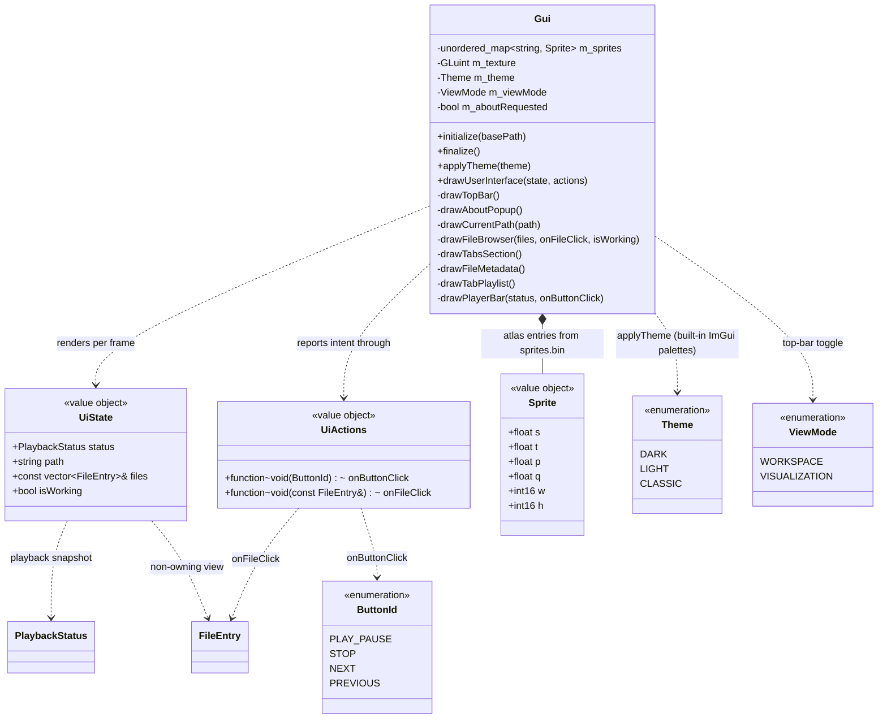

# UI domain

Presentation layer in `src/gui/`. `Gui` is stateless apart from the sprite atlas texture: each frame it receives a `UiState` view model (all data to render) and a `UiActions` bundle (callbacks to report intent). It never touches the player or filesystem directly — `Application` builds `UiState`/`UiActions`, main.cpp just forwards them (see [application.md](application.md)).

## Notes

- `UiState` (`src/gui/UiState.h`) is a per-frame value object, rebuilt each frame and never stored; its `files` member is a non-owning reference valid only for that frame. `UiActions` (`src/gui/UiActions.h`) is the callback bundle, wired once at startup. Both are produced by `Application`.
- `drawUserInterface(state, actions)` draws a top bar (`drawTopBar`) then a borderless fullscreen window laid out as: a left pane (~45% width, `drawCurrentPath` + `drawFileBrowser`) beside a right pane (`drawTabsSection` → Metadata + Playlist), both filling the height above a full-width 140 px `drawPlayerBar` pinned to the bottom. Pane/bar geometry is derived each frame from `GetContentRegionAvail()` and `ItemSpacing` (fixed 1280×720). The full layout spec is in [ui-design.md](ui-design.md).
- `drawTopBar` is the ImGui main menu bar: app title, a **Settings** menu whose **Theme** submenu calls `applyTheme`, an **About** entry, and a right-aligned **view-mode toggle** (fullscreen / fullscreen_exit glyph) flipping `m_viewMode`. About uses a one-frame `m_aboutRequested` latch; `OpenPopup`/`BeginPopupModal` (`drawAboutPopup`, k7 logo + credits) are hosted inside the always-drawn menu-bar window so About works in both view modes. The old Settings/About tabs are gone.
- `ViewMode` (`src/gui/ViewMode.h`) is presentation state on the `Gui`. `WORKSPACE` draws the full UI; `VISUALIZATION` early-returns after the top bar, so panes + player bar are skipped and the area below shows the GL clear color — reserved for the future visualizer (TODO_8). The mode never touches the player, so audio keeps playing while collapsed.
- `drawPlayerBar(status, onButtonClick)` reads `UiState::status`: track line (`title · fileName`, or `No track` when stopped), a display-only `m:ss` progress bar (`positionSeconds/durationSeconds`, no seek), and centered 48×48 transport ImageButtons; the play/pause button shows the `pause` sprite while `PlayerState::PLAYING`, else `play`. A file-local `formatTime(double)` renders `m:ss`.
- `UiState::status` is a `PlaybackStatus` snapshot from the player domain (see [audio.md](audio.md)). The Metadata tab (`drawFileMetadata`) still shows placeholder key/value rows until TODO_5 supplies typed per-plugin metadata.
- `Theme` (`src/gui/Theme.h`) selects one of ImGui's three built-in color palettes; `Gui::applyTheme(Theme)` dispatches to `StyleColorsDark`/`Light`/`Classic` and records `m_theme` (presentation state, drives the Settings menu checkmark). `initialize()` sets the theme-independent style metrics (rounding, padding, spacing) once and then applies the dark default; `applyTheme` only swaps colors, so it is safe to call live from the menu. Theme choice is not yet persisted (TODO_6). The full design lives in [ui-design.md](ui-design.md).

- Sprites are loaded in `initialize()` from `romfs/sprites/sprites.bin` (custom `SPSH` format) + `sprites.png` into one GL texture; `Sprite` holds the UV rect (s/t/p/q) and pixel size.
- Icon glyphs in labels (e.g. folder/file icons) are Material Symbols codepoints merged into the default font in main.cpp.
- Dear ImGui is a pristine git submodule at `external/imgui/` (pinned to v1.92.8). The Switch glad integration lives in `src/gui/imgui_impl_opengl3_glad.cpp` — a wrapper that includes `<glad/glad.h>` before the upstream OpenGL3 backend (`IMGUI_IMPL_OPENGL_LOADER_CUSTOM` skips the embedded loader on Switch).
