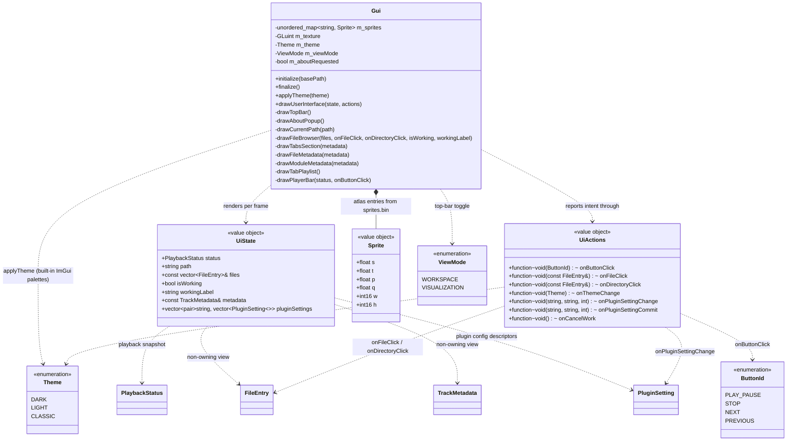

# UI domain

Presentation layer in `src/gui/`. `Gui` is stateless apart from the sprite atlas texture: each frame it receives a `UiState` view model (all data to render) and a `UiActions` bundle (callbacks to report intent). It never touches the player or filesystem directly — `Application` builds `UiState`/`UiActions`, main.cpp just forwards them (see [application.md](application.md)).

## Notes

- `UiState` (`src/gui/UiState.h`) is a per-frame value object, rebuilt each frame and never stored; its `files` member is a non-owning reference valid only for that frame. `UiActions` (`src/gui/UiActions.h`) is the callback bundle, wired once at startup. Both are produced by `Application`.
- `drawUserInterface(state, actions)` draws a top bar (`drawTopBar`) then a borderless fullscreen window laid out as: a left pane (~45% width, `drawCurrentPath` + `drawFileBrowser`) beside a right pane (`drawTabsSection` → Metadata + Playlist), both filling the height above a full-width 140 px `drawPlayerBar` pinned to the bottom. Pane/bar geometry is derived each frame from `GetContentRegionAvail()` and `ItemSpacing` (fixed 1280×720). The full layout spec is in [ui-design.md](ui-design.md).
- `drawTopBar(pluginSettings, onThemeChange, onPluginSettingChange)` is the ImGui main menu bar: app title, a **Settings** menu (**Theme** submenu + **Plugins** submenu), an **About** entry, and a right-aligned **view-mode toggle** (fullscreen / fullscreen_exit glyph) flipping `m_viewMode`. Each Theme item both calls `applyTheme` (immediate visual apply + checkmark state) **and** fires `onThemeChange(theme)` so `Application` can persist the choice (see [application.md](application.md) / [settings.md](settings.md)); the visual apply stays in the Gui because it owns the ImGui style.
- **Plugin config lives behind a submenu + per-plugin popup, fully generic** — zero plugin-specific UI code. The **Plugins** submenu lists one entry per plugin that publishes settings (from `UiState::pluginSettings`, a non-owning view over `Application`'s cached `vector<pair<pluginName, vector<PluginSetting>>>` snapshot — refreshed off the per-frame path, see [application.md](application.md); a plugin with no descriptors is skipped, and an empty submenu shows a dimmed *"No configurable plugins"*). Clicking a plugin name latches it into `m_requestedPluginPopup`; the top bar then `OpenPopup`s that name in the menu-bar window scope (same latch idiom as About, so it works in both view modes). `drawPluginPopups` draws one `BeginPopupModal` per plugin, **keyed and titled by the plugin name**, so only the picked plugin's popup is ever open. Inside, one widget per descriptor is chosen by `std::visit` on the descriptor's `shape`: `IntRange` → `SliderInt(min, max)`, `EnumOptions` → `Combo` over the label list (value = selected index), each row wrapped in `PushID(key)` and the block in `PushID(pluginName)` (keys need only be unique per plugin — the INI-key contract), plus a `Close` button. **Editing is split so a dragged slider does not rewrite the INI every frame:** every edit fires `onPluginSettingChange` (apply to the decoder live, immediate audio), while `onPluginSettingCommit` (persist) fires only on release — for the slider via `IsItemDeactivatedAfterEdit()`, for the combo on its discrete selection (`IsItemDeactivatedAfterEdit` is unreliable for combos, so it commits on change). `Application` routes the two to apply vs. save (see [application.md](application.md)). New decoder plugins that publish descriptors get this UI for free. About uses a one-frame `m_aboutRequested` latch; `OpenPopup`/`BeginPopupModal` (`drawAboutPopup`, k7 logo + credits) are hosted inside the always-drawn menu-bar window so About works in both view modes. The old Settings/About tabs are gone.
- `ViewMode` (`src/gui/ViewMode.h`) is presentation state on the `Gui`. `WORKSPACE` draws the full UI; `VISUALIZATION` early-returns after the top bar, so panes + player bar are skipped and the area below shows the GL clear color — reserved for the future visualizer (TODO_8). The mode never touches the player, so audio keeps playing while collapsed.
- `drawFileBrowser` is a three-column table (Name / Type / Size): `Type` shows `Folder`, `Source`, or the uppercase extension; `Size` is formatted B/KB/MB (one decimal) for files, blank for folders. It reports two intents: file rows call `onFileClick`; directory rows, the virtual-root source entries, and the Gui-pinned `..` row call `onDirectoryClick` (the `..` row passes a synthetic `FileEntry{"..", 0, "Folder", true}` — `..` is never a `FileSystem` entry). `Application::handleDirectoryClick` routes `..` to `navigateToParent()` and everything else to `navigateToEntry()` (see [filesystem.md](filesystem.md)).
- While `state.isWorking`, the browser is wrapped in `BeginDisabled` (blocks mouse + keyboard/gamepad nav) and a dimmed overlay draws a centered ASCII spinner (`| / - \`, stepped ~8×/s from `ImGui::GetTime()`) beside `state.workingLabel` — `"Scanning..."` for a directory scan, `"Downloading..."` for a file fetch (`Application` picks the label from `FileSystem::isFetching()`; see [filesystem.md](filesystem.md)). The spinner sits in a fixed-width slot so the label never jitters as the frame char changes width.
- A **Cancel** button sits on a second line below the spinner and fires `actions.onCancelWork` to abort a stuck scan/download. The overlay is a separate (non-disabled) window; on the rising edge of `isWorking` (tracked by `m_wasWorking`) it grabs focus and `SetKeyboardFocusHere` targets the button once, so it is reachable by gamepad/keyboard on the Switch (not only by mouse).
- `drawPlayerBar(status, onButtonClick)` reads `UiState::status`: track line (`title · fileName`, or `No track` when stopped), a progress row (`position` label, a display-only track, `duration` label — `positionSeconds/durationSeconds`, no seek), and centered 48×48 transport ImageButtons; the play/pause button shows the `pause` sprite while `PlayerState::PLAYING`, else `play`. A file-local `formatTime(double)` renders `m:ss`. **Progress is drawn by hand on the window draw list** (`GetWindowDrawList()`): a thin full-width `FrameBg` line, and — only while a track is loaded (`state != STOPPED`) — the played portion filled in `PlotHistogram` up to a circular playhead (`AddCircleFilled`) sliding along it, all vertically centred on the label line. When stopped the row is just the empty line (no knob). This replaced `ImGui::ProgressBar` (a framed widget whose `FramePadding.y` text-baseline offset pushed the timer labels out of alignment, and whose filled rectangle could not be rounded cleanly at partial/zero widths). The knob's travel is inset by its radius so it never overflows the line ends or the labels, and the row's slot is reserved with a plain `Dummy` so both labels keep one baseline.
- `UiState::status` is a `PlaybackStatus` snapshot from the player domain (see [audio.md](audio.md)). `UiState::metadata` is a non-owning `TrackMetadata` reference (the variant built by `Application`, see [application.md](application.md)) valid for the frame.
- **The Metadata tab dispatches on the variant.** `drawFileMetadata(metadata)` runs `std::visit` over a file-local `overloaded{}` lambda set — `std::monostate` renders a centered, dimmed *"No track loaded"*; `ModuleMetadata` calls `drawModuleMetadata`. There is deliberately **no** generic `auto` fallback: adding a plugin's metadata alternative to the variant fails to compile here until its own draw function exists (the exhaustiveness guard is the plugin author's checklist). `drawModuleMetadata` renders a two-column field table (text rows — Title/Artist/Format/Tracker — skipped when empty; count rows — Channels/Patterns/Samples/Instruments — always shown) and, when the song message is non-empty, a scrollable word-wrapped child region drawn with `TextUnformatted` (never printf-formatting user-authored text).
- `Theme` (`src/gui/Theme.h`) selects one of ImGui's three built-in color palettes; `Gui::applyTheme(Theme)` dispatches to `StyleColorsDark`/`Light`/`Classic` and records `m_theme` (presentation state, drives the Settings menu checkmark). `initialize()` sets the theme-independent style metrics (rounding, padding, spacing) once and then applies the dark default; `applyTheme` only swaps colors, so it is safe to call live from the menu. Theme choice is persisted via `onThemeChange` (see [settings.md](settings.md)). The full design lives in [ui-design.md](ui-design.md).

- Sprites are loaded in `initialize()` from `romfs/sprites/sprites.bin` (custom `SPSH` format) + `sprites.png` into one GL texture; `Sprite` holds the UV rect (s/t/p/q) and pixel size.
- Icon glyphs in labels (e.g. folder/file icons) are Material Symbols codepoints merged into the default font in main.cpp.
- Dear ImGui is a pristine git submodule at `external/imgui/` (pinned to v1.92.8). The Switch glad integration lives in `src/gui/imgui_impl_opengl3_glad.cpp` — a wrapper that includes `<glad/glad.h>` before the upstream OpenGL3 backend (`IMGUI_IMPL_OPENGL_LOADER_CUSTOM` skips the embedded loader on Switch).
