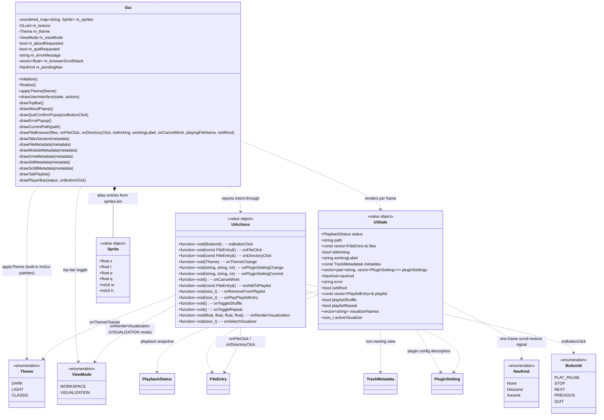

# UI domain

Presentation layer in `src/gui/`. `Gui` is stateless apart from the sprite atlas texture: each frame it receives a `UiState` view model (all data to render) and a `UiActions` bundle (callbacks to report intent). It never touches the player or filesystem directly — `Application` builds `UiState`/`UiActions`, main.cpp just forwards them (see [application.md](application.md)).

## Notes

- `UiState` (`src/gui/UiState.h`) is a per-frame value object, rebuilt each frame and never stored; its `files` member is a non-owning reference valid only for that frame. `UiActions` (`src/gui/UiActions.h`) is the callback bundle, wired once at startup. Both are produced by `Application`.
- `drawUserInterface(state, actions)` draws a top bar (`drawTopBar`) then a borderless fullscreen window laid out as: a left pane (~45% width, `drawCurrentPath` + `drawFileBrowser`) beside a right pane (`drawTabsSection` → Metadata + Playlist), both filling the height above a full-width 140 px `drawPlayerBar` pinned to the bottom. Pane/bar geometry is derived each frame from `GetContentRegionAvail()` and `ItemSpacing` (fixed 1280×720). The full layout spec is in [ui-design.md](ui-design.md).
- `drawTopBar(pluginSettings, onThemeChange, onPluginSettingChange, onPluginSettingCommit, visualizerNames, activeVisualizer, onSelectVisualizer, onButtonClick, error)` is the ImGui main menu bar: app title, a **Settings** menu (**Theme** submenu + **Visualizer** submenu + **Plugins** submenu, in that order), an **About** entry, a **Quit** entry (power glyph), and a right-aligned **view-mode toggle** (fullscreen / fullscreen_exit glyph) flipping `m_viewMode`. The **Quit** entry opens a confirm modal (`drawQuitConfirmPopup`): its **Quit** button fires `onButtonClick(QUIT)`, **Cancel** just dismisses. `QUIT` is intercepted by `Platform` (not `Application`) because `Platform` owns the run-loop `is_running` flag: it wraps the `onButtonClick` callback to flip that flag on `QUIT` and delegate every other id to `Application::handleButtonClick`, which keeps a no-op `case QUIT` so its `switch` stays exhaustive (see [platform.md](platform.md) / [application.md](application.md)). On desktop this exits like Esc / window-close; on Switch it returns to the Home menu (alongside the existing START-to-exit). The **Visualizer** submenu lists each `visualizerNames` entry with a checkmark on `activeVisualizer`; picking one fires `onSelectVisualizer(index)`. Each Theme item both calls `applyTheme` (immediate visual apply + checkmark state) **and** fires `onThemeChange(theme)` so `Application` can persist the choice (see [application.md](application.md) / [settings.md](settings.md)); the visual apply stays in the Gui because it owns the ImGui style.
- **Plugin config lives behind a submenu + per-plugin popup, fully generic** — zero plugin-specific UI code. The **Plugins** submenu lists one entry per plugin that publishes settings (from `UiState::pluginSettings`, a non-owning view over `Application`'s cached `vector<pair<pluginName, vector<PluginSetting>>>` snapshot — refreshed off the per-frame path, see [application.md](application.md); a plugin with no descriptors is skipped, and an empty submenu shows a dimmed *"No configurable plugins"*). Clicking a plugin name latches it into `m_requestedPluginPopup`; the top bar then `OpenPopup`s that name in the menu-bar window scope (same latch idiom as About, so it works in both view modes). `drawPluginPopups` draws one `BeginPopupModal` per plugin, **keyed and titled by the plugin name**, so only the picked plugin's popup is ever open. Inside, one widget per descriptor is chosen by `std::visit` on the descriptor's `shape`: `IntRange` → `SliderInt(min, max)`, `EnumOptions` → `Combo` over the label list (value = selected index), each row wrapped in `PushID(key)` and the block in `PushID(pluginName)` (keys need only be unique per plugin — the INI-key contract), plus **Save** and **Close** buttons. **The popup owns a working copy** (`m_settingsEdit`, key→value) seeded once when it opens (`m_openSettingsPlugin` latch) from the descriptor cache; each widget binds to a reference into that map, so it renders from stable storage and never flashes off the frame-lagging cache. Editing fires `onPluginSettingChange` (apply to the decoder **live** for an immediate audio preview) but does **not** persist. **Save** writes every value to the INI (`onPluginSettingCommit` per descriptor) and closes; **Close** closes without persisting, leaving the live-applied values in the decoder for the session (they revert on the next launch). The latch is cleared in one place — when `BeginPopupModal` returns false — so a dismissal via a button *or* the Escape key reseeds on the next open. `Application` routes the two callbacks to apply-live vs. save (see [application.md](application.md)). New decoder plugins that publish descriptors get this UI for free. About uses a one-frame `m_aboutRequested` latch; `OpenPopup`/`BeginPopupModal` (`drawAboutPopup`) are hosted inside the always-drawn menu-bar window so About works in both view modes. The box shows the k7 logo, the app name, a **version + build** line, **author + copyright** ("Copyright (C) 2026 Romain Graillot", "GPL-3.0-or-later"), a **credits** block (decoders libopenmpt / libgme / libsidplayfp / sc68 plus Dear ImGui, SDL2, and the bundled fonts, mirroring `THIRD_PARTY_NOTICES.md`), and the **project link** as plain text below the license line. The logo sits to the left of the text block so the box stays wider than it is tall. The version string is built from the CMake `OSP_VERSION` compile definition (from `project(VERSION)`), with an optional `OSP_GIT_REV` short-commit build suffix that is omitted when the rev is empty. **Quit** mirrors this exactly with a `m_quitRequested` latch and `drawQuitConfirmPopup`, hosted in the same menu-bar scope. The old Settings/About tabs are gone.
- **Playback errors surface through an error modal reusing the About-popup pattern.** `UiState::error` is a **one-frame** message string, non-empty only on the frame `Application` composes a playback failure (unsupported format, download failure, or decode failure — see [application.md](application.md)); it is empty on a normal play and while auto-advancing (a broken sibling is skipped silently, never popped). `drawTopBar` takes it as a trailing `const std::string &error` and, in the same menu-bar scope as the About/Quit/plugin popups, **latches it into `m_errorMessage` on the rising edge** (`!error.empty() && m_errorMessage.empty()` → copy + `OpenPopup("Playback error")`); the latch is what lets the modal persist until the user clicks Close even though `UiState::error` goes empty again the next frame. If a popup is already showing, a new error is dropped (kept simple). `drawErrorPopup()` renders the centered `BeginPopupModal("Playback error", …)` (same flags/centering as `drawAboutPopup`) showing `m_errorMessage` and a **Close** button that both `CloseCurrentPopup()`s **and** clears `m_errorMessage` — so unlike the read-only `drawAboutPopup`, `drawErrorPopup` is **non-const** (it mutates the latch).
- `ViewMode` (`src/gui/ViewMode.h`) is presentation state on the `Gui`. `WORKSPACE` draws the full UI; `VISUALIZATION` skips the panes + player bar and, after the top bar, hands the work area below to the visualizer via `actions.onRenderVisualization(x, y, w, h)` before returning. The rect is the main viewport's `WorkPos`/`WorkSize` (which already exclude the menu bar). The mode never touches the player, so audio keeps playing while collapsed.
- **`onRenderVisualization`** (`UiActions`) is the presentation-only hook for VISUALIZATION mode — the same principle as `onButtonClick`: `Gui` reports the reserved rect and knows nothing about the visualizer domain. It is wired in `main.cpp` (not `Application`, since the visualizer is a platform-layer concern): the callback reads the audio tap (`PlayerController::readLatestAudio`), builds a `VisualFrame`, and calls `VisualizerController::render`. See [visualization.md](visualization.md) for the visualizer domain and the ImGui/GL render bridge.
- **`onSelectVisualizer`** (`UiActions`) + **`UiState::visualizerNames` / `UiState::activeVisualizer`** drive the **Settings→Visualizer** picker (see `drawTopBar` above). Like `onRenderVisualization`, this stays wired in `main.cpp` (the visualizer bridge), not `Application`: `main.cpp` fills `visualizerNames` (from `VisualizerController::getNames()`) and `activeVisualizer` (from `getActiveIndex()`) onto the per-frame `UiState` before `drawUserInterface`, and `onSelectVisualizer(index)` calls `VisualizerController::select`. Because these two `UiState` fields carry default member initializers, `Application::makeUiState()`'s aggregate `return {…}` is unaffected — `main.cpp` sets them on the returned value. `Gui` only lists the names and reports the picked index. No persistence of the choice yet (a future settings item, alongside theme). See [visualization.md](visualization.md).
- `drawFileBrowser` is a three-column table (Name / Type / Size): `Type` shows `Folder`, `Source`, or the uppercase extension; `Size` is formatted B/KB/MB (one decimal) for files, blank for folders, and **right-aligned** within its fixed column (same `CalcTextSize` + `SetCursorPosX` idiom as the player bar's "Track n/N" indicator and duration label). It reports two intents: file rows call `onFileClick`; directory rows, the virtual-root source entries, and the Gui-pinned `..` row call `onDirectoryClick` (the `..` row passes a synthetic `FileEntry{"..", 0, "Folder", true}` — `..` is never a `FileSystem` entry). `Application::handleDirectoryClick` routes `..` to `navigateToParent()` and everything else to `navigateToEntry()` (see [filesystem.md](filesystem.md)). The `..` row is **hidden at the virtual root** (sources list), where it would be a no-op: `drawFileBrowser` guards it on `!isAtRoot`, a bool carried by `UiState` and set in `makeUiState` from `m_fileSystem.getPath().empty()` (preferred over string-matching the display path against `"Sources"`).
- **Scroll restore across navigation.** The table id is the constant `"file_browser"`, so ImGui keeps a single scroll offset for it — without help, that offset would bleed between directories. The driver is `UiState::navKind`, a one-frame `NavKind` signal originating in `FileSystem` and emitted only when a listing actually swaps in — never on a failed scan (see [filesystem.md](filesystem.md)). Because that swap can land on a frame the browser isn't drawn (VISUALIZATION mode early-returns before the panes, or a culled pane), `drawUserInterface` **latches** the signal into `m_pendingNav` every frame — *before* the VISUALIZATION early-return — rather than acting on it inline; `drawFileBrowser` then applies and clears `m_pendingNav` only once the table is actually laid out, so a signal is never lost. Navigation can only be triggered from the (visible) browser, so at most one signal is ever pending. Acting on the latch, `drawFileBrowser` keeps a `std::vector<float> m_browserScrollStack`: on **`Descend`** it pushes the current `GetScrollY()` and resets scroll to `0` (a new directory opens at the top); on **`Ascend`** it pops the stack and restores that offset (the parent comes back exactly where you left it). All `Get/SetScrollY` calls sit **inside** the `BeginTable`/`EndTable` scope (so they target the table's scrolling child) and run before any row `Selectable` callback fires. Descending into a source and climbing back to the virtual root are a matched push/pop pair at depth 0, so the stack stays balanced with real navigation (empty-stack pop falls back to `0`).
- While `state.isWorking`, the browser is wrapped in `BeginDisabled` (blocks mouse + keyboard/gamepad nav) and a dimmed overlay draws a centered ASCII spinner (`| / - \`, stepped ~8×/s from `ImGui::GetTime()`) beside `state.workingLabel` — `"Scanning..."` for a directory scan, `"Downloading..."` for a file fetch, and `"Loading..."` for a decode/parse. The spinner sits in a fixed-width slot so the label never jitters as the frame char changes width.
- **The async decode reuses this same overlay — no new widget.** `Gui` and `UiState` are unchanged for loading: `Application::makeUiState()` ORs the player's `isLoading()` into `isWorking` and picks the `"Loading..."` label (with priority over the FileSystem labels, since a decode always follows the fetch that fed it), and `onCancelWork` already routes cancellation to both the filesystem and the player (see [audio.md](audio.md) / [application.md](application.md)). So the spinner + dimmed backdrop + Cancel now cover the whole download-then-decode path, not just the download.
- The **currently-playing track's row is highlighted** (rendered as a selected `Selectable`): `drawFileBrowser` receives `playingFileName` (from `UiState::status.fileName`, empty when the player is `STOPPED`) and matches it against each file entry by name — the same filename basis `playAdjacentTrack` uses, so it lights the right row for both local and cached remote tracks.
- Menu/label icons follow an **icon + single space + text** convention (Material Symbols glyph, e.g. settings on the Settings menu, info on About, a note in the player bar).
- A **Cancel** button sits on a second line below the spinner and fires `actions.onCancelWork` to abort a stuck scan/download. The overlay is a separate (non-disabled) window; on the rising edge of `isWorking` (tracked by `m_wasWorking`) it grabs focus and `SetKeyboardFocusHere` targets the button once, so it is reachable by gamepad/keyboard on the Switch (not only by mouse).
- `drawPlayerBar(status, onButtonClick)` reads `UiState::status`: track line (`title · fileName`, or `No track` when stopped), a progress row (`position` label, a display-only track, `duration` label — `positionSeconds/durationSeconds`, no seek), and centered 48×48 transport ImageButtons; the play/pause button shows the `pause` sprite while `PlayerState::PLAYING`, else `play`.
- **Multi-subtrack files show a right-aligned "Track n/N" indicator on the track line.** When a track is loaded (`state != STOPPED && !fileName.empty()`) **and** `status.subtrackCount > 1`, `drawPlayerBar` right-aligns `Track <currentSubtrack+1>/<subtrackCount>` (1-based for display) on the same line as the title, via a trailing `SameLine` + `SetCursorPosX(cursor + avail − textWidth)`. Single-track files (count `1`, e.g. a MOD) and the stopped state show nothing — the indicator only appears where subtracks are navigable. Both fields come straight from `PlaybackStatus` (see [audio.md](audio.md)); the transport `NEXT`/`PREVIOUS` buttons step through those subtracks first, then the next/previous file (see below).
- **NEXT/PREVIOUS step subtracks first, then files.** The on-screen transport `NEXT`/`PREVIOUS` buttons (clickable via mouse or the Switch cursor) fire `onButtonClick(NEXT/PREVIOUS)`; `Application::advance` advances to the next/previous **subtrack** within the current file while one remains in that direction, and only at a boundary falls through to the next/previous **file** (auto-advance on track-end takes the same branch). **PREVIOUS from subtrack 0 lands on the previous file at ITS subtrack 0**, not that file's last subtrack — a deliberate, documented choice (see [application.md](application.md)). Single-track files always fall straight through to file navigation, so the old behavior is unchanged for them. No new `ButtonId` was added — the existing transport ids drive this. A file-local `formatTime(double)` renders `m:ss`. **Progress is drawn by hand on the window draw list** (`GetWindowDrawList()`): a thin full-width `FrameBg` line, and — only while a track is loaded (`state != STOPPED`) — the played portion filled in `PlotHistogram` up to a circular playhead (`AddCircleFilled`) sliding along it, all vertically centred on the label line. When stopped the row is just the empty line (no knob). This replaced `ImGui::ProgressBar` (a framed widget whose `FramePadding.y` text-baseline offset pushed the timer labels out of alignment, and whose filled rectangle could not be rounded cleanly at partial/zero widths). The knob's travel is inset by its radius so it never overflows the line ends or the labels, and the row's slot is reserved with a plain `Dummy` so both labels keep one baseline.
- `UiState::status` is a `PlaybackStatus` snapshot from the player domain (see [audio.md](audio.md)). `UiState::metadata` is a non-owning `TrackMetadata` reference (the variant built by `Application`, see [application.md](application.md)) valid for the frame.
- **The Metadata tab dispatches on the variant.** `drawFileMetadata(metadata)` runs `std::visit` over a file-local `overloaded{}` lambda set — `std::monostate` renders a centered, dimmed *"No track loaded"*; `ModuleMetadata` calls `drawModuleMetadata`; `GmeMetadata` calls `drawGmeMetadata`; `SidMetadata` calls `drawSidMetadata`; `Sc68Metadata` calls `drawSc68Metadata`. There is deliberately **no** generic `auto` fallback: adding a plugin's metadata alternative to the variant fails to compile here until its own draw function exists (the exhaustiveness guard is the plugin author's checklist). `drawModuleMetadata` renders a two-column field table (text rows — Title/Artist/Format/Tracker — skipped when empty; count rows — Channels/Patterns/Samples/Instruments — always shown) and, when the song message is non-empty, a scrollable word-wrapped child region drawn with `TextUnformatted` (never printf-formatting user-authored text). `drawGmeMetadata` follows the same shape for libgme's fields (text rows — Game/System/Author/Copyright; count row — Tracks; scrollable Comment block). `drawSidMetadata` renders libsidplayfp's fields as a text-row-only table (Title/Author/Released/SID model/Clock, each skipped when empty). `drawSc68Metadata` does the same for libsc68's fields (Title/Author/Composer/Hardware/Ripper, each skipped when empty).
- **The Playlist tab is data-driven** (as of 28a): `makeUiState()` fills a per-frame playlist slice on `UiState` — `playlist` (a non-owning view over `PlayList::entries()`, valid for the frame) plus the `playlistShuffle` / `playlistRepeat` flags — and `UiActions` carries five playlist callbacks (`onAddToPlaylist`, `onRemoveFromPlaylist`, `onPlayPlaylistEntry`, `onToggleShuffle`, `onToggleRepeat`). `drawTabPlaylist` is still the stub, so the tab renders nothing yet; the drawing (with the per-row "tofu" state icon), the browser right-click "Add to playlist" context menu, and the real action handlers arrive in later chunks (28b–28e). See [playlist.md](playlist.md).
- `Theme` (`src/gui/Theme.h`) selects one of ImGui's three built-in color palettes; `Gui::applyTheme(Theme)` dispatches to `StyleColorsDark`/`Light`/`Classic` and records `m_theme` (presentation state, drives the Settings menu checkmark). `initialize()` sets the theme-independent style metrics (rounding, padding, spacing) once and then applies the dark default; `applyTheme` only swaps colors, so it is safe to call live from the menu. Theme choice is persisted via `onThemeChange` (see [settings.md](settings.md)). The full design lives in [ui-design.md](ui-design.md).

- Sprites are loaded in `initialize()` from `romfs/sprites/sprites.bin` (custom `SPSH` format) + `sprites.png` into one GL texture; `Sprite` holds the UV rect (s/t/p/q) and pixel size.
- Icon glyphs in labels (e.g. folder/file icons) are Material Symbols codepoints merged into the default font in main.cpp.
- Dear ImGui is a pristine git submodule at `external/imgui/` (pinned to v1.92.8). The Switch glad integration lives in `src/gui/imgui_impl_opengl3_glad.cpp` — a wrapper that includes `<glad/glad.h>` before the upstream OpenGL3 backend (`IMGUI_IMPL_OPENGL_LOADER_CUSTOM` skips the embedded loader on Switch).
