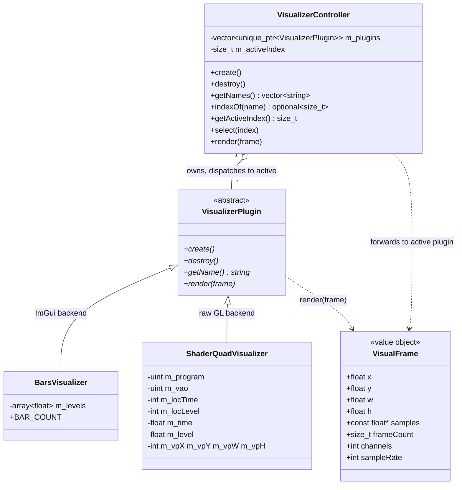

# Visualization domain

Presentation layer in `src/visualizer/`. A pluggable, audio-reactive visualization system mirroring the `PlayerPlugin` pattern: one interface, interchangeable implementations, each free to render with ImGui primitives **or** raw OpenGL. Unlike the player domain, the visualizer layer may depend on ImGui/GL — but it does **not** depend on `PlayerController` or `Gui`; `Platform` wires them together.

## Notes

- **`VisualFrame`** (`src/visualizer/VisualFrame.h`) is the per-frame input: the reserved screen rect (`x, y, w, h`) plus a read-only view of the most recently decoded audio (`samples`, `frameCount`, `channels`, `sampleRate`). It is deliberately **free of ImGui/GL types** so it can be built in the platform layer (`Platform`) without dragging the presentation backend into the audio wiring. `samples` may be `nullptr` when `frameCount == 0`.

- **`VisualizerPlugin`** (`src/visualizer/VisualizerPlugin.h`) is the abstract base, mirroring `PlayerPlugin`. `create()`/`destroy()` give a raw-GL plugin a clear lifecycle for its shader/VBO (called once from `VisualizerController::create()`/`destroy()` on the main thread, with a live GL context); ImGui plugins leave them empty. `render(frame)` runs inside the ImGui frame (between `NewFrame` and `Render`) once per frame while in VISUALIZATION mode.

- **`VisualizerController`** (`src/visualizer/VisualizerController.{h,cpp}`) mirrors `PlayerController`'s ownership pattern: owns `vector<unique_ptr<VisualizerPlugin>>` and an active index (default 0), one `emplace_back` per plugin in `create()` (registration order = selector order), and `render()` forwards to the active plugin. Registration order is `BarsVisualizer` (index 0, default active) then `ShaderQuadVisualizer` (index 1). `getNames()` feeds the Settings→Visualizer picker and `getActiveIndex()` reports which one has the checkmark; `select(index)` (bounds-checked) switches the active plugin at runtime. `indexOf(name)` resolves a stable plugin name back to its index (`nullopt` if unknown), which the platform layer uses to restore the persisted selection at startup. It is non-copyable and guards `render()`/`select()` against an empty/out-of-range index, so `render()` is a safe no-op before `create()` / after `destroy()`.

- **`BarsVisualizer`** (`src/visualizer/visualizers/BarsVisualizer.{h,cpp}`) is the basic plugin shipped in chunk 8c (ImGui backend, `create()`/`destroy()` empty), and the sole default-active plugin (index 0). It draws `BAR_COUNT` (64) vertical bars whose heights track per-band audio amplitude. Bands are **time-domain**: the sample window is bucketed into `BAR_COUNT` contiguous buckets and each bar's target is the **peak of |mono|** over its bucket (peak, not RMS → transients pop) times an empirical visual `GAIN`, clamped to 1. No FFT → **no dependency, Switch-safe**. Per-bar heights are smoothed with a fast **attack** / gentle **decay** and persisted across frames in `m_levels`, so bars rise sharply on transients and fall smoothly; when `frameCount == 0` all targets are 0, so the bars **decay to rest**. Drawn via `ImGui::GetBackgroundDrawList()->AddRectFilled(...)` inside the reserved rect, growing bottom→up, using the theme accent (`ImGuiCol_PlotHistogram`) for consistency with the player bar. A true FFT **spectrum** and a GL **shader-quad** are follow-on plugins (8d/future).

- **`ShaderQuadVisualizer`** (`src/visualizer/visualizers/ShaderQuadVisualizer.{h,cpp}`) is the raw-GL plugin shipped in chunk 8d (getName() `"Plasma"`, index 1). It renders an animated plasma with a **fullscreen-triangle** fragment shader (attribute-less: the triangle's clip-space corners are derived from `gl_VertexID`, so no VBO — only an empty VAO, which core profile still requires for `glDrawArrays`). Rather than draw immediately, `render()` schedules the GL draw on the background draw list via **`ImDrawList::AddCallback`** and immediately queues `ImDrawCallback_ResetRenderState`; the GL3 backend runs the callback during `ImGui_ImplOpenGL3_RenderDrawData`, then the reset restores the backend's own viewport/scissor/program/blend for the ImGui geometry that follows (the callback deliberately leaves state dirtied and restores nothing itself). The draw is **confined to the reserved rect** with `glViewport` + `glScissor` over the rect converted to framebuffer pixels and **Y-flipped** (GL's framebuffer origin is bottom-left, ImGui's screen origin is top-left; `DisplayFramebufferScale` handles HiDPI backing). The shader uses **`#version 330 core`** — the same version `Platform` feeds `ImGui_ImplOpenGL3_Init`, proven portable on desktop **and** Switch here. It obeys the freeze-when-hidden contract by accumulating `ImGui::GetIO().DeltaTime` into `m_time` inside `render()` (never `GetTime()`), and is **audio-reactive** via a `u_level` uniform (mean of `|mono|` over the sample window, gained and clamped to `[0, 1]`; `0` when `frameCount == 0` so the plasma settles to a dim rest). `create()` compiles/links the program (logging any compile/link info log via `SDL_Log` and leaving `m_program == 0` on failure, which makes `render()` a safe no-op); `destroy()` frees the program and VAO. Both plugins' `create()`/`destroy()` run for **all** registered plugins at startup/shutdown (with a live GL context), so the GL resources exist regardless of which plugin is active — selecting only changes which one renders.

- **Animation freezes when hidden.** A visualizer must advance its animation/state from the per-frame delta **inside `render()`** (`BarsVisualizer` drives its attack/decay smoothing from `ImGui::GetIO().DeltaTime`), never from the always-ticking global `ImGui::GetTime()`. Because the controller's `render()` is only called in VISUALIZATION mode, deriving motion from render-time makes a visualizer stop while hidden and resume where it left off — the bars freeze mid-decay when hidden and resume from the same heights, no phase jump on re-entry, no work when off-screen. Audio-reactive plugins get this for free (their state only updates when fed a frame).

## Render bridge (ImGui / GL)

There is **one render call site and one draw order** regardless of a plugin's backend, because `render()` runs inside the ImGui frame:

- **ImGui plugins** (like `BarsVisualizer`) draw **immediately** via `ImGui::GetBackgroundDrawList()` — the background list paints behind every window, directly on the reserved rect in screen coordinates. Portable and identical on desktop + Switch (no shader/CMake changes).
- **GL plugins** (`ShaderQuadVisualizer`, realized in chunk 8d) schedule their draw through `ImDrawList::AddCallback` on the same background draw list, so the raw-GL rendering is ordered into the same ImGui draw data and executed before the backend draws its own geometry inside `ImGui_ImplOpenGL3_RenderDrawData`; the plugin queues `ImDrawCallback_ResetRenderState` right after so the backend restores its render state for the following ImGui geometry.

The single call site is `Platform`'s `onRenderVisualization` callback (wired onto `UiActions`): in VISUALIZATION mode `Gui` invokes it with the reserved rect (`viewport->WorkPos`/`WorkSize`, which already exclude the main menu bar); the callback reads the audio tap, builds a `VisualFrame`, and calls `visualizer.render(frame)`. `Gui` stays presentation-only and knows nothing about the visualizer domain — same principle as `onButtonClick` (see [ui.md](ui.md)).

**Selector (Settings→Visualizer).** The active visualizer is switched at runtime from a **Settings→Visualizer** submenu that lists each registered plugin name with a checkmark on the active one. The wiring keeps `Gui` and `Application` ignorant of the visualizer domain: `Platform` fills `UiState::visualizerNames` (from `VisualizerController::getNames()`) and `UiState::activeVisualizer` (from `getActiveIndex()`) onto the per-frame view model before `drawUserInterface`, and wires `UiActions::onSelectVisualizer` to call `VisualizerController::select(index)`. `Gui` merely lists the names and reports the picked index — same presentation-only principle as `onRenderVisualization`.

**Persistence.** The active selection is persisted through `Settings`, alongside the theme. `Platform` owns both `VisualizerController` and `Settings`, so it is the sole bridge (the visualizer domain never reaches `Application`/`Gui`): `onSelectVisualizer` selects the plugin, then writes the chosen plugin's stable `getName()` to `[user] visualizer` (`setString` + `save()`). At startup `Platform` reads that key and, when non-empty, resolves it via `VisualizerController::indexOf(name)` and `select`s the result; an empty or unknown name leaves the controller's default (index 0). Storing the **stable name** rather than the index keeps the choice valid across reordering of the plugin registration. See [settings.md](settings.md).

## Audio tap threading contract

The waveform reaches the visualizer through the player domain's lock-free **seqlock** tap (see [audio.md](audio.md)): the audio thread publishes the just-decoded block from `decode()`; `Platform` reads it with `PlayerController::readLatestAudio()` (never touches `m_mutex`, never blocks the audio thread). `decode()` publishes nothing when not `PLAYING`, so an ungated read returns a **stale** block — `Platform` gates on `PlayerState::PLAYING` and passes `frameCount = 0` otherwise, so the visual **decays to rest** rather than reacting to a frozen buffer.
