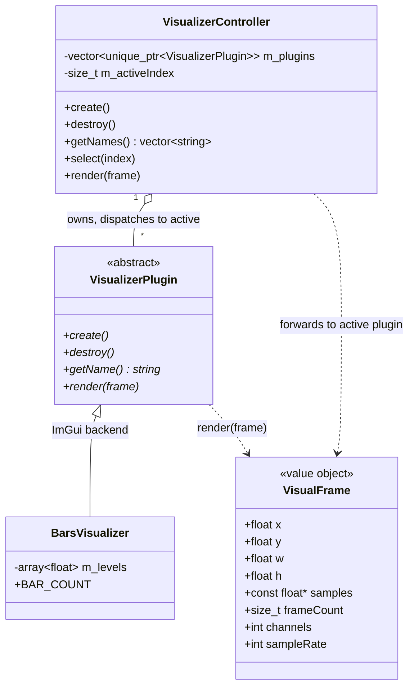

# Visualization domain

Presentation layer in `src/visualizer/`. A pluggable, audio-reactive visualization system mirroring the `PlayerPlugin` pattern: one interface, interchangeable implementations, each free to render with ImGui primitives **or** raw OpenGL. Unlike the player domain, the visualizer layer may depend on ImGui/GL — but it does **not** depend on `PlayerController` or `Gui`; `main.cpp` wires them together.

## Notes

- **`VisualFrame`** (`src/visualizer/VisualFrame.h`) is the per-frame input: the reserved screen rect (`x, y, w, h`) plus a read-only view of the most recently decoded audio (`samples`, `frameCount`, `channels`, `sampleRate`). It is deliberately **free of ImGui/GL types** so it can be built in the platform layer (main.cpp) without dragging the presentation backend into the audio wiring. `samples` may be `nullptr` when `frameCount == 0`.

- **`VisualizerPlugin`** (`src/visualizer/VisualizerPlugin.h`) is the abstract base, mirroring `PlayerPlugin`. `create()`/`destroy()` give a raw-GL plugin a clear lifecycle for its shader/VBO (called once from `VisualizerController::create()`/`destroy()` on the main thread, with a live GL context); ImGui plugins leave them empty. `render(frame)` runs inside the ImGui frame (between `NewFrame` and `Render`) once per frame while in VISUALIZATION mode.

- **`VisualizerController`** (`src/visualizer/VisualizerController.{h,cpp}`) mirrors `PlayerController`'s ownership pattern: owns `vector<unique_ptr<VisualizerPlugin>>` and an active index (default 0), one `emplace_back` per plugin in `create()` (registration order = selector order later), and `render()` forwards to the active plugin. It is non-copyable and guards `render()`/`select()` against an empty/out-of-range index, so `render()` is a safe no-op before `create()` / after `destroy()`.

- **`BarsVisualizer`** (`src/visualizer/visualizers/BarsVisualizer.{h,cpp}`) is the basic plugin shipped in chunk 8c (ImGui backend, `create()`/`destroy()` empty), and the sole default-active plugin (index 0). It draws `BAR_COUNT` (64) vertical bars whose heights track per-band audio amplitude. Bands are **time-domain**: the sample window is bucketed into `BAR_COUNT` contiguous buckets and each bar's target is the **peak of |mono|** over its bucket (peak, not RMS → transients pop) times an empirical visual `GAIN`, clamped to 1. No FFT → **no dependency, Switch-safe**. Per-bar heights are smoothed with a fast **attack** / gentle **decay** and persisted across frames in `m_levels`, so bars rise sharply on transients and fall smoothly; when `frameCount == 0` all targets are 0, so the bars **decay to rest**. Drawn via `ImGui::GetBackgroundDrawList()->AddRectFilled(...)` inside the reserved rect, growing bottom→up, using the theme accent (`ImGuiCol_PlotHistogram`) for consistency with the player bar. A true FFT **spectrum** and a GL **shader-quad** are follow-on plugins (8d/future).

- **Animation freezes when hidden.** A visualizer must advance its animation/state from the per-frame delta **inside `render()`** (`BarsVisualizer` drives its attack/decay smoothing from `ImGui::GetIO().DeltaTime`), never from the always-ticking global `ImGui::GetTime()`. Because the controller's `render()` is only called in VISUALIZATION mode, deriving motion from render-time makes a visualizer stop while hidden and resume where it left off — the bars freeze mid-decay when hidden and resume from the same heights, no phase jump on re-entry, no work when off-screen. Audio-reactive plugins get this for free (their state only updates when fed a frame).

## Render bridge (ImGui / GL)

There is **one render call site and one draw order** regardless of a plugin's backend, because `render()` runs inside the ImGui frame:

- **ImGui plugins** (like `BarsVisualizer`) draw **immediately** via `ImGui::GetBackgroundDrawList()` — the background list paints behind every window, directly on the reserved rect in screen coordinates. Portable and identical on desktop + Switch (no shader/CMake changes).
- A future **GL plugin** schedules its draw through `ImDrawList::AddCallback`, so its raw-GL rendering is ordered into the same ImGui draw data and executed before `ImGui_ImplOpenGL3_RenderDrawData`.

The single call site is `main.cpp`'s `onRenderVisualization` callback (wired onto `UiActions`): in VISUALIZATION mode `Gui` invokes it with the reserved rect (`viewport->WorkPos`/`WorkSize`, which already exclude the main menu bar); the callback reads the audio tap, builds a `VisualFrame`, and calls `visualizer.render(frame)`. `Gui` stays presentation-only and knows nothing about the visualizer domain — same principle as `onButtonClick` (see [ui.md](ui.md)).

## Audio tap threading contract

The waveform reaches the visualizer through the player domain's lock-free **seqlock** tap (see [audio.md](audio.md)): the audio thread publishes the just-decoded block from `decode()`; `main.cpp` reads it with `PlayerController::readLatestAudio()` (never touches `m_mutex`, never blocks the audio thread). `decode()` publishes nothing when not `PLAYING`, so an ungated read returns a **stale** block — `main.cpp` gates on `PlayerState::PLAYING` and passes `frameCount = 0` otherwise, so the visual **decays to rest** rather than reacting to a frozen buffer.
